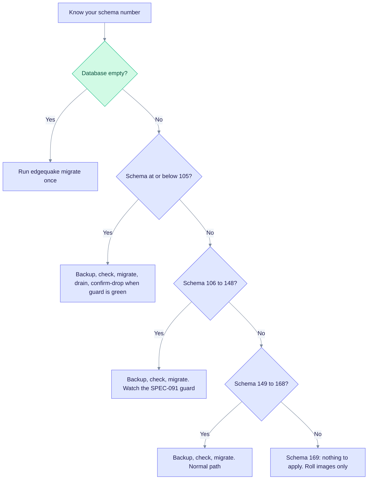
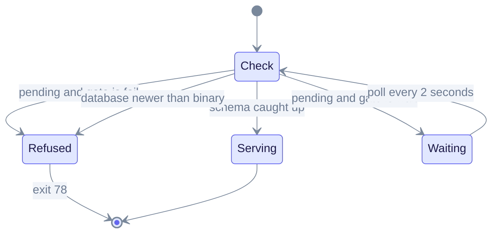

# Upgrading EdgeQuake

This is the canonical guide for database upgrades. It is for operators who run EdgeQuake against their own PostgreSQL. Use it before you start a newer image or binary. Per-release notes (`upgrade-to-0.XX.md`) describe product changes; this page describes the migration process that works from any published version to HEAD.

> **Schema train today:** migration **169** (SPEC-163 provider connections).
> The released product is **v0.32.2** (schema 168). HEAD ships as **v0.33.0** (schema 169).
>
> **One rule:** the API never changes the database schema. Only `edgequake migrate`
> (or the Compose service / Helm Job that runs it) writes schema.

Design detail: [`specs/150-reliable-migration-system/`](../../specs/150-reliable-migration-system/).
Short reference: [`edgequake/docs/migrations.md`](../../edgequake/docs/migrations.md).

---

## 1. Which path do I take?

Read your current schema number first (see [section 2](#2-which-version-am-i-on)), then follow the chart.



How to read it: start at the top, answer each question, and stop at the box that matches you. Every path ends with the same verify step in section 3.

| From (schema) | Releases | Risk | What to do |
|---------------|----------|------|------------|
| Empty database | none | S | `edgequake migrate` once. A fresh install needs no drop consent. |
| 105 or lower | before v0.23.0 | XL | Backup, check, migrate, drain, then `--confirm-drop` only when the guard is green. |
| 106 to 148 | v0.23.0 to v0.25.x | M to L | Known checksum variants repair automatically. Watch the SPEC-091 guard. See [#396](https://github.com/raphaelmansuy/edgequake/issues/396). |
| 149 | v0.26.x | S to M | Normal path (150 to 169). Leftover drops may still be pending. |
| 159 to 166 | v0.27 to v0.31 | S | Apply the remaining numbered files. |
| 168 | v0.32.x | S | Apply 169 (`provider_connections`, expand-only). |
| 169 | v0.33.0 | none | `migrate` is a no-op. Roll images only. |

Risk assumes a small database. Large graphs take longer (class XL) because some steps rewrite AGE tables or build indexes.
Proof: `make spec150-matrix` (all epochs) and `make spec150-matrix-quick` (key epochs) replay each epoch to HEAD on PG16, PG17 and PG18.

---

## 2. Which version am I on?

```bash
# Running API
curl -sf localhost:8080/health | jq '{version, schema}'

# Offline, before a restart
edgequake migrate status
edgequake migrate check
```

| Signal | Meaning |
|--------|---------|
| `version` | Binary or image version, for example `0.32.2`. |
| `schema.latest_version` | Highest applied migration, for example `168`. |
| `schema.pending_count` | Safe-schema migrations still missing. |
| `/ready` returns **200** | Safe for traffic. |
| `/ready` returns **503** | Schema or index not ready. Run migrate, or wait. |

Schema number to release (every published tag is mapped in `scripts/spec150/epochs.toml`; `./scripts/check_epoch_coverage.sh` enforces it):

| Schema max | Product releases |
|-----------:|------------------|
| 24 | v0.2.0 to v0.4.1 |
| 105 | v0.22.0 |
| 141 | v0.23.0 |
| 147 | v0.24.4 |
| 148 | v0.25.0 |
| 149 | v0.26.0 to v0.26.10 |
| 159 | v0.27.0 |
| 160 | v0.28.0 to v0.28.2 |
| 161 | v0.28.3 |
| 162 | v0.28.4 to v0.28.5 |
| 163 | v0.29.0 |
| 165 | v0.30.0 |
| 166 | v0.31.0 |
| 168 | v0.32.0 to v0.32.2 |
| 169 | v0.33.0 (SPEC-163 `provider_connections`) |

---

## 3. The golden path (every upgrade)

Run these steps in order. Use the migrator binary or image that matches or is newer than the API you are about to start. Never point an older migrate image at a newer database.

```bash
# 1. Backup
pg_dump -Fc "$DATABASE_URL" > edgequake-$(date +%F).dump   # or a volume snapshot

# 2. Preflight: extensions, PostgreSQL major, dirty ledger (no writes)
edgequake migrate check

# 3. Preview pending steps (no writes)
edgequake migrate dry-run

# 4. Apply safe schema
edgequake migrate

# 5. Optional: foreground data drain when mid-cutover
edgequake migrate drain

# 6. Drop old tables. ONLY when the guard is green
edgequake migrate --confirm-drop

# 7. Start the API. Under an orchestrator also set EDGEQUAKE_SCHEMA_GATE=wait

# 8. Verify
curl -sf "$HOST/ready" && curl -sf "$HOST/health" | jq .schema
```

Other `migrate` verbs: `status` (per-job progress), `console [--watch]` (live dashboard), `plan` (ordered runbook), `guard [--family NAME]` (is a flip or drop safe?), `family list|set`, `pause|resume|cancel STEP_ID`. Run `edgequake migrate nonsense` to print the full usage text.

### What you will see

```text
EdgeQuake migrate v0.32.2
 PREFLIGHT
  [OK  ] postgresql_major: PostgreSQL 16.x (major 16)
  [OK  ] extension_vector: pgvector ...
  [OK  ] extension_age: Apache AGE ...
UPGRADE PATH
  database schema : 149 (v0.26.0 to v0.26.10)
  binary schema   : 168 (v0.32.x)
  pending steps   : 19
  irreversible    : none
[ 1/19] 150 provider access ledger ... applied in 0.1s
[ 7/19] 156 graph lineage source ids backfill ... [heavy DDL - may take minutes on large graphs]
[19/19] 168 identity lockout columns ... applied in 0.0s
```

This output was captured from an empty-database upgrade of schema 149 to 168 on PG16. On HEAD the last step is `169_spec163_provider_connections.sql`.

---

## 4. What happens at API boot

The API checks the schema before it serves traffic. The `EDGEQUAKE_SCHEMA_GATE` setting chooses what it does when migrations are pending.



How to read it: the API starts in `Check`. If the schema is current it serves. If migrations are pending, `fail` mode exits with code 78, while `wait` mode answers `/live` (200) and `/ready` (503) and polls until migrate finishes. A database that is newer than the binary always exits 78.

| Mode | Set it | Use it for |
|------|--------|------------|
| `fail` (default) | nothing | Bare metal and `make dev`. A missing migrate is a loud error. |
| `wait` | `EDGEQUAKE_SCHEMA_GATE=wait` | Compose and Kubernetes, where migrate and the API start together. |

---

## 5. Platform runbooks

### Docker Compose

Migrate is a one-shot service. The API waits for `service_completed_successfully` and runs with `EDGEQUAKE_SCHEMA_GATE=wait`.

```bash
export EDGEQUAKE_VERSION=0.32.2
docker compose -f docker-compose.quickstart.yml pull
docker compose -f docker-compose.quickstart.yml up -d
# Re-run migrate by hand:
docker compose -f docker-compose.quickstart.yml run --rm migrate
curl -sf localhost:8080/ready
```

### Helm and Kubernetes

- With an external database, the migrate Job is a `pre-install,pre-upgrade` hook.
- With the bundled PostgreSQL, the Job is a normal Job named `edgequake-migrate-r<revision>`, and the API waits (`EDGEQUAKE_SCHEMA_GATE=wait`, startup probe on `/live`).

```bash
EDGEQUAKE_VERSION=0.32.2 make k8s-install
```

### Bare metal or systemd

```bash
# Run migrate as a oneshot unit ordered Before=edgequake.service
sudo -u edgequake DATABASE_URL=... /usr/local/bin/edgequake migrate
sudo systemctl start edgequake
```

### Local development

`make dev` runs `edgequake migrate` before it starts the backend. `make migrate` updates the schema only.

---

## 6. Exit codes

| Code | Meaning | What to do |
|-----:|---------|------------|
| 0 | Success. Also returned when only DROP OLD steps remain pending. | Start or keep serving. |
| 65 | Unknown migration checksum. | Do not edit shipped SQL. Add a new migration, or use a scoped `EDGEQUAKE_ALLOW_CHECKSUM_REPAIR`. |
| 75 | Another migrate holds the advisory lock. | Wait for it. Check `pg_locks`. |
| 78 | Serve refused by the schema gate. | Run `edgequake migrate`, or upgrade the binary if the database is newer. |

---

## 7. Recovery (symptom, cause, fix)

| Symptom | Likely cause | Fix |
|---------|--------------|-----|
| Exit 65, `VersionMismatch` | A shipped `NNN_*.sql` was edited, or the database was built from an unlisted variant. | Known variants in `manifest.toml` repair automatically. One time only: `EDGEQUAKE_ALLOW_CHECKSUM_REPAIR=71,78 edgequake migrate`, then unset it. An unknown hash needs a new migration. |
| Migrate stops on a dirty version | A step failed part way. | Inspect `SELECT * FROM public._sqlx_migrations WHERE success = false;`. Fix the DDL or confirm it did not apply, delete the dirty row, rerun `edgequake migrate`. |
| Exit 75 | Two migrates at once, or a crashed session still holds the lock. | Wait up to `EDGEQUAKE_MIGRATE_LOCK_DEADLINE` (60 s). After a crash make sure no session holds `hashtext('edgequake.migrate.run')`. |
| `migrate check` fails | Missing `vector` or `age` extension, unsupported PostgreSQL major, binary older than the database, or a dirty ledger. | The command prints a plain-English fix for each. |
| Need to go back | There are no down-migrations. | Restore from backup. Always take a verified backup before `--confirm-drop`. |

---

## 8. Settings for migrate and the gate

Full list: [env-reference.md](env-reference.md). Defaults are read from code.

| Variable | Default | Purpose |
|----------|---------|---------|
| `EDGEQUAKE_SCHEMA_GATE` | `fail` | `wait` serves lite `/live` and `/ready` until migrate catches up. |
| `EDGEQUAKE_SCHEMA_GATE_POLL` | `2` | Seconds between polls in wait mode. |
| `EDGEQUAKE_MIGRATE_LOCK_DEADLINE` | `60` | Seconds to wait for the lock before exit 75. |
| `EDGEQUAKE_MIGRATE_LOCK_TIMEOUT` | `5s` | Session `lock_timeout` for migrate. |
| `EDGEQUAKE_MIGRATE_STATEMENT_TIMEOUT` | per lock class | Session `statement_timeout` override. |
| `EDGEQUAKE_ALLOW_CHECKSUM_REPAIR` | unset | Emergency, scoped hash rewrite. Unset it afterwards. |
| `EDGEQUAKE_SERVE_RECONCILE` | unset | One-release escape: allow serve-time support DDL. |
| `EDGEQUAKE_MIGRATION_CONFIRM_DROP` | unset | Same as `--confirm-drop`. Never set it in shared env files. |

---

## 9. Known limits

- **[#396](https://github.com/raphaelmansuy/edgequake/issues/396):** the SPEC-091 guard can stay red on mid-cutover fleets. Do not use `--confirm-drop` until it is green.
- **PostgreSQL itself is not upgraded.** Changing the PG major is a separate cluster migration (`scripts/migrate_postgres_major.sh` or an image rebuild).
- **Large graphs.** Migrations 070, 071, 074, 156 and 158, and HNSW builds, can hold SHARE or ACCESS EXCLUSIVE locks for a long time. Plan a maintenance window.
- **`migrations/scripts/reset_migrations.sql`** is for development only. It drops the migration ledger. Never run it in production.
- **`edgequake/docker/init.sql`** is legacy and not mounted. The numbered migrations are the schema source of truth.

---

## 10. Related pages

- Per-release notes: [upgrade-to-0.33.0.md](upgrade-to-0.33.0.md), [upgrade-to-0.32.2.md](upgrade-to-0.32.2.md) and earlier.
- Release process: [release-and-cd.md](release-and-cd.md).
- Deployment: [deployment.md](deployment.md), [docker-quickstart.md](docker-quickstart.md).
- SPEC-150 runbook: [`specs/150-reliable-migration-system/11-ops-runbook.md`](../../specs/150-reliable-migration-system/11-ops-runbook.md).
- Incident catalogue: [`specs/150-reliable-migration-system/02-incident-catalogue.md`](../../specs/150-reliable-migration-system/02-incident-catalogue.md).
