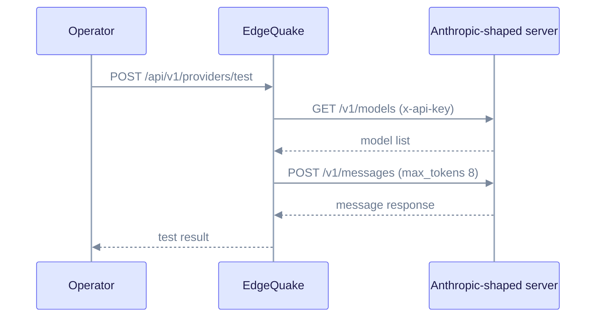

Anthropic provides chat models only. For embeddings, choose another provider such as OpenAI or Ollama. This page covers the cloud setup, the Anthropic-shaped local server and how the test probe authenticates.

## When to use

- You want Claude for entity extraction or answers.
- You can run embeddings on another provider.

## Cloud

```bash
export EDGEQUAKE_LLM_PROVIDER=anthropic
export ANTHROPIC_API_KEY=sk-ant-...
export EDGEQUAKE_LLM_MODEL=claude-sonnet-4-6
export EDGEQUAKE_EMBEDDING_PROVIDER=openai   # Anthropic has no embeddings
export OPENAI_API_KEY=sk-...
```

| Variable | Purpose | Default |
|----------|---------|---------|
| `ANTHROPIC_API_KEY` | API key. Sent as the `x-api-key` header with `anthropic-version`. | none |
| `ANTHROPIC_AUTH_TOKEN` | Used when `ANTHROPIC_API_KEY` is empty. | none |
| `ANTHROPIC_BASE_URL` | Server root for an Anthropic-shaped server | Anthropic cloud |
| `EDGEQUAKE_LLM_MODEL` | Chat model. The catalog lists `claude-sonnet-4-6` and `claude-opus-4-8`. | client default `claude-sonnet-5-5` |

Set `EDGEQUAKE_LLM_MODEL` explicitly so the model does not depend on the client default.

## Anthropic-shaped local server

Any server that implements `POST /v1/messages` works:

```bash
export EDGEQUAKE_LLM_PROVIDER=anthropic
export ANTHROPIC_BASE_URL=http://127.0.0.1:4000   # your server's port
export ANTHROPIC_API_KEY=local
```

Use the server root with no trailing path. In Docker, use `http://host.docker.internal:PORT`.

## Verify the test probe

`POST /api/v1/providers/test` with `"shape":"anthropic_messages"` does this:

1. Lists models at `/v1/models`.
2. Sends a short message to `/v1/messages` with `max_tokens` set to 8.

It sends the key as `x-api-key` by default. Set `"auth_scheme":"bearer"` to send `Authorization: Bearer` instead. The probe skips the embedding check for this shape. See [Test a server](index.md#test-a-server).



## Troubleshoot

- **401 or 403 from the server.** The key is wrong, or you set `auth_scheme` to `bearer` for a server that expects `x-api-key`. Check both.
- **Probe shows `model_not_found`.** The model name is not in the list returned by `/v1/models`.
- **Embedding errors.** Anthropic has no embedding endpoint. Set `EDGEQUAKE_EMBEDDING_PROVIDER` to a provider that has one, such as [OpenAI](openai.md) or [Ollama](ollama.md).

## Notes

- A saved Connection for an Anthropic-shaped server uses `api_shape=anthropic_messages` (see [Roles](roles.md)).
- For a local setup with no key, see [Ollama](ollama.md).

Related: [Providers overview](index.md), [Provider security](security.md).
