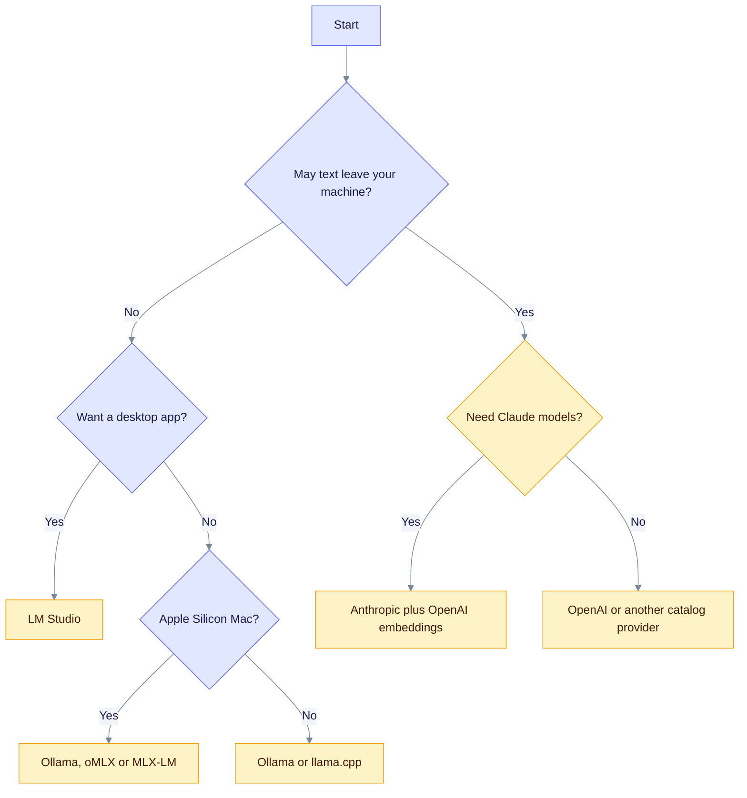
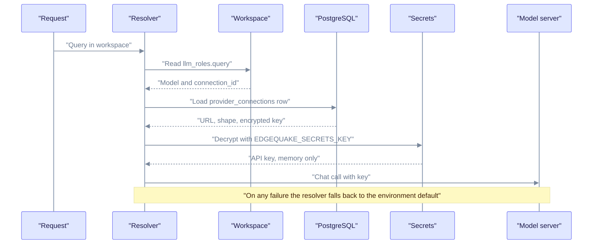

EdgeQuake needs two kinds of model: a chat model (to extract entities and answer questions) and an embedding model (to turn text into vectors). This section shows how to point each one at a cloud API or a local server, and how to check that the link works.

> Product release: v0.32.2. Connections, `edgequake doctor` and `POST /api/v1/providers/test` are new in the next release (v0.33.0, SPEC-163).

## Three ways to start

| Path | Command | Use it when |
|------|---------|-------------|
| Docker quickstart | `curl -fsSL https://raw.githubusercontent.com/raphaelmansuy/edgequake/edgequake-main/quickstart.sh \| sh` | First look |
| Docker, no prompts | `sh quickstart.sh --yes --provider ollama` | Scripts and CI |
| Source | `make dev` | You change the code |
| Helm | [Deployment](../operations/deployment.md) | Production |

`quickstart.sh` accepts `--provider ollama|openai|omlx|anthropic|lmstudio`, `--base-url URL`, `--model ID` and `--embed-model ID`. Without a terminal it needs `--yes`.

## Which provider should I use?

The chart below picks a provider from two questions: may text leave your machine, and what hardware do you have.



Read it top to bottom: answer each diamond and follow the labelled arrow to a box. You can mix choices, for example a cloud chat model with local embeddings (see [Roles](roles.md)).

## How EdgeQuake finds the client for a role

A workspace assigns a model to each role. If a role names a saved Connection, EdgeQuake loads it from PostgreSQL, decrypts the key in memory and builds the client. If anything in that chain fails, it silently falls back to the next choice (request, workspace, tenant, environment).



Read it left to right and top to bottom: each arrow is one step in time. The key never leaves the server process, and API responses show only a fingerprint.

## Providers

Server defaults come from `EDGEQUAKE_LLM_PROVIDER` and `EDGEQUAKE_LLM_MODEL` (aliases `EDGEQUAKE_DEFAULT_LLM_PROVIDER` and `EDGEQUAKE_DEFAULT_LLM_MODEL`). The full variable list is in the [environment reference](../operations/env-reference.md).

| Provider id | Page | Auth | Default URL used by the client |
|-------------|------|------|-------------------------------|
| `openai` | [OpenAI](openai.md) | `OPENAI_API_KEY` | `https://api.openai.com/v1` |
| `anthropic` | [Anthropic](anthropic.md) | `ANTHROPIC_API_KEY` | `https://api.anthropic.com` |
| `ollama` | [Ollama](ollama.md) | none | `http://localhost:11434` |
| `lmstudio` | [LM Studio](lmstudio.md) | none | `http://localhost:1234` |
| `omlx` | [oMLX](omlx.md) | optional | `http://127.0.0.1:9050` |
| `mlx-lm` | [MLX-LM](mlx-lm.md) | optional | `http://127.0.0.1:8080` |
| `vllm-mlx` | [vLLM-MLX](vllm-mlx.md) | optional | `http://127.0.0.1:8000` |
| `llamacpp` | [llama.cpp](llamacpp.md) | optional | `http://127.0.0.1:8080` |
| `openai-compatible` | [Generic OpenAI shape](openai-compatible.md) | optional | none (you must set it) |

The catalog `edgequake/models.toml` also lists `mistral`, `gemini`, `xai`, `openrouter`, `minimax`, `nvidia`, `cohere`, `jina`, `huggingface`, `vertexai` and `mtplx`. Each reads the key from the variable named in its `api_key_env` field (for example `MISTRAL_API_KEY`, `GEMINI_API_KEY`). `azure` and `mock` are in the catalog but disabled.

## Test a server

Run a probe before you save anything. It lists models, sends one chat ping and one embedding ping, and reports a `kind` such as `unreachable`, `unauthorized`, `model_not_found`, `dim_mismatch`, `shape_mismatch`, `ssrf_denied` or `invalid_url`. The endpoint needs an admin credential; with auth off (dev mode) no header is needed.

```bash
curl -sS -X POST http://127.0.0.1:8080/api/v1/providers/test \
  -H 'Content-Type: application/json' \
  -d '{"shape":"openai_chat","base_url":"http://127.0.0.1:9050","allow_private_network":true}'
```

In the web UI, open Settings, find **LLM connections** and press **Test connection**. To check the whole install from a shell, run `edgequake doctor` (add `--json` for machine output). It exits 0 when all checks pass, 1 when `DATABASE_URL` is missing, and 2 for any other failed check.

Check the live state with `curl http://127.0.0.1:8080/health`. The status is `degraded` when a local provider (Ollama, LM Studio, oMLX and similar) does not answer; for cloud providers `/health` only checks that a key is set.

## Pages

- [OpenAI](openai.md)
- [Anthropic and Anthropic-shaped servers](anthropic.md)
- [Ollama](ollama.md)
- [LM Studio](lmstudio.md)
- [oMLX](omlx.md)
- [MLX-LM](mlx-lm.md)
- [vLLM-MLX](vllm-mlx.md)
- [llama.cpp](llamacpp.md)
- [Generic OpenAI-shaped server](openai-compatible.md)
- [Workspace roles](roles.md)
- [Provider security](security.md)
