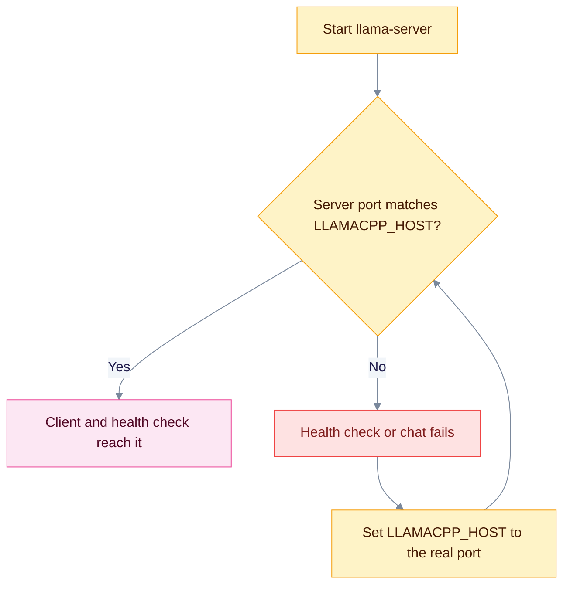

`llama-server` from llama.cpp serves GGUF models on almost any hardware. EdgeQuake treats it as an OpenAI-shaped local server. This page shows how to connect it and why the port must be set explicitly.

## When to use

- You run GGUF models on Linux, Windows or macOS.
- You want one small server binary with no Python environment.

## Configure

```bash
export EDGEQUAKE_LLM_PROVIDER=llamacpp
export LLAMACPP_HOST=http://127.0.0.1:8081
export LLAMACPP_MODEL=default
```

| Variable | Purpose |
|----------|---------|
| `LLAMACPP_HOST` | Server URL. Aliases: `LLAMA_SERVER_HOST`, `LLAMACPP_BASE_URL`, `LLAMA_SERVER_BASE_URL`. |
| `LLAMACPP_MODEL` | Model name. `default` means the loaded model. |
| `LLAMACPP_API_KEY` | Optional key. Alias `LLAMA_SERVER_API_KEY`. |
| `EDGEQUAKE_EMBEDDING_MODEL` | Embedding model, if you run the server with embeddings enabled. Use this variable. `LLAMACPP_EMBEDDING_MODEL` is not read by the embedding path. |

## Models

- **Chat:** the GGUF file you pass with `-m`. `default` uses the loaded model.
- **Embeddings:** start `llama-server` with an embedding model and set `EDGEQUAKE_EMBEDDING_PROVIDER=llamacpp` and `EDGEQUAKE_EMBEDDING_MODEL`. Check vector size with [Roles](roles.md#change-embeddings-with-care).

## Set the port explicitly

The three places that use a port disagree:

| Place | Address |
|-------|---------|
| Client default | `http://127.0.0.1:8080` |
| `/health` and the test probe | `http://127.0.0.1:8081` |
| Your `LLAMACPP_HOST` | whatever you set |

Always set `LLAMACPP_HOST`, and start the server on the same port.



## Verify

```bash
llama-server -m model.gguf --port 8081
curl http://127.0.0.1:8081/v1/models
curl http://127.0.0.1:8080/health
```

`/health` reports `degraded` when the server does not answer on `/v1/models`. The probe (`POST /api/v1/providers/test` with `"shape":"openai_chat"`) runs the same model list check and a short chat request. See [Test a server](index.md#test-a-server).

## Troubleshoot

- **`/health` is degraded but `curl` works.** `LLAMACPP_HOST` is not set, so the health check falls back to port 8081 while your server runs elsewhere. Set `LLAMACPP_HOST` to the real port.
- **Model not found.** Run `curl http://127.0.0.1:8081/v1/models` and copy the id into `LLAMACPP_MODEL`.
- **Not reachable from Docker.** Replace `127.0.0.1` with `host.docker.internal`.

Related: [Providers overview](index.md), [MLX-LM](mlx-lm.md), [vLLM-MLX](vllm-mlx.md).
