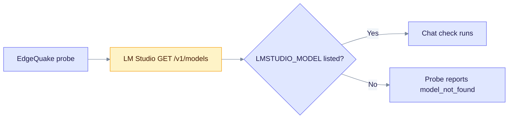

LM Studio is a desktop app that serves local models. Start its local server, load a model, then point EdgeQuake at it. This page lists the variables EdgeQuake reads and how to check the link.

## When to use

- You already use LM Studio to manage and load models.
- You want a local chat and embedding server with a graphical interface.

## Configure

```bash
export EDGEQUAKE_LLM_PROVIDER=lmstudio
export LMSTUDIO_HOST=http://127.0.0.1:1234
export LMSTUDIO_MODEL=your-loaded-model
```

| Variable | Purpose | Default |
|----------|---------|---------|
| `LMSTUDIO_HOST` | Server URL | `http://localhost:1234` |
| `LMSTUDIO_MODEL` | Chat model you loaded. LM Studio serves only what is loaded. | `gemma2-9b-it` |
| `LMSTUDIO_EMBEDDING_MODEL` | Embedding model, used when `EDGEQUAKE_EMBEDDING_PROVIDER=lmstudio` | `nomic-embed-text-v1.5` |
| `LMSTUDIO_EMBEDDING_DIM` | Embedding vector size | `768` |

`LM_STUDIO_BASE_URL` is not read. Use `LMSTUDIO_HOST`.

## Models

- **Chat:** load the model in LM Studio, then set `LMSTUDIO_MODEL` to its name.
- **Embeddings:** load an embedding model in LM Studio, then set `EDGEQUAKE_EMBEDDING_PROVIDER=lmstudio` and `LMSTUDIO_EMBEDDING_MODEL`.

## Verify

```bash
curl http://127.0.0.1:1234/v1/models
curl http://127.0.0.1:8080/health
```

`/health` reports `degraded` when LM Studio does not answer on `/v1/models`. The probe (`POST /api/v1/providers/test` with `"shape":"openai_chat"`) lists the same models. See [Test a server](index.md#test-a-server).



In Docker, use `http://host.docker.internal:1234`. `quickstart.sh --provider lmstudio --base-url URL` sets `LMSTUDIO_HOST` for you.

## Troubleshoot

- **Probe reports `model_not_found`.** The name in `LMSTUDIO_MODEL` is not one LM Studio lists. Copy the name from `/v1/models`.
- **`/health` is degraded.** LM Studio's local server is stopped, or it listens on another port. Start the server in LM Studio and match the port.
- **Embeddings fail.** No embedding model is loaded in LM Studio, or `EDGEQUAKE_EMBEDDING_PROVIDER` is not set to `lmstudio`.

Related: [Providers overview](index.md), [Ollama](ollama.md), [Generic OpenAI-shaped server](openai-compatible.md).
