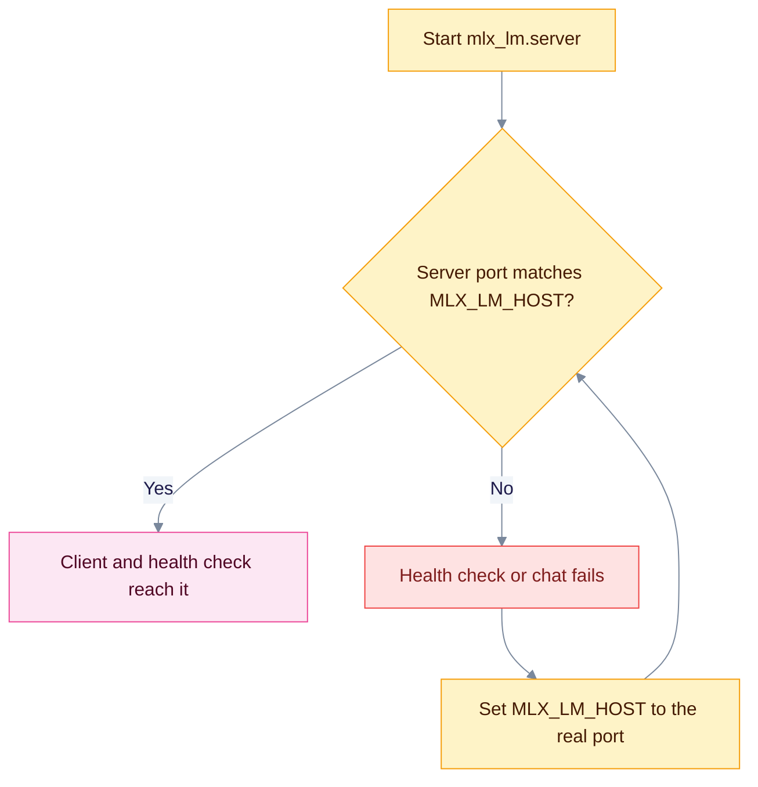

`mlx_lm.server` is Apple's official MLX server. EdgeQuake treats it as an OpenAI-shaped local server. This page shows how to connect it and why you must set the port yourself.

## When to use

- You run MLX models on a Mac with Apple Silicon.
- You want Apple's own server rather than a third-party one.

## Configure

```bash
export EDGEQUAKE_LLM_PROVIDER=mlx-lm
export MLX_LM_HOST=http://127.0.0.1:8083
export MLX_LM_MODEL=default
```

| Variable | Purpose |
|----------|---------|
| `MLX_LM_HOST` | Server URL. Aliases: `MLX_LM_BASE_URL`, `MLXLM_HOST`. |
| `MLX_LM_MODEL` | Model name. `default` means the loaded model. |
| `MLX_LM_API_KEY` | Optional key. Alias `MLXLM_API_KEY`. |
| `EDGEQUAKE_EMBEDDING_MODEL` | Embedding model, if your server offers one. Use this variable. `MLX_LM_EMBEDDING_MODEL` is not read by the embedding path. |

## Models

- **Chat:** the model you pass to `mlx_lm.server --model`, or `default` to use the loaded one.
- **Embeddings:** set `EDGEQUAKE_EMBEDDING_PROVIDER=mlx-lm` and `EDGEQUAKE_EMBEDDING_MODEL`. Check the vector size with [Roles](roles.md#change-embeddings-with-care).

## Set the port explicitly

The three places that use a port disagree:

| Place | Address |
|-------|---------|
| Client default | `http://127.0.0.1:8080` |
| `/health` and the test probe | `http://127.0.0.1:8083` |
| Your `MLX_LM_HOST` | whatever you set |

Always set `MLX_LM_HOST`, and start the server on the same port.



## Verify

```bash
mlx_lm.server --model <your-model> --port 8083
curl http://127.0.0.1:8083/v1/models
curl http://127.0.0.1:8080/health
```

`/health` reports `degraded` when the server does not answer on `/v1/models`. The probe (`POST /api/v1/providers/test` with `"shape":"openai_chat"`) runs the same model list check and a short chat request. See [Test a server](index.md#test-a-server).

## Troubleshoot

- **`/health` is degraded but `curl` works.** `MLX_LM_HOST` is not set, so the health check falls back to port 8083 while your server runs elsewhere. Set `MLX_LM_HOST` to the real port.
- **Model not found.** Run `curl http://127.0.0.1:8083/v1/models` and copy the id into `MLX_LM_MODEL`.
- **Not reachable from Docker.** Replace `127.0.0.1` with `host.docker.internal`.

Related: [Providers overview](index.md), [oMLX](omlx.md), [llama.cpp](llamacpp.md).
