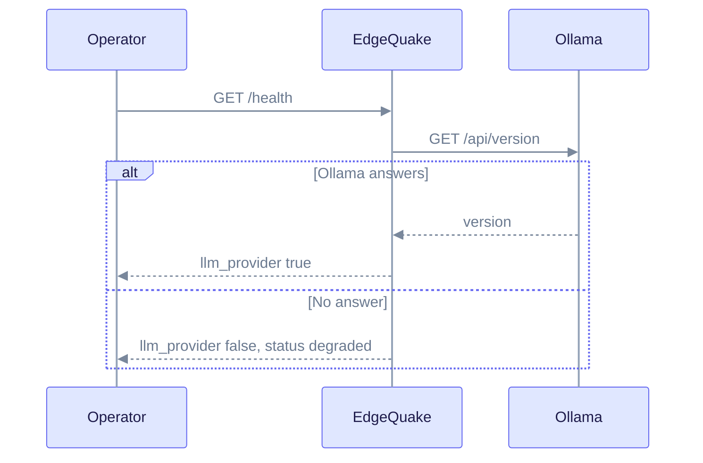

Ollama runs open models on your own machine. It needs no API key, and EdgeQuake talks to its native API. This page covers the setup, the Docker address and how to check the link.

## When to use

- You want no API costs and no text leaving your machine.
- You accept slower extraction than a cloud model gives.
- You want a local default for development. Use [OpenAI](openai.md) or [Anthropic](anthropic.md) for higher quality.

## Configure

```bash
ollama serve
ollama pull gemma4:latest
ollama pull embeddinggemma
export EDGEQUAKE_LLM_PROVIDER=ollama
export EDGEQUAKE_LLM_MODEL=gemma4:latest
export EDGEQUAKE_EMBEDDING_PROVIDER=ollama
export OLLAMA_EMBEDDING_MODEL=embeddinggemma
export OLLAMA_HOST=http://127.0.0.1:11434
```

| Variable | Purpose | Default |
|----------|---------|---------|
| `OLLAMA_HOST` | Server URL | `http://localhost:11434` |
| `EDGEQUAKE_LLM_MODEL` | Chat model. Pull it first. | none |
| `OLLAMA_EMBEDDING_MODEL` | Embedding model for `EDGEQUAKE_EMBEDDING_PROVIDER=ollama` | `embeddinggemma:latest` |

## Models

- **Chat:** any model you have pulled. The catalog lists `gemma4:latest`, `gemma3:latest` and `llama3.2:latest`, among others.
- **Embeddings:** `embeddinggemma` is the quickstart default and returns 768-dimension vectors. `nomic-embed-text` is also in the catalog.

Changing the embedding model changes the vector size. Rebuild stored embeddings after you change it (see [Roles](roles.md#change-embeddings-with-care)).

## Docker

A container cannot reach `127.0.0.1` on your host. Use `http://host.docker.internal:11434` instead. `quickstart.sh` rewrites loopback addresses for you and prints the address it chose.

## Verify

```bash
curl http://127.0.0.1:11434/api/tags
curl http://127.0.0.1:8080/health
```

`/health` calls `/api/version` on Ollama. The probe (`POST /api/v1/providers/test` with `"shape":"ollama"`) checks `/api/version` and sends a short chat request to `/api/chat`. It skips the embedding check.



The health check reports `degraded` when Ollama does not answer. Each request is a live call, not a stored status.

## Troubleshoot

- **Extraction fails with a network error.** Ollama is not running. Start it with `ollama serve` and check [Troubleshooting](../troubleshooting/index.md).
- **Probe reports `shape_mismatch` ("chat ping failed") for a model you pulled.** The chat model name is wrong or not pulled. `/api/version` does not list models, so the probe cannot report `model_not_found` for Ollama. Run `ollama list` and compare the name.
- **A saved Connection points at another Ollama host.** The Connection is tested and used with its own URL. The environment default and `/health` still read `OLLAMA_HOST`. Set both when they must agree.
- **Ingestion is slow.** EdgeQuake limits extraction concurrency for local providers such as Ollama. This is expected on a laptop.

Related: [Providers overview](index.md), [Anthropic](anthropic.md).
