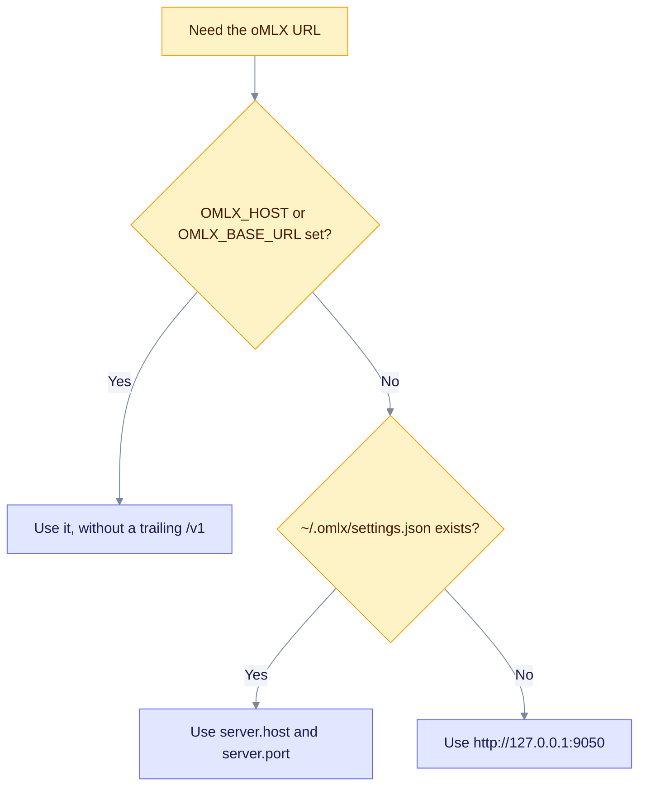

oMLX serves MLX models on Apple Silicon through an OpenAI-shaped API. Its default address is `http://127.0.0.1:9050`. This page covers the setup, where EdgeQuake reads the URL and key, and how to check the link.

## When to use

- You run models on a Mac with Apple Silicon and want no API costs.
- You already run oMLX and want EdgeQuake to reuse its settings file.

## Configure

```bash
export EDGEQUAKE_LLM_PROVIDER=omlx
export OMLX_HOST=http://127.0.0.1:9050
export OMLX_MODEL=default
export EDGEQUAKE_EMBEDDING_PROVIDER=omlx
export EDGEQUAKE_EMBEDDING_MODEL=<your-embedding-model>
export EDGEQUAKE_EMBEDDING_DIMENSION=768
```

| Variable | Purpose |
|----------|---------|
| `OMLX_HOST` | Server URL. Alias `OMLX_BASE_URL`. A trailing `/v1` is removed. |
| `OMLX_MODEL` | Chat model name. `default` means the model oMLX has loaded. |
| `OMLX_API_KEY` | Optional key, sent as a Bearer token. |
| `EDGEQUAKE_EMBEDDING_MODEL` | Embedding model name. Use this variable. `OMLX_EMBEDDING_MODEL` is not read. |
| `EDGEQUAKE_EMBEDDING_DIMENSION` | Vector size. Set it when the catalog has no entry for your model. It must match the model's real output size. Without it, EdgeQuake uses 768. |

## Where the URL and key come from

EdgeQuake resolves the host, the key and the model separately. For each one it uses the first source that is set:

1. The environment variable.
2. `~/.omlx/settings.json` (`server.host`, `server.port`, `auth.api_key`, `model.default_model`).
3. The built-in default, `http://127.0.0.1:9050`.



The health check is the exception: `/health` reads only `OMLX_HOST` and `OMLX_BASE_URL`, not the settings file.

## Verify

```bash
curl http://127.0.0.1:9050/v1/models
curl http://127.0.0.1:8080/health
```

In Docker, use `http://host.docker.internal:9050`. The quickstart shortcut is `quickstart.sh --yes --provider omlx --base-url http://127.0.0.1:9050`.

`/health` reports `degraded` when oMLX does not answer on `/v1/models`. The probe (`POST /api/v1/providers/test`) lists `/v1/models` and sends a short chat request to `/v1/chat/completions`. See [Test a server](index.md#test-a-server).

## Troubleshoot

- **`/health` says degraded, but the chat works.** The health check reads `OMLX_HOST` only. If the URL comes from `~/.omlx/settings.json`, export `OMLX_HOST` too.
- **Embeddings fail or the vectors have the wrong size.** Check that `EDGEQUAKE_EMBEDDING_MODEL` is set and that `EDGEQUAKE_EMBEDDING_DIMENSION` matches the model. Changing either means rebuilding stored embeddings ([Roles](roles.md#change-embeddings-with-care)).
- **Not reachable from Docker.** Replace `127.0.0.1` with `host.docker.internal`.

## MTPLX note

The sibling server MTPLX uses `MTPLX_HOST`. Its client default port is 8000, but the health check and probe assume 9060. Set `MTPLX_HOST` explicitly.

Related: [Providers overview](index.md), [Provider security](security.md).
