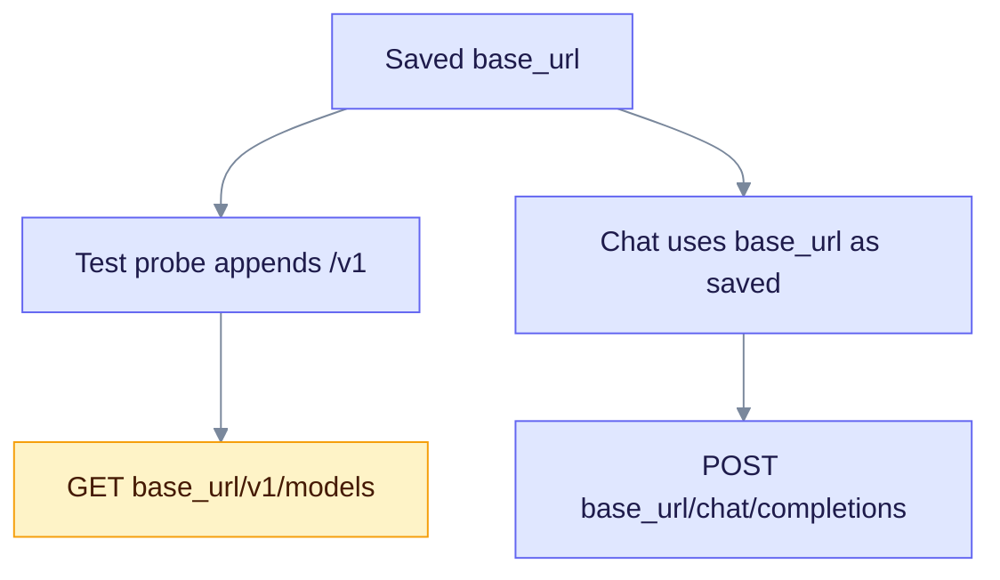

Many servers copy the OpenAI API: vLLM, LiteLLM, text-generation-inference, corporate gateways and others. Use this page when none of the named providers fits. You can configure it with environment variables or with a saved Connection.

## When to use

- Your server speaks `/v1/chat/completions` and `/v1/embeddings`.
- No named provider page covers your server.

## With environment variables

```bash
export EDGEQUAKE_LLM_PROVIDER=openai-compatible
export OPENAI_COMPATIBLE_BASE_URL=http://127.0.0.1:8000/v1
export OPENAI_COMPATIBLE_API_KEY=optional
export OPENAI_COMPATIBLE_MODEL=my-model
```

| Variable | Purpose | Default |
|----------|---------|---------|
| `OPENAI_COMPATIBLE_BASE_URL` | Required. Include `/v1`. EdgeQuake appends `/chat/completions` and `/embeddings`. | none |
| `OPENAI_COMPATIBLE_API_KEY` | Optional. Sent as a Bearer token when set. | none |
| `OPENAI_COMPATIBLE_MODEL` | Chat model | `default` |
| `OPENAI_COMPATIBLE_EMBEDDING_MODEL` | Optional embedding model | none |

The environment holds one such server. For two servers, use two Connections.

## With a saved Connection

1. Open **Settings**, then **LLM connections**.
2. Enter a slug, the shape `openai_chat`, the base URL and an optional key.
3. Press **Test connection**, then **Save**.

Saving needs PostgreSQL, an admin credential and, when you enter a key, `EDGEQUAKE_SECRETS_KEY` ([Provider security](security.md)). The same fields work through `POST /api/v1/connections`.

Accepted shapes:

| Shape | Used for |
|-------|----------|
| `openai_chat`, `openai`, `openai-compatible`, `openai_compatible` | OpenAI Chat Completions servers |
| `omlx`, `mlx-lm`, `mlx_lm`, `llamacpp`, `vllm-mlx`, `lmstudio` | Local servers with the same API |
| `ollama` | Ollama native API |
| `anthropic_messages`, `anthropic`, `claude` | Anthropic Messages API |

Any other value is passed to the provider factory by name.

## Known limitation: the `/v1` suffix

This mismatch is verified in the code, not on a live server:

- The test probe always adds `/v1` to the base URL. It calls `{base_url}/v1/models`. It expects the server root.
- The chat client uses the saved base URL as given and appends `/chat/completions`. It expects the URL to include `/v1`.



So one saved URL cannot satisfy both checks:

- A root URL such as `http://host:9050` can pass the test, but chat then calls a path without `/v1`, which the server may not serve.
- A URL ending in `/v1` makes the test call `/v1/v1/models`, which fails.

Until this is fixed, do not rely on a green test for a saved Connection. Send a real query after you save. The environment variables use the URL with `/v1` for chat, so this mismatch does not apply to them.

## Related

- [Roles](roles.md)
- [Providers overview](index.md)
- [OpenAI](openai.md)
