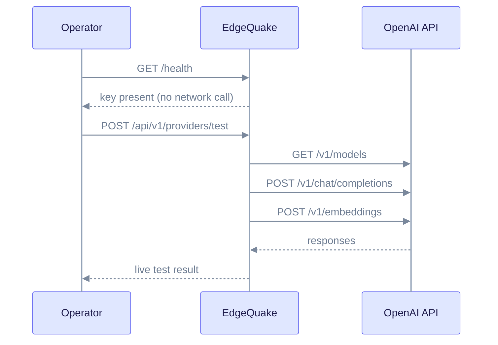

OpenAI is the catalog default for both chat and embeddings. You need an API key and little else. This page lists the variables, the default models and how to check the connection.

## When to use

- You want the highest extraction and answer quality with the least setup.
- You accept per-token costs and sending text to OpenAI.

## Configure

```bash
export EDGEQUAKE_LLM_PROVIDER=openai
export OPENAI_API_KEY=sk-...
export EDGEQUAKE_LLM_MODEL=gpt-5.4-mini
export EDGEQUAKE_EMBEDDING_PROVIDER=openai
export EDGEQUAKE_EMBEDDING_MODEL=text-embedding-3-small
```

| Variable | Purpose | Default |
|----------|---------|---------|
| `OPENAI_API_KEY` | Required. Sent as `Authorization: Bearer`. | none |
| `EDGEQUAKE_LLM_MODEL` | Chat model | catalog default `gpt-4.1-mini`; the quickstart picks `gpt-5.4-mini` |
| `EDGEQUAKE_EMBEDDING_MODEL` | Embedding model | `text-embedding-3-small` (1536 dimensions) |
| `OPENAI_BASE_URL` | Optional. Send traffic through an OpenAI-compatible proxy or gateway. | `https://api.openai.com/v1` |

## Models

- **Chat:** `gpt-5.4-mini` is the quickstart choice. `gpt-5.4-nano` and `gpt-5.4` are also offered.
- **Embeddings:** `text-embedding-3-small` returns 1536-dimension vectors. `text-embedding-3-large` returns 3072.

All model names come from `edgequake/models.toml`. Changing the embedding model changes the vector size, so rebuild stored embeddings after you change it ([Roles](roles.md#change-embeddings-with-care)).

## Verify

Two checks answer two different questions:

| Check | Calls OpenAI? | Answers |
|-------|---------------|---------|
| `GET /health` | No. It only checks that `OPENAI_API_KEY` is set. | Is the key configured? |
| `POST /api/v1/providers/test` | Yes | Does the key work, and do the models respond? |

```bash
curl -sS http://127.0.0.1:8080/health
```

Look for `"llm_provider": true` under `components` and your model under `providers.llm`. Use the probe for a live result ([Test a server](index.md#test-a-server)).



## Troubleshoot

- **`/health` says the provider is ready, but extraction fails with 401.** The key is set but invalid. `/health` does not test it. Run the probe.
- **Probe reports `model_not_found`.** The model name is not available to your key. Check the name in `EDGEQUAKE_LLM_MODEL`.
- **Requests go to the wrong host.** `OPENAI_BASE_URL` points at a proxy. Unset it or fix the URL.

## Notes

- To store the key in the database instead of the environment, create a Connection with `api_shape=openai_chat` (see [Provider security](security.md)).
- For another OpenAI-shaped server, see [Generic OpenAI-shaped server](openai-compatible.md).

Related: [Roles](roles.md), [Anthropic](anthropic.md), [Providers overview](index.md).
