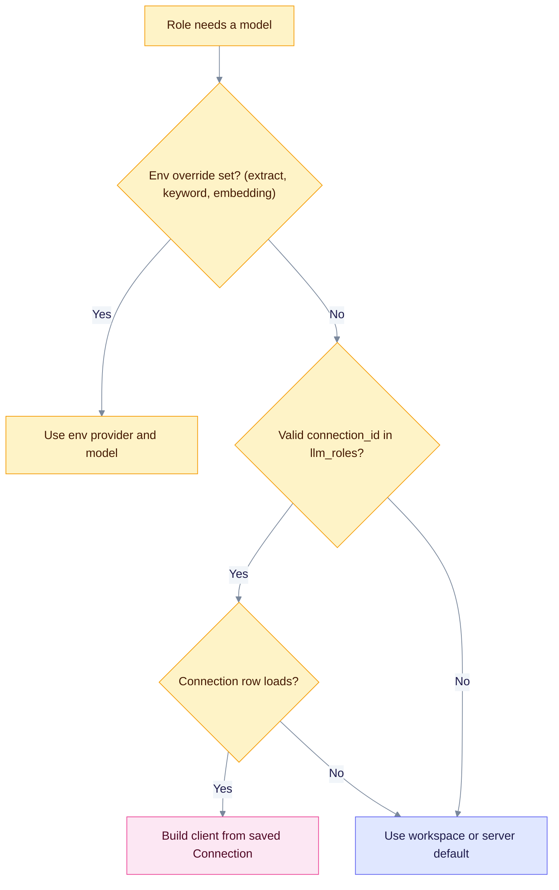

A role is a job that needs a model, such as extracting entities or writing an answer. A workspace can give each role its own provider, model or saved Connection. Roles you leave empty inherit the workspace default, then the server default.

## Roles and where they are set

| Role | Job | Configured by | Uses a Connection? |
|------|-----|---------------|--------------------|
| `extract` | Pull entities and relations from documents | Env `EDGEQUAKE_EXTRACT_LLM_PROVIDER` and `EDGEQUAKE_EXTRACT_LLM_MODEL` (env wins), then `llm_roles.extract` | Yes |
| `query` | Write the final answer | `llm_roles.query`, or a request override | Yes |
| `keyword` | Pull search keywords from a question | Env `EDGEQUAKE_KEYWORD_LLM_PROVIDER` and `EDGEQUAKE_KEYWORD_LLM_MODEL` (env wins), then `llm_roles.keyword`, then the query model | Yes |
| `summary` | Merge entity descriptions | `llm_roles.summary` | No |
| `vlm` (vision) | Read PDF pages as images | Upload or workspace `vision_llm_*`, or `llm_roles.vlm` | Yes |
| `embedding` | Turn text into vectors | Workspace `embedding_*`, env `EDGEQUAKE_EMBEDDING_PROVIDER` and `EDGEQUAKE_EMBEDDING_MODEL`, or `llm_roles.embedding.connection_id` | Yes |
| `reranker` | Re-order retrieved chunks | Env `EDGEQUAKE_RERANKER` (mode), `EDGEQUAKE_RERANKER_PROVIDER`, `EDGEQUAKE_RERANKER_MODEL` and `EDGEQUAKE_RERANKER_BASE_URL`. Whole server | No |
| `decision` | Decision-style extraction (SPEC-160) | `EDGEQUAKE_DECISION_*` and workspace metadata | No |

The `llm_roles` map in workspace metadata accepts five chat roles: `extract`, `query`, `summary`, `vlm` and `keyword`. The Settings page role matrix shows six roles: those five plus `embedding`. Reranker and decision are set with environment variables.

## How a role picks its client

Read the chart top to bottom. An environment override wins. Then a valid saved Connection. Then the workspace or server default. Each failed check falls through to the next branch.



## Example

Workspace metadata:

```json
{
  "llm_roles": {
    "extract": { "provider": "openai", "model": "gpt-5.4-mini" },
    "query": {
      "provider": "openai-compatible",
      "model": "my-model",
      "connection_id": "11111111-1111-1111-1111-111111111111"
    }
  }
}
```

The `query` role calls the saved Connection. The `extract` role calls OpenAI with the server's key.

## Fallback is silent

EdgeQuake does not return an error when a Connection cannot be used. It moves to the next choice instead. The cases are:

- `connection_id` is not a valid UUID, the row does not exist, PostgreSQL is not available, or the client cannot be built.
- A key cannot be decrypted, for example after you change `EDGEQUAKE_SECRETS_KEY`. The key is then treated as missing. The Connection still loads, now without a key, so a cloud server rejects the calls. Enter the key again.

If answers come from a different model than you expect, test the Connection with **Test connection** and check `/health`.

## Change embeddings with care

Vectors from two embedding models are not comparable. After you change the embedding provider, model or dimension, rebuild the stored embeddings. See [Embedding backfill](../operations/embedding-registry-backfill.md).

Related: [Providers overview](index.md), [Provider security](security.md).
