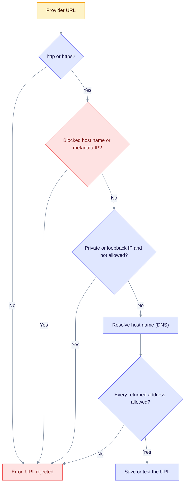

Saved Connections hold API keys and URLs that point at other servers. This page lists the controls around them, the rules for provider URLs and the server settings to check before you expose EdgeQuake. The full threat model is in [Security](../security/index.md).

## Controls at a glance

| Control | What it does | Setting |
|---------|--------------|---------|
| Encrypted keys | Connection keys are stored with AES-256-GCM. API responses show only a fingerprint and `key_configured`. | `EDGEQUAKE_SECRETS_KEY` |
| Write-only keys | You can set or replace a key. You can never read it back. | none |
| URL checks | Saved and tested URLs must pass the SSRF rules below. | `allow_private_network` per Connection |
| Admin only | Creating, updating, deleting and testing Connections, and the probe, need the admin role. | `EDGEQUAKE_AUTH_ENABLED` |
| Loopback publish | The quickstart publishes ports on `127.0.0.1` only. | `docker-compose.quickstart.yml` |

## Set the encryption key

`EDGEQUAKE_SECRETS_KEY` must hold 32 bytes. Use one of three forms: 32 raw characters, base64 that decodes to 32 bytes, or 64 hex characters. Without a valid key, saving an API key returns `400` and nothing is stored.

```bash
export EDGEQUAKE_SECRETS_KEY="$(openssl rand -base64 32)"
```

- Keep this value. If it changes or is lost, stored keys cannot be decrypted. See [Fallback](roles.md#fallback-is-silent) for what happens then.
- `EDGEQUAKE_SECRETS_KEY_ID` (default `v1`) labels each stored envelope. The server loads one key, so there is no rotation. To change the key, enter each stored key again.
- `quickstart.sh` generates a new key on each run unless `EDGEQUAKE_SECRETS_KEY` is already exported. Export your own key before the first run.

## Provider URL rules

| URL | Result |
|-----|--------|
| Scheme other than `http` or `https` | Rejected |
| Host names `*.internal`, `metadata.google.internal`, `kubernetes.default`, `instance-data` or `metadata` | Always rejected |
| `169.254.x.x` (cloud metadata), other link-local addresses, `fe80::/10` | Always rejected |
| Decimal, hex or octal IP spellings such as `2130706433` or `0x7f000001` | Rejected |
| Loopback, `10.x`, `172.16-31.x`, `192.168.x`, `::1`, unique-local IPv6 (`fc00::/7`) | Rejected unless `allow_private_network` is true |
| Public host name or address | Allowed |

`allow_private_network` defaults to `true` when `locality` is `local`. If you omit `locality`, EdgeQuake sets it from the URL: `localhost`, loopback and private addresses are `local`.

Host names are resolved. Saving a Connection and testing a URL look up the host name and check every returned address against the same rules. A name that does not resolve is an error. The check runs before the client connects, so a host name that later points somewhere else (DNS rebinding) can still get past it. Literal IP addresses skip the lookup.

The Settings page sets `locality` and `allow_private_network` from the URL. A host such as `localhost`, `127.*`, `10.*`, `192.168.*`, `172.16-31.*` or an `fc`/`fd` IPv6 address is saved as local with private networks allowed. Any other host is saved as cloud.



Read it top to bottom. Each red end box is a refusal. Literal IP addresses skip the DNS step.

## Server settings to check

- `EDGEQUAKE_AUTH_ENABLED` is read first and wins over `EDGEQUAKE_DEV_MODE`. The Docker quickstart sets dev mode on and auth off by default, so turn auth on before you expose the port.
- `JWT_SECRET` must be at least 32 bytes and must not be the public default. Otherwise the server refuses to start, unless `EDGEQUAKE_DEV_MODE` is on.
- `EDGEQUAKE_SETUP_TOKEN`: when set, `POST /api/v1/setup/initialize` needs the header `X-EdgeQuake-Setup-Token` with the same value. Otherwise it returns `401`.
- Production checklist: [Runtime auth hardening](../operations/runtime-auth-hardening.md). Also set `EDGEQUAKE_CORS_ORIGINS`, `ALLOW_REGISTRATION=false` and `EDGEQUAKE_STRICT_STARTUP=1`.

Run `edgequake doctor` to check the secrets key, the JWT secret, `DATABASE_URL` and the bind address in one step.

Related: [Providers overview](index.md), [Workspace roles](roles.md).
