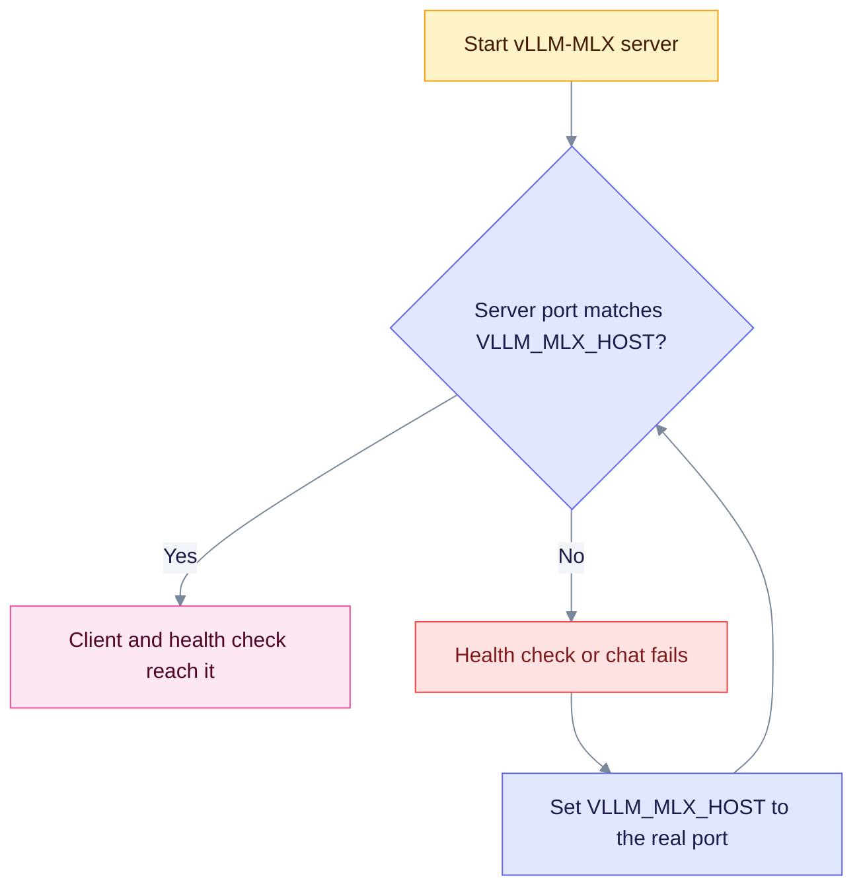

vLLM-MLX is a vLLM-style server for Apple Silicon. EdgeQuake treats it as an OpenAI-shaped local server. This page shows how to connect it and why the port must match in three places.

## When to use

- You run MLX models with a vLLM-style server on a Mac with Apple Silicon.
- You want the same OpenAI-shaped API you use with vLLM elsewhere.

## Configure

```bash
export EDGEQUAKE_LLM_PROVIDER=vllm-mlx
export VLLM_MLX_HOST=http://127.0.0.1:8082
export VLLM_MLX_MODEL=default
```

| Variable | Purpose |
|----------|---------|
| `VLLM_MLX_HOST` | Server URL. Alias `VLLM_MLX_BASE_URL`. |
| `VLLM_MLX_MODEL` | Model name. `default` means the loaded model. |
| `VLLM_MLX_API_KEY` | Optional key. |
| `EDGEQUAKE_EMBEDDING_MODEL` | Embedding model, if offered. Use this variable. `VLLM_MLX_EMBEDDING_MODEL` is not read by the embedding path. |

## Models

- **Chat:** the model your server loaded, or `default`.
- **Embeddings:** set `EDGEQUAKE_EMBEDDING_PROVIDER=vllm-mlx` and `EDGEQUAKE_EMBEDDING_MODEL`. Check vector size with [Roles](roles.md#change-embeddings-with-care).

## Set the port explicitly

The three places that use a port disagree:

| Place | Address |
|-------|---------|
| Client default | `http://127.0.0.1:8000` |
| `/health` and the test probe | `http://127.0.0.1:8082` |
| Your `VLLM_MLX_HOST` | whatever you set |

Start your server on the port you put in `VLLM_MLX_HOST`, so all three agree.



## Verify

```bash
curl "$VLLM_MLX_HOST/v1/models"
curl http://127.0.0.1:8080/health
```

`/health` reports `degraded` when the server does not answer on `/v1/models`. The probe (`POST /api/v1/providers/test` with `"shape":"openai_chat"`) runs the same model list check and a short chat request. See [Test a server](index.md#test-a-server).

## Troubleshoot

- **`/health` is degraded but `curl` works.** `VLLM_MLX_HOST` is not set, so the health check falls back to port 8082 while your server runs elsewhere. Set `VLLM_MLX_HOST` to the real port.
- **Model not found.** Run `curl "$VLLM_MLX_HOST/v1/models"` and copy the id into `VLLM_MLX_MODEL`.
- **Not reachable from Docker.** Replace `127.0.0.1` with `host.docker.internal`.

Related: [Providers overview](index.md), [llama.cpp](llamacpp.md), [MLX-LM](mlx-lm.md).
