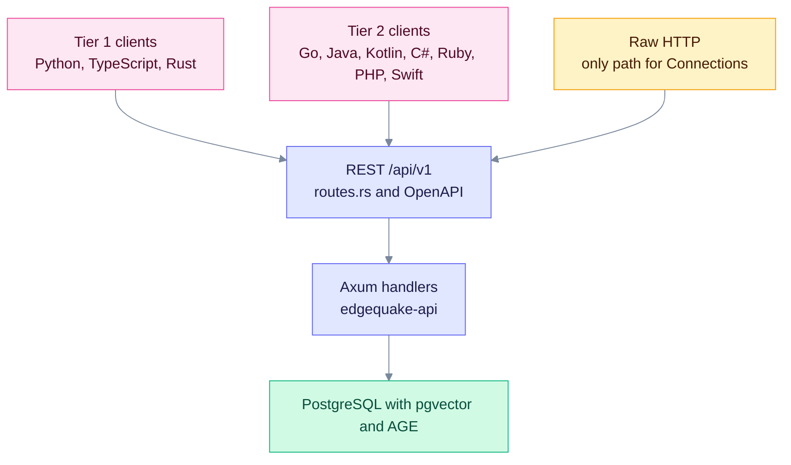

# Brutal honest SDK assessment

This page says what the SDKs cover today, including the gaps and the client bugs. It is for maintainers and integrators who need the truth, not a marketing summary. **Checked:** 2026-10-10 against EdgeQuake **v0.32.2**, plus the v0.33.0 Connections routes in HEAD.

## Where the SDKs sit

Every SDK is a thin client over the same REST routes. Coverage gaps live in the clients, not in the server.

## Contract rules

- Paths and verbs must match `edgequake/crates/edgequake-api/src/routes.rs`. An invented URL is a client bug.
- Request bodies must match the handler DTOs. The query endpoint reads `max_results` and `enable_rerank`.
- Pagination uses `page` and `page_size`. The server reads `page_size` on documents, entities, relationships and tasks.
- The OpenAPI snapshot still wins for optional fields on large structs. SDKs often trim models.

## Version decoupling

The SDK source is **0.4.0** and the product is **0.32.2**. Public registries lag behind the source: PyPI has **0.3.0**, npm has **0.1.0** and crates.io has **0.4.0**. Java, Kotlin, Go, C#, Ruby, PHP and Swift are not on public registries. See [VERSION-POLICY](VERSION-POLICY.md).

## Status by language

| Language | Source version | Registry (2026-10-10) | Wraps Connections | Known issues |
|----------|----------------|-----------------------|-------------------|--------------|
| Python | 0.4.0 | PyPI 0.3.0 | No | Sends `top_k` and `rerank`; `mode` type hint omits `mix`; defaults to `hybrid` |
| TypeScript | 0.4.0 | npm 0.1.0 | No | Package is `edgequake-sdk`, but some comments and examples say `@edgequake/sdk` |
| Rust | 0.4.0 | crates.io 0.4.0 | No | `QueryRequest` has `top_k` and no `max_results`; `mode` is an enum |
| Go | no version field | Not on Go module proxy | No | List calls send `per_page`; the documented `go get` path does not resolve |
| Java | 0.4.0 | Not on Maven Central | No | None found in this pass |
| Kotlin | 0.4.0 | Not on Maven Central | No | `query.execute` defaults to `hybrid` |
| C# | 0.4.0 | Not on NuGet | No | `Query.ExecuteAsync` defaults to `hybrid` |
| Ruby | 0.4.0 | Not on RubyGems | No | `query.execute` defaults to `hybrid` |
| PHP | no version field | Not on Packagist | No | `query->execute` defaults to `hybrid` |
| Swift | no version field | SPM path only | No | `query.execute` defaults to `hybrid`; declares macOS 13 only |

Tier 2 entries come from source reading. They have not been run against a live server.

## Coverage by area

| Area | Tier 1 (Python, TypeScript, Rust) | Tier 2 |
|------|-----------------------------------|--------|
| Document list | Python and TypeScript send `page`, `page_size`, `date_from`, `date_to` and `document_pattern`. Rust has `list_with_query`. | Java, Kotlin, C#, Ruby, PHP and Swift send `page` and `page_size`. Go sends `per_page`. |
| Parse API (SPEC-094) | `parse()`, `backends()` and `job()` in all three | Not audited in this pass |
| Query body | TypeScript sends `max_results` and `enable_rerank`. Python sends `top_k` and `rerank`. Rust has `top_k` only. | Most query methods send `query` and `mode` only |
| Cancel and retry | `tasks` has cancel and retry in all three | Mostly listed, not audited |
| Presentation fields | `display_status` and `ui_phase` are not modelled in any SDK | Same |
| Connections and `providers/test` | Missing | Missing |

## Suspected client bugs

| # | Where | Problem | Evidence |
|---|-------|---------|----------|
| 1 | Python `QueryResource.execute` | Sends `top_k` and `rerank`. The server reads `max_results` and `enable_rerank`, so the values are ignored. | `sdks/python/edgequake/resources/query.py`; `handlers/query_types.rs` |
| 2 | Python `QueryResource.execute` | The `mode` type hint lists only local, global, hybrid and naive. The server also accepts `mix` and `bypass`, and its default is `mix`. | `sdks/python/edgequake/resources/query.py`; `edgequake-query/src/modes.rs` |
| 3 | Rust `QueryRequest` | Models `top_k` and has no `max_results`. `mode` is a `QueryMode` enum, so a string does not compile. | `sdks/rust/src/types/query.rs` |
| 4 | Go list methods | `Documents.List`, `Entity`, `Relationship` and `Task` lists send `per_page`. The server reads `page_size`. | `sdks/go/services.go`; `handlers/documents_types/listing.rs` |
| 5 | Go install path | `github.com/edgequake/edgequake-go` is not on the Go module proxy (404). The module lives in a subdirectory of the monorepo, and `sdks/go/README.md` still tells users to `go get` it. | `sdks/go/README.md`; `proxy.golang.org` check |
| 6 | TypeScript naming | `package.json` says `edgequake-sdk`. `src/index.ts`, `src/client.ts`, `README.md` and `examples/configuration.ts` still say `@edgequake/sdk`. | `sdks/typescript/src/index.ts`; `sdks/typescript/README.md` |
| 7 | MCP stdio package | `@edgequake/mcp-server` depends on `edgequake-sdk ^0.1.0`, while the SDK source is 0.4.0. | `mcp/package.json` |

## Bottom line

- Use Tier 1 for new work. Use TypeScript for query tuning until Python sends `max_results` and `enable_rerank`.
- Install from the monorepo when you need 0.4.0 features. Use a registry pin only when the table says the package is published.
- Call Connections and provider tests with raw HTTP until an SDK release wraps them.
- Track coverage in [SDK-API-COVERAGE](../../specs/009-skd-update/SDK-API-COVERAGE.md).
