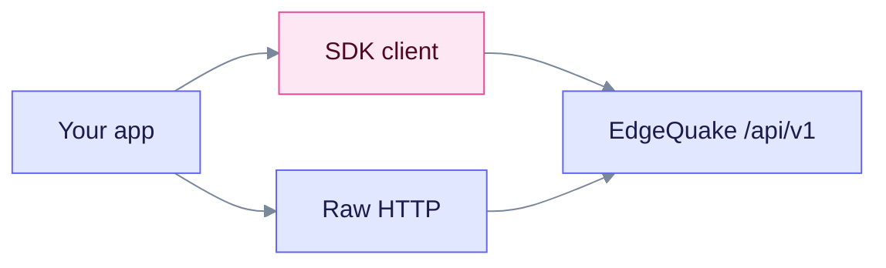

# EdgeQuake SDKs

EdgeQuake ships official HTTP clients for ten languages. Use them when you want a typed library instead of raw `curl`. This page shows which clients exist, where each one is published, and which routes they do not wrap yet.

The server pin is **v0.32.2**. The client source trees in `sdks/` are **0.4.0** and track the HTTP surface, not the product number. The server contract is the OpenAPI snapshot plus `routes.rs`. When an SDK and the server disagree, the server wins.

## How SDKs connect to the server



Use an SDK for common resources. Call Connections and `POST /api/v1/providers/test` with raw HTTP until an SDK wraps them.

## Language matrix

Registry checks ran on 2026-10-10. "Published" means the package is on that registry at the version shown.

| Tier | Language | Source | Package id | Source version | Published | Client class |
|------|----------|--------|------------|----------------|-----------|--------------|
| 1 | Python | [python](python/README.md) | PyPI `edgequake-sdk` | 0.4.0 | **0.3.0** on PyPI | `EdgeQuake` / `AsyncEdgeQuake` |
| 1 | TypeScript | [typescript](typescript/README.md) | npm `edgequake-sdk` | 0.4.0 | **0.1.0** on npm | `EdgeQuake` |
| 1 | Rust | [rust](rust/README.md) | crates.io `edgequake-sdk` | 0.4.0 | **0.4.0** on crates.io | `EdgeQuakeClient` |
| 2 | Go | [go](go/README.md) | `github.com/edgequake/edgequake-go` | no version field (Go 1.21+) | Not on the Go module proxy | `edgequake.NewClient` |
| 2 | Java | [java](java/README.md) | `io.edgequake:edgequake-sdk` | 0.4.0 | Not on Maven Central | `EdgeQuakeClient` |
| 2 | Kotlin | [kotlin](kotlin/README.md) | `io.edgequake:edgequake-sdk-kotlin` | 0.4.0 | Not on Maven Central | `EdgeQuakeClient` |
| 2 | C# | [csharp](csharp/README.md) | `EdgeQuake.SDK` | 0.4.0 | Not on NuGet | `EdgeQuakeClient` |
| 2 | Ruby | [ruby](ruby/README.md) | gem `edgequake` | 0.4.0 | Not on RubyGems | `EdgeQuake::Client` |
| 2 | PHP | [php](php/README.md) | Composer `edgequake/sdk` | no version field | Not on Packagist | `EdgeQuake\Client` |
| 2 | Swift | [swift](swift/README.md) | package `EdgeQuakeSDK` | no version field (Swift 5.9+) | Path / SPM only | `EdgeQuakeClient` |

Install from a registry only when the table says the package is published. Otherwise build from the monorepo path under `sdks/`, as each language page shows.

## Quick start (Python)

```bash
pip install edgequake-sdk==0.3.0   # latest on PyPI
# or from source: pip install ./sdks/python   (source 0.4.0)
```

```python
from edgequake import EdgeQuake

client = EdgeQuake(base_url="http://localhost:8080", api_key="eq-...")
print(client.health().status)
doc = client.documents.upload(content="Marie Curie won two Nobel Prizes.", title="Notes")
answer = client.query.execute(query="How many Nobel Prizes?", mode="mix")
print(answer.answer)
```

Pass `mode="mix"` explicitly. The server default is `mix`, but the Python client defaults to `hybrid`. The Python client also sends `top_k` and `rerank`, which the server ignores. TypeScript sends the server's real fields (`max_results`, `enable_rerank`).

## Coverage notes

| Area | Status |
|------|--------|
| Documents, PDF, query, chat, graph, conversations, tasks, parse | Tier 1 covers most. Tier 2 covers a useful subset. |
| `display_status` / `ui_phase` | The server returns them. No SDK models them yet. |
| Connections, `providers/test`, `llm_roles.connection_id` | Not in any SDK. Use raw HTTP. |
| Go list calls | Documents, entities, relationships and tasks send `per_page`. The server reads `page_size`. |

Further reading: [Brutal assessment](BRUTAL-ASSESSMENT.md) for gaps and client bugs, [Version policy](VERSION-POLICY.md) for pins, [SDK API coverage](../../specs/009-skd-update/SDK-API-COVERAGE.md) for the spec tracker, [Connections](../api-reference/connections.md) for the raw HTTP routes, and the [API reference](../api-reference/index.md).
