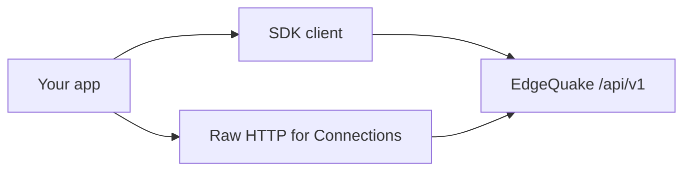

# EdgeQuake SDKs

This page lists the official HTTP clients for EdgeQuake. It is for developers who prefer a typed library over raw `curl`. Server product pin: **v0.32.2**. Client source trees in `sdks/` are versioned **0.4.0** and track the HTTP surface, not the product number.

The server contract is [OpenAPI](../../edgequake_webui/openapi/openapi.snapshot.json) plus `routes.rs`. When an SDK and the server disagree, trust the server. No SDK yet wraps the v0.33.0 Connections or `POST /providers/test` routes — call those with raw HTTP ([Connections](../api-reference/connections.md)).



Read it left to right: use an SDK for common resources, and raw HTTP for brand-new admin routes until the SDKs catch up.

## Language matrix

| Tier | Language | Source | Package id | Source version | Published (checked) | Client class |
|------|----------|--------|------------|----------------|---------------------|--------------|
| 1 | Python | [python](python/README.md) | PyPI `edgequake-sdk` | 0.4.0 | **0.3.0** on PyPI | `EdgeQuake` / `AsyncEdgeQuake` |
| 1 | TypeScript | [typescript](typescript/README.md) | npm `edgequake-sdk` | 0.4.0 | **0.1.0** on npm | `EdgeQuake` |
| 1 | Rust | [rust](rust/README.md) | crates.io `edgequake-sdk` | 0.4.0 | **0.4.0** on crates.io | `EdgeQuakeClient` |
| 2 | Go | [go](go/README.md) | `github.com/edgequake/edgequake-go` | go 1.21+ | Not on pkg.go.dev | `edgequake.NewClient` |
| 2 | Java | [java](java/README.md) | `io.edgequake:edgequake-sdk` | 0.4.0 | Not on Maven Central | `EdgeQuakeClient` |
| 2 | Kotlin | [kotlin](kotlin/README.md) | `io.edgequake:edgequake-sdk-kotlin` | 0.4.0 | Not on Maven Central | `EdgeQuakeClient` |
| 2 | C# | [csharp](csharp/README.md) | `EdgeQuake.SDK` | 0.4.0 | Not on NuGet | `EdgeQuakeClient` |
| 2 | Ruby | [ruby](ruby/README.md) | gem `edgequake` | 0.4.0 | Not on RubyGems | `EdgeQuake::Client` |
| 2 | PHP | [php](php/README.md) | Composer `edgequake/sdk` | (unversioned) | Not on Packagist | `EdgeQuake\Client` |
| 2 | Swift | [swift](swift/README.md) | package `EdgeQuakeSDK` | Swift 5.9+ | Path / SPM only | `EdgeQuakeClient` |

Install from a registry only when the table says it is published. Otherwise build from the monorepo path under `sdks/`.

## Quick start (Python)

```bash
pip install edgequake-sdk==0.3.0   # latest on PyPI
# or: pip install ./sdks/python    # source 0.4.0
```

```python
from edgequake import EdgeQuake

client = EdgeQuake(base_url="http://localhost:8080", api_key="eq-...")
print(client.health().status)
doc = client.documents.upload(content="Marie Curie won two Nobel Prizes.", title="Notes")
answer = client.query.execute(query="How many Nobel Prizes?", mode="mix")
print(answer.answer)
```

See language pages for TypeScript, Rust and the others. Prefer `mode="mix"` (server default). Python currently sends `top_k` / `rerank` on query; the server ignores unknown fields — use typed clients that send `max_results` / `enable_rerank` when available (TypeScript does).

## Coverage notes

| Area | Status |
|------|--------|
| Documents, PDF, query, chat, graph, conversations, tasks, parse | Tier 1 covers most; Tier 2 covers a useful subset |
| `display_status` / `ui_phase` | Present in JSON; not always first-class on models |
| Connections, `providers/test`, `llm_roles.connection_id` | **Not in any SDK** — raw HTTP |
| Go document list | Sends `per_page`; API expects `page_size` (known client bug) |

Deeper honesty: [Brutal assessment](BRUTAL-ASSESSMENT.md). Version rules: [VERSION-POLICY](VERSION-POLICY.md). Spec tracker: [SDK-API-COVERAGE](../../specs/009-skd-update/SDK-API-COVERAGE.md). API overview: [API reference](../api-reference/index.md).
