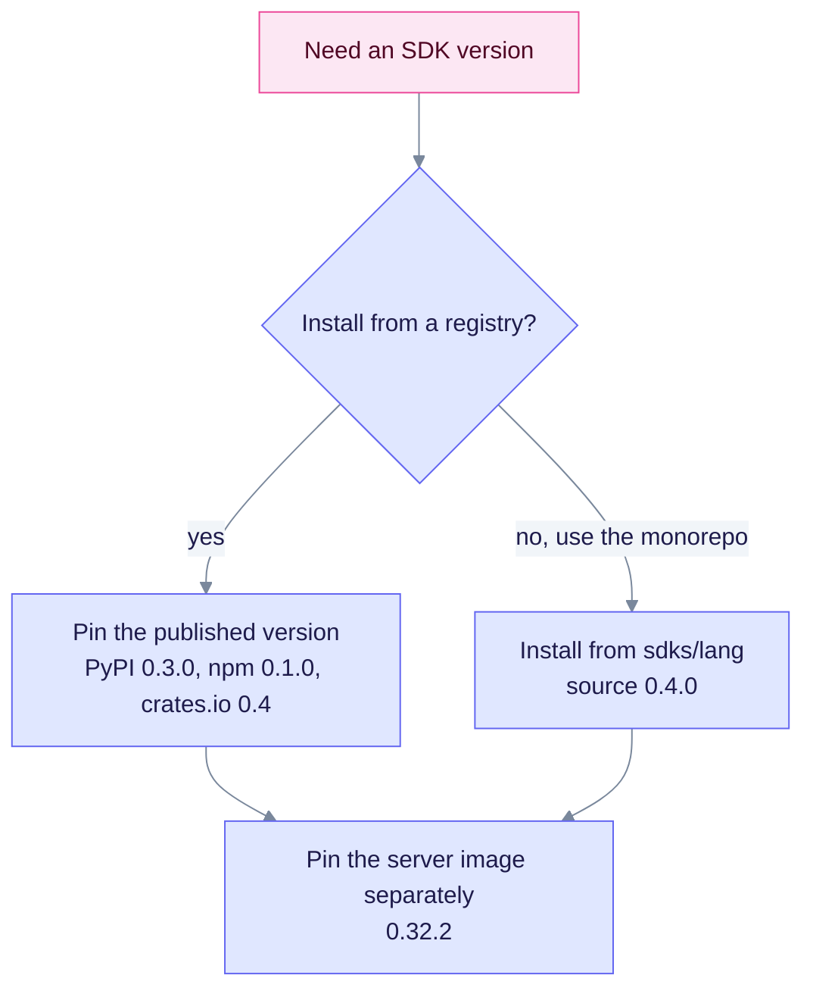

# SDK version policy

The server is at **0.32.2**, but the client libraries say **0.4.0**. This page explains why, and how to choose a pin. It is for release managers and integrators.

## Two version lines

| Surface | Version (2026-10-10) | Meaning |
|---------|----------------------|---------|
| Server, Docker image and workspace crates | **0.32.2** | Product release. Image: `ghcr.io/raphaelmansuy/edgequake:0.32.2` |
| SDK source trees under `sdks/` | **0.4.0** (Go, PHP and Swift have no version field) | Client library semver |
| Published registries | May lag the source | PyPI `edgequake-sdk` **0.3.0**, npm `edgequake-sdk` **0.1.0**, crates.io `edgequake-sdk` **0.4.0**. The other SDKs are not published. |

A 0.4.x client talking to a 0.32.x server is intentional when the OpenAPI paths match. SDK majors bump when the client API breaks, not on every server patch.

## Rules

1. The contract source of truth is the server OpenAPI, generated from `routes.rs`. Refresh it with `make codegen-openapi-refresh`.
2. SDK package versions track client surface changes, not every server patch.
3. When an SDK breaking change ships, bump the SDK major and state the minimum server version in that SDK's README.
4. Root GitHub Actions workflows (`.github/workflows/sdk-*.yml`) run SDK CI. Nested `sdks/*/.github/workflows` files are not run by GitHub Actions. The shared SSOT is `.github/workflows/sdk-ci.yml`.
5. New server routes (for example the v0.33.0 Connections routes) can ship before any SDK wraps them. Call raw HTTP until a client release adds them.

## Choose a pin

Pick the SDK pin from where you install it. Pin the server image on its own line, because the server moves on the product version.

| Goal | Pin |
|------|-----|
| Match published PyPI | `pip install edgequake-sdk==0.3.0` |
| Match published npm | `npm install edgequake-sdk@0.1.0` |
| Match published crates.io | `edgequake-sdk = "0.4"` in `Cargo.toml` |
| Match monorepo HEAD | Install from `sdks/<lang>` (source 0.4.0) |
| Match a server image | Pin the server tag `0.32.2` separately from the SDK |

Related: [SDK overview](README.md), [Brutal assessment](BRUTAL-ASSESSMENT.md).
