# C# SDK

The .NET client is package `EdgeQuake.SDK`, source version **0.4.0**, targeting **`net10.0`**. It is **not published** to NuGet, so reference the project directly from `sdks/csharp`. The client exposes async services such as `Documents`, `Query` and `Entities` on `EdgeQuakeClient`.

## Install

```bash
dotnet add <your-app>.csproj reference <path>/sdks/csharp/src/EdgeQuakeSDK/EdgeQuakeSDK.csproj
```



```mermaid
%%{init: {"theme":"base","themeVariables":{"primaryColor":"#E0E7FF","primaryBorderColor":"#6366F1","primaryTextColor":"#1E1B4B","secondaryColor":"#D1FAE5","secondaryBorderColor":"#10B981","secondaryTextColor":"#064E3B","tertiaryColor":"#FEF3C7","tertiaryBorderColor":"#F59E0B","tertiaryTextColor":"#6B7A90","lineColor":"#7A889C","clusterBkg":"rgba(99,102,241,0.07)","clusterBorder":"#A5B4FC","noteBkgColor":"#FEF9C3","noteTextColor":"#422006","textColor":"#6B7A90","titleColor":"#6B7A90","signalColor":"#7A889C","signalTextColor":"#6B7A90","loopTextColor":"#6B7A90","edgeLabelBackground":"#F1F5F9","actorLineColor":"#94A3B8"}}}%%
%% eq-theme:v1
flowchart LR
    Proj["sdks/csharp/src/EdgeQuakeSDK"] -->|"dotnet add reference"| App["Your .NET app"]
    App --> Client["EdgeQuakeClient"]
    Client --> API["REST /api/v1"]
%% eq-classes
classDef eqActor fill:#FCE7F3,stroke:#EC4899,color:#500724
class Client eqActor
```

The app references the SDK project, so no NuGet feed is needed.

## Example

```csharp
using EdgeQuakeSDK;

var client = new EdgeQuakeClient(new EdgeQuakeConfig {
    BaseUrl = "http://localhost:8080",
    ApiKey = "eq-...",
});

var docs = await client.Documents.ListAsync(page: 1, pageSize: 20);
var answer = await client.Query.ExecuteAsync("What is in my documents?", mode: "mix");
Console.WriteLine(answer.Answer);
```

## Notes

- `Query.ExecuteAsync` defaults `mode` to `"hybrid"`, not the server default `mix`. Pass `mode: "mix"` explicitly.
- Connections and `POST /api/v1/providers/test` are not wrapped. Use raw HTTP ([Connections](../../api-reference/connections.md)).

See the [SDK overview](../README.md) for the full language matrix.
