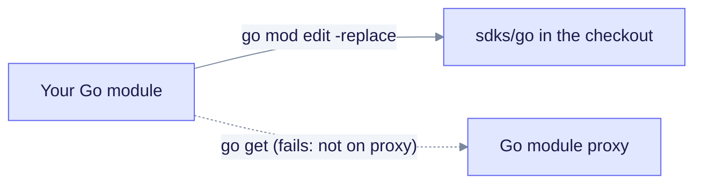

# Go SDK

The Go client lives in `sdks/go` and uses the module path `github.com/edgequake/edgequake-go` with Go 1.21+. The module is **not on the public Go module proxy**, so `go get github.com/edgequake/edgequake-go` fails. Install it from a local checkout with a `replace` directive.

## Install from a checkout

```bash
# Run from your module directory. Replace the path with your checkout.
go mod edit \
  -require=github.com/edgequake/edgequake-go@v0.0.0 \
  -replace=github.com/edgequake/edgequake-go=/path/to/edgequake/sdks/go
go mod tidy
```



The solid path works. The dotted path is what the old install instructions suggested, and it returns a 404.

## Example

```go
package main

import (
    "context"
    "fmt"

    "github.com/edgequake/edgequake-go"
)

func main() {
    c := edgequake.NewClient(edgequake.WithBaseURL("http://localhost:8080"))
    docs, err := c.Documents.List(context.Background(), 1, 20)
    if err != nil {
        panic(err)
    }
    fmt.Println(len(docs.Documents))

    ans, err := c.Query.Execute(context.Background(), &edgequake.QueryRequest{
        Query: "What is in my documents?",
        Mode:  "mix",
    })
    if err != nil {
        panic(err)
    }
    fmt.Println(ans.Answer)
}
```

## Known issues

| Issue | Effect | Workaround |
|-------|--------|------------|
| List calls send `per_page` | `Documents.List`, entity, relationship and task lists. The server reads `page_size`, so the page size is ignored. | Call the REST route directly, or patch the query parameter in `sdks/go/services.go` |
| No registry release | Nothing to pin in `go.sum` | Use the local `replace` above |
| Connections not wrapped | No Go method for `/api/v1/connections` | Use raw HTTP ([Connections](../../api-reference/connections.md)) |

Overview of all clients: [SDK overview](../README.md). Gap list: [Brutal assessment](../BRUTAL-ASSESSMENT.md).
