# Java SDK

The Java client is a Maven artifact, `io.edgequake:edgequake-sdk:0.4.0`, built from `sdks/java`. It targets **Java 17** and is **not published** to Maven Central, so you install it into your local Maven repository first.

## Install

```bash
cd sdks/java && mvn install -DskipTests
```

Then depend on it from your own `pom.xml`:

```xml
<dependency>
  <groupId>io.edgequake</groupId>
  <artifactId>edgequake-sdk</artifactId>
  <version>0.4.0</version>
</dependency>
```



```mermaid
%%{init: {"theme":"base","themeVariables":{"primaryColor":"#E0E7FF","primaryBorderColor":"#6366F1","primaryTextColor":"#1E1B4B","secondaryColor":"#D1FAE5","secondaryBorderColor":"#10B981","secondaryTextColor":"#064E3B","tertiaryColor":"#FEF3C7","tertiaryBorderColor":"#F59E0B","tertiaryTextColor":"#6B7A90","lineColor":"#7A889C","clusterBkg":"rgba(99,102,241,0.07)","clusterBorder":"#A5B4FC","noteBkgColor":"#FEF9C3","noteTextColor":"#422006","textColor":"#6B7A90","titleColor":"#6B7A90","signalColor":"#7A889C","signalTextColor":"#6B7A90","loopTextColor":"#6B7A90","edgeLabelBackground":"#F1F5F9","actorLineColor":"#94A3B8"}}}%%
%% eq-theme:v1
flowchart LR
    Src["sdks/java source"] -->|"mvn install"| Local["Local ~/.m2 repository"]
    Local -->|"dependency in pom.xml"| App["Your Java app"]
    App --> Client["EdgeQuakeClient"]
%% eq-classes
classDef eqActor fill:#FCE7F3,stroke:#EC4899,color:#500724
class Client eqActor
```

Only the local Maven repository holds this artifact until it is published.

## Example

```java
import io.edgequake.sdk.EdgeQuakeClient;
import io.edgequake.sdk.EdgeQuakeConfig;

var config = EdgeQuakeConfig.builder()
    .baseUrl("http://localhost:8080")
    .apiKey("eq-...")
    .build();
var client = new EdgeQuakeClient(config);

var health = client.health().check();
var docs = client.documents().list(1, 20);
```

## Services

`EdgeQuakeClient` exposes services for documents, entities, query, graph, tasks and related operations. Method names follow the REST resources, so check the class in `sdks/java/src` for the exact signatures.

## Limits

- Connections and `POST /api/v1/providers/test` are not wrapped. Use raw HTTP ([Connections](../../api-reference/connections.md)).
- Defaults were not audited in this pass. Pass `mode` explicitly on query calls.

See the [SDK overview](../README.md) for the full language matrix.
