# Kotlin SDK

The Kotlin client is a Maven artifact, `io.edgequake:edgequake-sdk-kotlin:0.4.0`, built from `sdks/kotlin`. It targets **JVM 17**. It is **not published** to Maven Central, so install it into your local Maven repository first.

## Install

```bash
cd sdks/kotlin && mvn install -DskipTests
```

Then depend on it from your own `pom.xml`:

```xml
<dependency>
  <groupId>io.edgequake</groupId>
  <artifactId>edgequake-sdk-kotlin</artifactId>
  <version>0.4.0</version>
</dependency>
```

## Example

```kotlin
import io.edgequake.sdk.EdgeQuakeClient
import io.edgequake.sdk.EdgeQuakeConfig

val client = EdgeQuakeClient(
    EdgeQuakeConfig(baseUrl = "http://localhost:8080", apiKey = "eq-...")
)
val docs = client.documents.list(page = 1, pageSize = 20)
val answer = client.query.execute("What is in my documents?", mode = "mix")
```



```mermaid
%%{init: {"theme":"base","themeVariables":{"primaryColor":"#E0E7FF","primaryBorderColor":"#6366F1","primaryTextColor":"#1E1B4B","secondaryColor":"#D1FAE5","secondaryBorderColor":"#10B981","secondaryTextColor":"#064E3B","tertiaryColor":"#FEF3C7","tertiaryBorderColor":"#F59E0B","tertiaryTextColor":"#6B7A90","lineColor":"#7A889C","clusterBkg":"rgba(99,102,241,0.07)","clusterBorder":"#A5B4FC","noteBkgColor":"#FEF9C3","noteTextColor":"#422006","textColor":"#6B7A90","titleColor":"#6B7A90","signalColor":"#7A889C","signalTextColor":"#6B7A90","loopTextColor":"#6B7A90","edgeLabelBackground":"#F1F5F9","actorLineColor":"#94A3B8"}}}%%
%% eq-theme:v1
flowchart LR
    Src["sdks/kotlin source"] -->|"mvn install"| Local["Local ~/.m2 repository"]
    Local -->|"dependency in pom.xml"| App["Your Kotlin app"]
    App --> Client["EdgeQuakeClient"]
    Client --> API["REST /api/v1"]
%% eq-classes
classDef eqActor fill:#FCE7F3,stroke:#EC4899,color:#500724
class Client eqActor
```

The Kotlin client is a thin layer over the same REST API as the Java client.

## Limits

- The surface matches the [Java SDK](../java/README.md). Check the classes in `sdks/kotlin/src` for exact signatures.
- Connections and `POST /api/v1/providers/test` are not wrapped. Use raw HTTP ([Connections](../../api-reference/connections.md)).
- Query defaults to `hybrid` in the client. Pass `mode = "mix"` to match the server default.

See the [SDK overview](../README.md) for the full language matrix.
