# PHP SDK

The PHP client is Composer package `edgequake/sdk`, requires **PHP 8.1+**, and is **not published** to Packagist. Install it from a Composer path repository that points at `sdks/php`. Build a `Config` object and pass it to `Client`.

## Install

Add the path repository and the package to `composer.json`:

```json
{
  "minimum-stability": "dev",
  "repositories": [{ "type": "path", "url": "sdks/php" }],
  "require": { "edgequake/sdk": "*" }
}
```

`minimum-stability` must be `dev` because the package has no tagged release. Without it, `composer install` fails with a stability error.

```bash
composer install
```



```mermaid
%%{init: {"theme":"base","themeVariables":{"primaryColor":"#E0E7FF","primaryBorderColor":"#6366F1","primaryTextColor":"#1E1B4B","secondaryColor":"#D1FAE5","secondaryBorderColor":"#10B981","secondaryTextColor":"#064E3B","tertiaryColor":"#FEF3C7","tertiaryBorderColor":"#F59E0B","tertiaryTextColor":"#6B7A90","lineColor":"#7A889C","clusterBkg":"rgba(99,102,241,0.07)","clusterBorder":"#A5B4FC","noteBkgColor":"#FEF9C3","noteTextColor":"#422006","textColor":"#6B7A90","titleColor":"#6B7A90","signalColor":"#7A889C","signalTextColor":"#6B7A90","loopTextColor":"#6B7A90","edgeLabelBackground":"#F1F5F9","actorLineColor":"#94A3B8"}}}%%
%% eq-theme:v1
flowchart LR
    Repo["sdks/php path repository"] -->|"composer install"| App["Your PHP app"]
    App --> Config["Config class"]
    Config --> Client["Client class"]
    Client --> API["REST /api/v1"]
%% eq-classes
classDef eqActor fill:#FCE7F3,stroke:#EC4899,color:#500724
class Client eqActor
```

The Composer path repository supplies the package, and the `Config` object carries the connection settings.

## Example

```php
<?php
require __DIR__ . '/vendor/autoload.php';

use EdgeQuake\Client;
use EdgeQuake\Config;

$client = new Client(new Config(baseUrl: 'http://localhost:8080', apiKey: 'eq-...'));

$docs = $client->documents->list(1, 20);
$answer = $client->query->execute('What is in my documents?', 'mix');
```

Passing an associative array to `new Client([...])` throws a `TypeError`. Always pass a `Config`.

## Notes

- `query->execute` defaults `mode` to `'hybrid'`. Pass `'mix'` to match the server default.
- Connections and `POST /api/v1/providers/test` are not wrapped. Use raw HTTP ([Connections](../../api-reference/connections.md)).

See the [SDK overview](../README.md) for the full language matrix.
