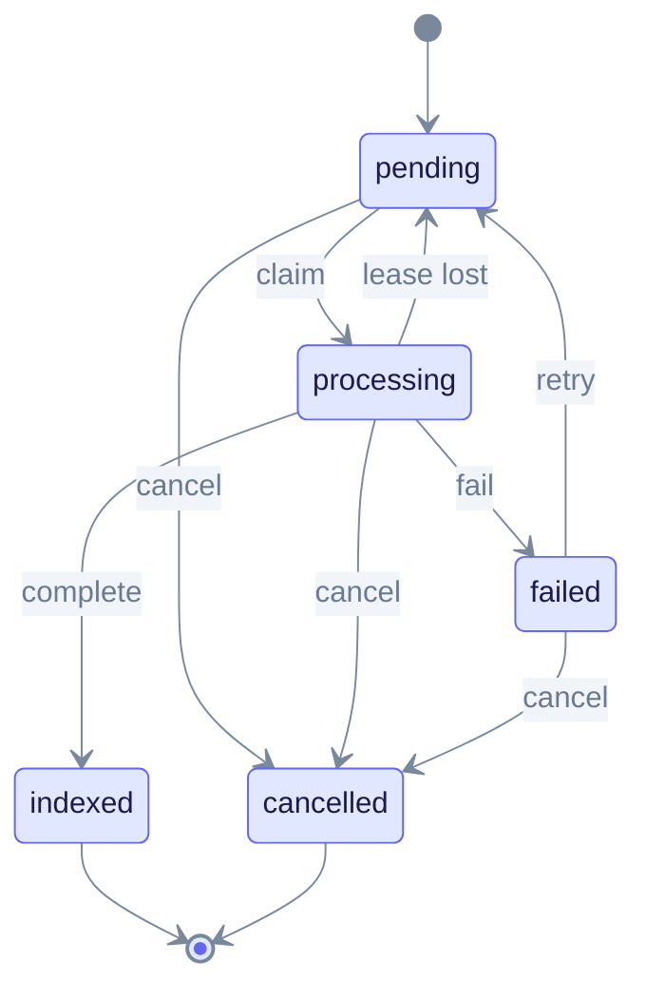

# Python SDK

The Python client wraps the EdgeQuake REST API with a sync client and an async twin. It needs **Python 3.10+**. The source tree is version **0.4.0**, and the latest release on PyPI is **0.3.0**.

## Install

```bash
pip install edgequake-sdk==0.3.0   # latest on PyPI
pip install ./sdks/python          # source tree, 0.4.0
```

## Create a client

```python
from edgequake import EdgeQuake, AsyncEdgeQuake

client = EdgeQuake(
    base_url="http://localhost:8080",
    api_key="eq-...",           # or jwt="..."
    workspace_id="...",         # optional workspace scope
)
print(client.health().status)
```

| Argument | Default | Purpose |
|----------|---------|---------|
| `base_url` | `http://localhost:8080` | Server URL |
| `api_key` / `jwt` | none | `X-API-Key` header or bearer token |
| `tenant_id`, `workspace_id`, `user_id` | none | Scope headers for multi-tenant calls |
| `timeout` | `30.0` seconds | Per-request timeout |
| `max_retries` | `3` | Retries on 429 and 503 |
| `on_token_refresh` | none | Callback that returns a new JWT after a 401 |

For async code, use `AsyncEdgeQuake` with the same resource names:

```python
async with AsyncEdgeQuake(base_url="http://localhost:8080", api_key="eq-...") as client:
    answer = await client.query.execute(query="What is this about?", mode="mix")
```

## Resources

| Attribute | Covers |
|-----------|--------|
| `documents`, `pdf` | Upload, list, delete, track; PDF upload and operations |
| `parse` | Stateless PDF to Markdown: `parse`, `backends`, `job` |
| `query`, `chat` | RAG query and chat, with SSE streaming |
| `graph`, `entities`, `relationships` | Knowledge graph |
| `conversations`, `folders` | Chat history |
| `auth`, `users`, `api_keys`, `tenants` | Identity |
| `workspaces`, `tasks`, `pipeline`, `costs` | Operations |
| `lineage`, `chunks`, `provenance` | Provenance |
| `settings`, `models`, `admin`, `effective_config` | Configuration |

## Upload and track documents

```python
up = client.documents.upload(content="Hello graph.", title="Note")
print(up.document_id, up.task_id)
```

- `task_id` is set for accepted uploads and equals the `track_id`. Pass it to `client.tasks.get(...)` or `client.tasks.cancel(...)`.
- For a duplicate upload, `task_id` is `None` and `duplicate_of` names the existing document.

PDF uploads go through `client.pdf` and return a `pdf_id` plus a `task_id`:

```python
pdf = client.pdf.upload("paper.pdf", title="Paper")
print(pdf.pdf_id, pdf.task_id)
```

The task lifecycle below follows the server state machine in `edgequake-tasks`.



The state diagram shows every transition the server allows. The cancel endpoint itself only accepts `pending` and `processing` tasks. Poll `tasks.get(track_id)` until the status is `indexed`, `failed` or `cancelled`.

## Query

```python
ans = client.query.execute(query="What is this about?", mode="mix")
print(ans.answer)
```

Known gaps on this client:

- The `mode` type hint lists `local`, `global`, `hybrid` and `naive` only. The server also accepts `mix` (its default) and `bypass`. Passing `mode="mix"` works at runtime, but type checkers flag it until the hint is widened.
- The client defaults to `hybrid`, not the server default `mix`.
- The client sends `top_k` and `rerank`. The server ignores them, so the result count is set by the server.

Connections and `providers/test` are not wrapped. Use raw HTTP ([Connections](../../api-reference/connections.md)).

Quickstart walkthrough: [quickstart.md](quickstart.md). API shapes: [REST API](../../api-reference/rest-api.md).
