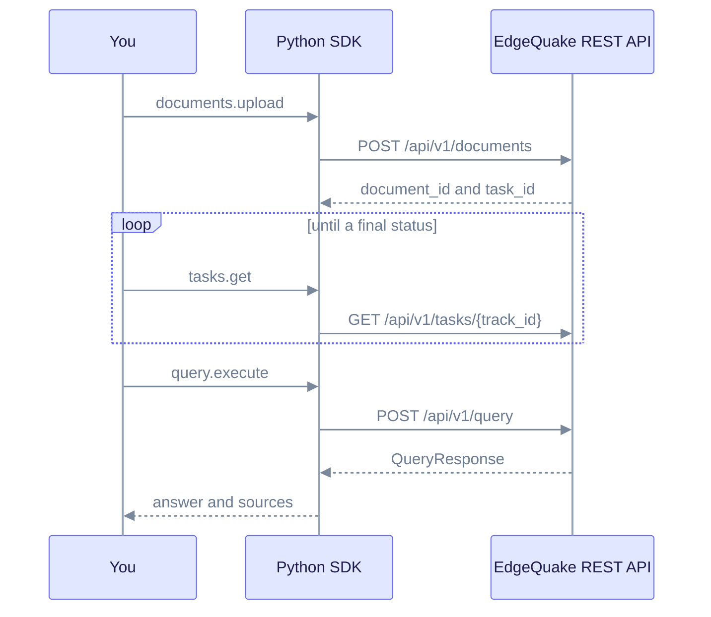

# Python SDK quickstart

This walkthrough uploads a short document, waits for indexing, and asks a question. You need a running EdgeQuake server (`make dev` or an equivalent) and Python 3.10+.

## 1. Install

```bash
pip install edgequake-sdk==0.3.0
```

## 2. Create a client

```python
from edgequake import EdgeQuake

client = EdgeQuake(base_url="http://localhost:8080")
# With auth: EdgeQuake(base_url="...", api_key="eq-...", workspace_id="...")
print(client.health().status)  # "healthy" when the server is ready
```

## 3. Upload and wait

```python
import time

up = client.documents.upload(
    content="Marie Curie won Nobel Prizes in Physics (1903) and Chemistry (1911).",
    title="Curie",
)
if up.task_id is None:
    raise SystemExit(f"Duplicate of {up.duplicate_of}; nothing new to index")

while True:
    task = client.tasks.get(up.task_id)
    if task.status in ("indexed", "failed", "cancelled"):
        break
    time.sleep(1)
if task.status != "indexed":
    raise SystemExit(f"Ingestion ended with status {task.status}")
```

## 4. Query

```python
res = client.query.execute(query="How many Nobel Prizes did Marie Curie win?", mode="mix")
print(res.answer)
for s in res.sources:
    print("-", s.snippet or s.id)
```



Upload, poll the task until it reaches a final status, then query. Read it top to bottom.

Next: [Python README](README.md) for the full resource list, and [Document upload](../../api-reference/document-upload-quick-reference.md).
