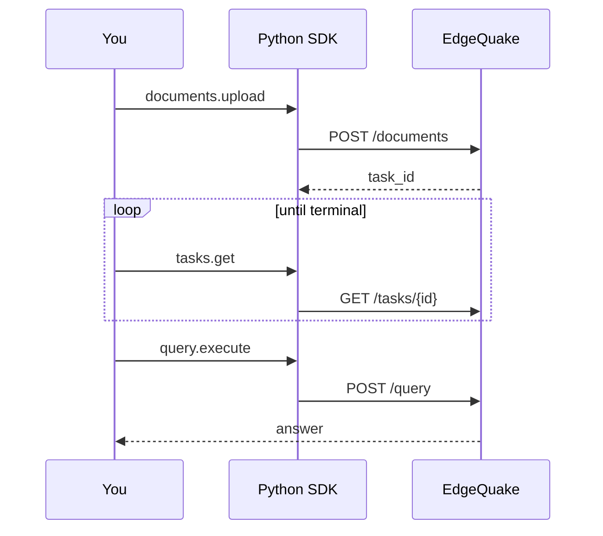

# Python SDK quickstart

This walkthrough uploads a short document and asks a question. You need a running EdgeQuake server (`make dev` or equivalent) and Python 3.10+.

## 1. Install

```bash
pip install edgequake-sdk==0.3.0
```

## 2. Create a client

```python
from edgequake import EdgeQuake

client = EdgeQuake(base_url="http://localhost:8080")
# With auth: EdgeQuake(base_url="...", api_key="eq-...", workspace_id="...")
assert client.health().status in ("healthy", "degraded")
```

## 3. Upload and wait

```python
import time

up = client.documents.upload(
    content="Marie Curie won Nobel Prizes in Physics (1903) and Chemistry (1911).",
    title="Curie",
)
task_id = up.task_id
while True:
    task = client.tasks.get(task_id)
    if task.status in ("indexed", "failed", "cancelled"):
        break
    time.sleep(1)
print("status:", task.status)
```

## 4. Query

```python
res = client.query.execute(query="How many Nobel Prizes did Marie Curie win?", mode="mix")
print(res.answer)
for s in res.sources:
    print("-", getattr(s, "snippet", None) or s)
```



Read it top to bottom: upload, wait for `indexed`, then query. Next: [Python README](README.md), [Document upload](../../api-reference/document-upload-quick-reference.md).
