# Ruby SDK

The Ruby client is gem `edgequake`, source version **0.4.0**, and needs **Ruby 3.0+**. It is **not published** to RubyGems, so install it from a path in your Gemfile. Build a `EdgeQuake::Config` first, then pass it to `EdgeQuake::Client`.

## Install

```ruby
# Gemfile
gem "edgequake", path: "sdks/ruby"
```

```bash
bundle install
```



```mermaid
%%{init: {"theme":"base","themeVariables":{"primaryColor":"#E0E7FF","primaryBorderColor":"#6366F1","primaryTextColor":"#1E1B4B","secondaryColor":"#D1FAE5","secondaryBorderColor":"#10B981","secondaryTextColor":"#064E3B","tertiaryColor":"#FEF3C7","tertiaryBorderColor":"#F59E0B","tertiaryTextColor":"#6B7A90","lineColor":"#7A889C","clusterBkg":"rgba(99,102,241,0.07)","clusterBorder":"#A5B4FC","noteBkgColor":"#FEF9C3","noteTextColor":"#422006","textColor":"#6B7A90","titleColor":"#6B7A90","signalColor":"#7A889C","signalTextColor":"#6B7A90","loopTextColor":"#6B7A90","edgeLabelBackground":"#F1F5F9","actorLineColor":"#94A3B8"}}}%%
%% eq-theme:v1
flowchart LR
    Gem["sdks/ruby gem"] -->|"Gemfile path"| App["Your Ruby app"]
    App --> Config["EdgeQuake::Config"]
    Config --> Client["EdgeQuake::Client"]
    Client --> API["REST /api/v1"]
%% eq-classes
classDef eqActor fill:#FCE7F3,stroke:#EC4899,color:#500724
class Client eqActor
```

The `Config` object carries the connection settings and is passed to the client.

## Example

```ruby
require "edgequake"

config = EdgeQuake::Config.new(base_url: "http://localhost:8080", api_key: "eq-...")
client = EdgeQuake::Client.new(config: config)

docs = client.documents.list(page: 1, page_size: 20)
answer = client.query.execute(query: "What is in my documents?", mode: "mix")
puts answer
```

Passing `base_url:` and `api_key:` straight to `EdgeQuake::Client.new` raises `unknown keywords`. Always go through `EdgeQuake::Config`.

## Notes

- `query.execute` defaults `mode` to `"hybrid"`. Pass `mode: "mix"` to match the server default.
- Connections and `POST /api/v1/providers/test` are not wrapped. Use raw HTTP ([Connections](../../api-reference/connections.md)).

See the [SDK overview](../README.md) for the full language matrix.
