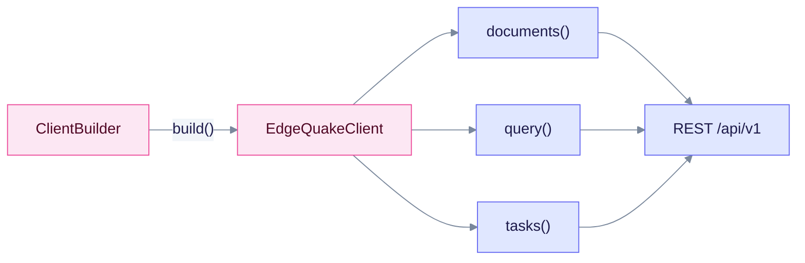

# Rust SDK

The Rust client is an async crate built on Tokio. It is the only SDK whose latest source version (**0.4.0**) matches its published crates.io release. Use `EdgeQuakeClient` for documents, query, parse and the other resources, and `ClientBuilder` to configure the base URL and API key.

## Install

```toml
[dependencies]
edgequake-sdk = "0.4"
tokio = { version = "1", features = ["full"] }
```

## Example

This snippet compiles against `edgequake-sdk` 0.4.0.

```rust
use edgequake_sdk::types::query::{QueryMode, QueryRequest};
use edgequake_sdk::ClientBuilder;

#[tokio::main]
async fn main() -> Result<(), Box<dyn std::error::Error>> {
    let client = ClientBuilder::default()
        .base_url("http://localhost:8080")
        .api_key("eq-...")
        .build()?;

    let health = client.health().check().await?;
    println!("{health:?}");

    let ans = client
        .query()
        .execute(&QueryRequest {
            query: "What is in my documents?".into(),
            mode: Some(QueryMode::Mix),
            ..Default::default()
        })
        .await?;
    println!("{:?}", ans.answer);
    Ok(())
}
```

`mode` is a `QueryMode` enum, so a plain string such as `"mix".into()` does not compile.



`ClientBuilder` produces one `EdgeQuakeClient`, and each resource method sends a request to the same REST API.

## Request fields

| Field | Type | Notes |
|-------|------|-------|
| `query` | `String` | Required question text |
| `mode` | `Option<QueryMode>` | Use `QueryMode::Mix` to match the server default |
| `top_k` | field on `QueryRequest` | There is no `max_results` field in this crate |

## Resources

Resources mirror the REST API: `documents`, `pdf`, `parse`, `query`, `chat`, `graph`, `conversations`, `tasks`, and more. Each one is a method on `EdgeQuakeClient`.

## Limits

- Connections and `POST /api/v1/providers/test` are not wrapped. Use raw HTTP ([Connections](../../api-reference/connections.md)).
- `display_status` and `ui_phase` are not modelled.

Next steps: [Rust quickstart](quickstart.md). Overview of all clients: [SDK overview](../README.md).
