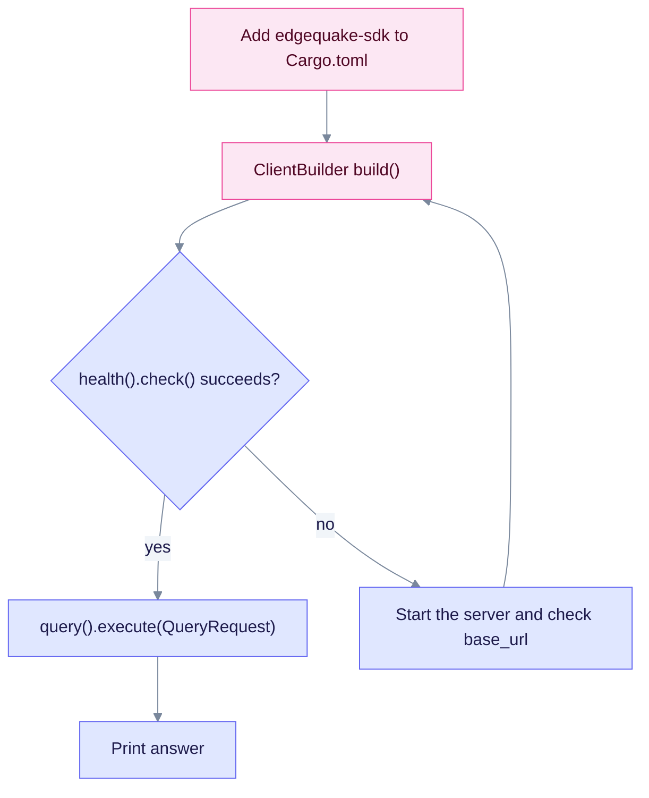

# Rust SDK quickstart

This guide adds the crate to a Cargo project, checks the server, and runs one query. You need Rust with Cargo and a running EdgeQuake server on port 8080.

## 1. Add the crate

```toml
[dependencies]
edgequake-sdk = "0.4"
tokio = { version = "1", features = ["full"] }
```

## 2. Check the server

```rust
use edgequake_sdk::ClientBuilder;

#[tokio::main]
async fn main() -> Result<(), Box<dyn std::error::Error>> {
    let client = ClientBuilder::default()
        .base_url("http://localhost:8080")
        .build()?;
    println!("{:?}", client.health().check().await?);
    Ok(())
}
```

## 3. Ask a question

Use the query snippet in the [Rust README](README.md#example). It sets `mode: Some(QueryMode::Mix)` and passes the API key if the server needs one.



The flow checks the server before the query, so a wrong base URL fails early.

Upload and task polling are covered in [Document upload](../../api-reference/document-upload-quick-reference.md).
