# Swift SDK

The Swift client is the `EdgeQuakeSDK` product, built with Swift 5.9 and targeting **macOS 13+**. It is distributed as source under `sdks/swift` and installed as a Swift Package Manager path dependency. Create an `EdgeQuakeClient` from an `EdgeQuakeConfig`, then call the async services.

## Install

Add the path dependency and product to your `Package.swift`:

```swift
dependencies: [
    .package(path: "<path>/sdks/swift"),
],
targets: [
    .executableTarget(
        name: "App",
        dependencies: [.product(name: "EdgeQuakeSDK", package: "swift")]
    ),
]
```

The `package: "swift"` value is the directory name of the path dependency, not the product name.

```mermaid
%%{init: {"theme":"base","themeVariables":{"primaryColor":"#E0E7FF","primaryBorderColor":"#6366F1","primaryTextColor":"#1E1B4B","secondaryColor":"#D1FAE5","secondaryBorderColor":"#10B981","secondaryTextColor":"#064E3B","tertiaryColor":"#FEF3C7","tertiaryBorderColor":"#F59E0B","tertiaryTextColor":"#6B7A90","lineColor":"#7A889C","clusterBkg":"rgba(99,102,241,0.07)","clusterBorder":"#A5B4FC","noteBkgColor":"#FEF9C3","noteTextColor":"#422006","textColor":"#6B7A90","titleColor":"#6B7A90","signalColor":"#7A889C","signalTextColor":"#6B7A90","loopTextColor":"#6B7A90","edgeLabelBackground":"#F1F5F9","actorLineColor":"#94A3B8"}}}%%
%% eq-theme:v1
flowchart LR
    Pkg["sdks/swift path package"] -->|"SPM path dependency"| App["Your Swift target"]
    App --> Client["EdgeQuakeClient"]
    Client --> API["REST /api/v1"]
%% eq-classes
classDef eqActor fill:#FCE7F3,stroke:#EC4899,color:#500724
class Client eqActor
```



The path dependency builds the SDK inside your package, so no separate download step is needed.

## Example

```swift
import EdgeQuakeSDK

let client = EdgeQuakeClient(config: EdgeQuakeConfig(
    baseUrl: "http://localhost:8080",
    apiKey: "eq-..."
))

let docs = try await client.documents.list(page: 1, pageSize: 20)
let answer = try await client.query.execute(query: "What is in my documents?", mode: "mix")
print(answer.answer ?? "")
```

## Notes

- `query.execute` defaults `mode` to `"hybrid"`. Pass `mode: "mix"` to match the server default.
- Connections and `POST /api/v1/providers/test` are not wrapped. Use raw HTTP ([Connections](../../api-reference/connections.md)).

See the [SDK overview](../README.md) for the full language matrix.
