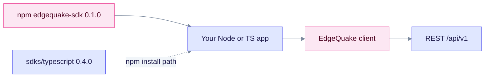

# TypeScript SDK

The TypeScript client is the official JavaScript and TypeScript SDK for EdgeQuake. The npm package is **`edgequake-sdk`** (not `@edgequake/sdk`), and it requires **Node.js 18+**. The source tree is version **0.4.0**, and the latest npm release is **0.1.0**.

## Install

```bash
npm install edgequake-sdk@0.1.0   # latest on npm
# or from source: npm install ./sdks/typescript   (0.4.0)
```



Use the npm release for stable installs. Use the source tree when you need the 0.4.0 changes.

## Example

```ts
import { EdgeQuake } from "edgequake-sdk";

const client = new EdgeQuake({
  baseUrl: "http://localhost:8080",
  apiKey: "eq-...",
  workspaceId: "...",
});

const health = await client.health();
const answer = await client.query.execute({
  query: "What is in my documents?",
  mode: "mix",
  max_results: 10,
});
console.log(answer.answer);
```

## Resources

| Resource | Covers |
|----------|--------|
| `documents` (with `documents.pdf`) | Upload, list, delete, PDF |
| `parse` | Stateless PDF to Markdown |
| `query`, `chat` | RAG query and chat |
| `graph` (with `graph.entities` and `graph.relationships`) | Knowledge graph |
| `conversations`, `folders` | Chat history |
| `auth`, `users`, `apiKeys`, `tenants`, `workspaces` | Identity |
| `tasks`, `pipeline`, `costs`, `lineage`, `chunks` | Operations and provenance |
| `settings`, `models` | Configuration |

Streaming helpers: `parseSSEStream` and `EdgeQuakeWebSocket`.

## Query fields

The query request uses the server's real field names:

| Field | Purpose |
|-------|---------|
| `mode` | `naive`, `local`, `global`, `hybrid` or `mix` |
| `max_results` | Result cap |
| `enable_rerank` | Turn on reranking |
| `llm_provider` | Provider override |

## Notes

- Connections and `POST /api/v1/providers/test` are not wrapped. Use raw HTTP ([Connections](../../api-reference/connections.md)).
- Do not import from `@edgequake/sdk`. Some comments and examples still use that name, which is a known documentation issue.

Next steps: [TypeScript quickstart](quickstart.md). API details: [REST API](../../api-reference/rest-api.md).
