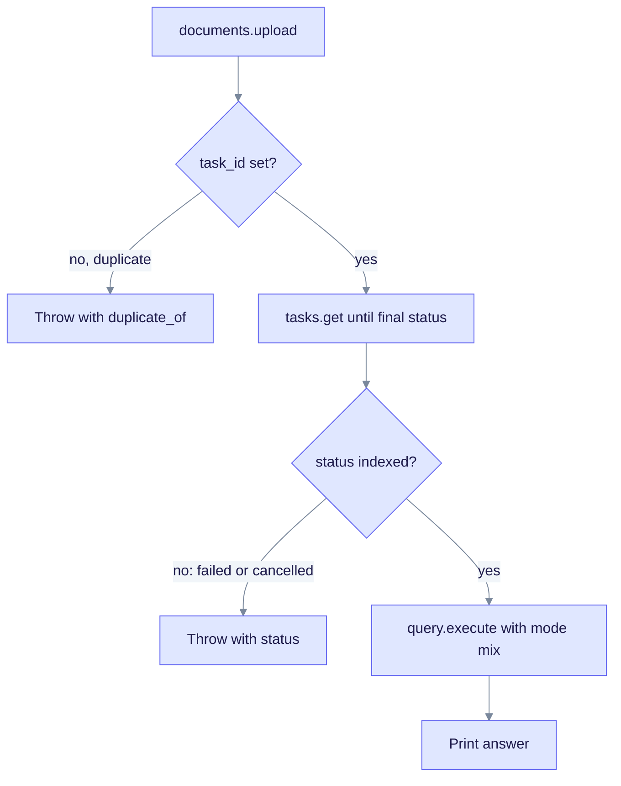

# TypeScript SDK quickstart

This guide uploads one document, waits until it is indexed, and asks a question. You need Node.js 18+ and a running EdgeQuake server on port 8080.

## 1. Install

```bash
npm install edgequake-sdk@0.1.0
```

## 2. Upload and wait for indexing

```ts
import { EdgeQuake } from "edgequake-sdk";

const client = new EdgeQuake({ baseUrl: "http://localhost:8080" });

const up = await client.documents.upload({
  content: "Marie Curie won two Nobel Prizes.",
  title: "Curie",
});
if (!up.task_id) {
  throw new Error(`Duplicate upload of ${up.duplicate_of}`);
}

let status = "pending";
while (status === "pending" || status === "processing") {
  const task = await client.tasks.get(up.task_id);
  status = task.status;
  await new Promise((r) => setTimeout(r, 1000));
}
if (status !== "indexed") {
  throw new Error(`Ingestion ended with status ${status}`);
}
```

## 3. Query

```ts
const res = await client.query.execute({
  query: "How many Nobel Prizes did Marie Curie win?",
  mode: "mix",
});
console.log(res.answer);
```



Upload and polling come before the query. A duplicate or a failed task stops the script with a clear error.

Next: [TypeScript README](README.md) for the resource list, and [Document upload](../../api-reference/document-upload-quick-reference.md).
