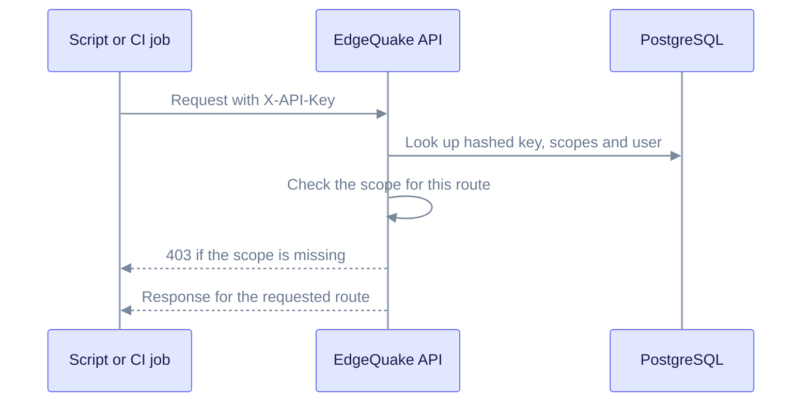

SSO covers people at a browser. Programs use API keys, or the MCP OAuth flow (SPEC-154). An SSO user creates an API key with the normal endpoint and the session token, so the same rules apply: tenant binding, scopes and token audience.

## Create an API key

1. Sign in, then call the key endpoint with the access token from the handoff.
2. Pick the scopes and an optional expiry. Omit `scopes` to get read and query.

```bash
curl -X POST http://localhost:8080/api/v1/api-keys \
  -H "Authorization: Bearer $ACCESS_TOKEN" \
  -H "Content-Type: application/json" \
  -d '{"name":"ci","scopes":["edgequake:read","edgequake:query"],"expires_in_days":90}'
```

The response shows the key once. The server stores only an Argon2 hash. Keys start with `eq_`.

| Scope | Allows |
|-------|--------|
| `edgequake:read` | Read endpoints |
| `edgequake:query` | Query endpoints (`POST /api/v1/query` and related routes) |
| `edgequake:write` | Changes to data. Not granted by default. |

Legacy names (`read`, `query`, `write`) are accepted and normalized to the scopes above. A key with `edgequake:write` acts as a `user`. A key without it acts as `readonly`. See the [security guide](../best-practices.md#credential-types) for all credential types.

## Use the key

Send the key in either header. Both are accepted:

- `X-API-Key: eq_...`
- `Authorization: Bearer eq_...`



The key is checked on every request. A missing scope returns 403, and an inactive user or an expired key returns 401.

## What revokes what

| Event | Effect |
|-------|--------|
| Back-channel logout from the IdP | Revokes the SSO session (refresh family and federated session). It does not revoke API keys that were already issued. |
| Revoke a key (`DELETE /api/v1/api-keys/{key_id}`) | The key stops working at once. |
| Deactivate the user | The user's JWTs and keys stop working, because the account is checked on each request. |
| Remove a membership or suspend a tenant | Session refresh fails at once with `membership_revoked` or `tenant_suspended`. |

## MCP OAuth

MCP clients discover the OAuth endpoints from public well-known paths, such as `/.well-known/oauth-authorization-server`. These discovery endpoints stay public. The token endpoints are `POST /oauth/token`, `POST /oauth/revoke` and `POST /oauth/register`, and the authorization endpoint is `GET /oauth/authorize`.

The MCP endpoint `POST /mcp` does its own authentication. MCP tokens are refused on the REST API.
