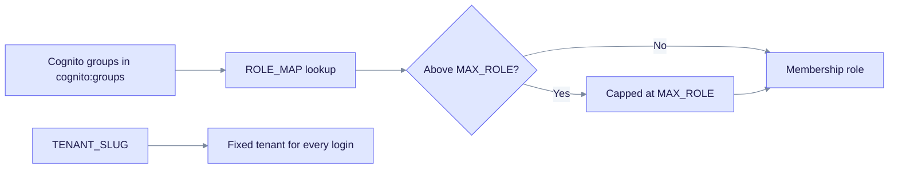

AWS Cognito sign-in connects to EdgeQuake over OIDC. Cognito has no organization claim, so one tenant is pinned for all logins. Cognito groups become EdgeQuake roles through `EDGEQUAKE_OIDC_ROLE_MAP`.

## What you need

- A Cognito user pool and an app client. Use a confidential client (with a client secret) and the authorization-code grant.
- The scopes `openid email profile`.
- The callback URL `https://<api>/api/v1/auth/oidc/callback`.
- A tenant slug to pin logins to.

## Configure EdgeQuake

```bash
EDGEQUAKE_OIDC_ENABLED=true
EDGEQUAKE_OIDC_KIND=cognito
EDGEQUAKE_OIDC_SLUG=aws
EDGEQUAKE_OIDC_ISSUER_URL=https://cognito-idp.<region>.amazonaws.com/<pool-id>
EDGEQUAKE_OIDC_CLIENT_ID=...
EDGEQUAKE_OIDC_CLIENT_SECRET=...
EDGEQUAKE_OIDC_REDIRECT_URI=https://<api>/api/v1/auth/oidc/callback
EDGEQUAKE_OIDC_SUCCESS_REDIRECT_URL=https://<app>/auth/callback
EDGEQUAKE_OIDC_ROLE_CLAIM=cognito:groups
EDGEQUAKE_OIDC_ROLE_MAP={"eq-admin":"admin"}
EDGEQUAKE_OIDC_TENANT_SLUG=acme
```

Groups arrive in the `cognito:groups` claim (this is also the default for `kind=cognito`). Each group is mapped through `EDGEQUAKE_OIDC_ROLE_MAP`. The result is capped by `EDGEQUAKE_OIDC_MAX_ROLE`, which defaults to `admin`. See [Tenants, organizations and roles](tenant-and-roles.md) for the full rules.

## How a Cognito login is checked



Groups that are not in the map get `EDGEQUAKE_OIDC_DEFAULT_ROLE` (default `member`). The tenant does not depend on the token, because the pin is set in the configuration.

## IAM Identity Center

For IAM Identity Center, connect it to Keycloak as a SAML or OIDC identity provider, then point EdgeQuake at Keycloak. Keycloak keeps the organization-to-tenant mapping, which Cognito cannot provide. See the [Keycloak quickstart](keycloak-quickstart.md).

## Verify

1. Check that EdgeQuake lists the provider: `curl https://<api>/api/v1/auth/sso/providers`.
2. Open `https://<api>/api/v1/auth/oidc/login?provider=aws`. The browser should go to the Cognito hosted sign-in page.
3. After sign-in, check the role of the test user. A user in `eq-admin` should get the `admin` membership role.

## Troubleshoot

| Symptom | Cause | Fix |
|---------|-------|-----|
| Every user gets `member` | The groups claim is empty or the name does not match `ROLE_MAP` | Check the group names in Cognito and the `cognito:groups` claim in the ID token |
| A group grants less than expected | `MAX_ROLE` caps the role | Raise `EDGEQUAKE_OIDC_MAX_ROLE` only if you want that ceiling |
| Login fails at the Cognito page | Wrong callback URL or client secret | Compare the callback URL and secret in the app client with the EdgeQuake values |

All variables are listed in the [SSO environment reference](env-reference.md).
