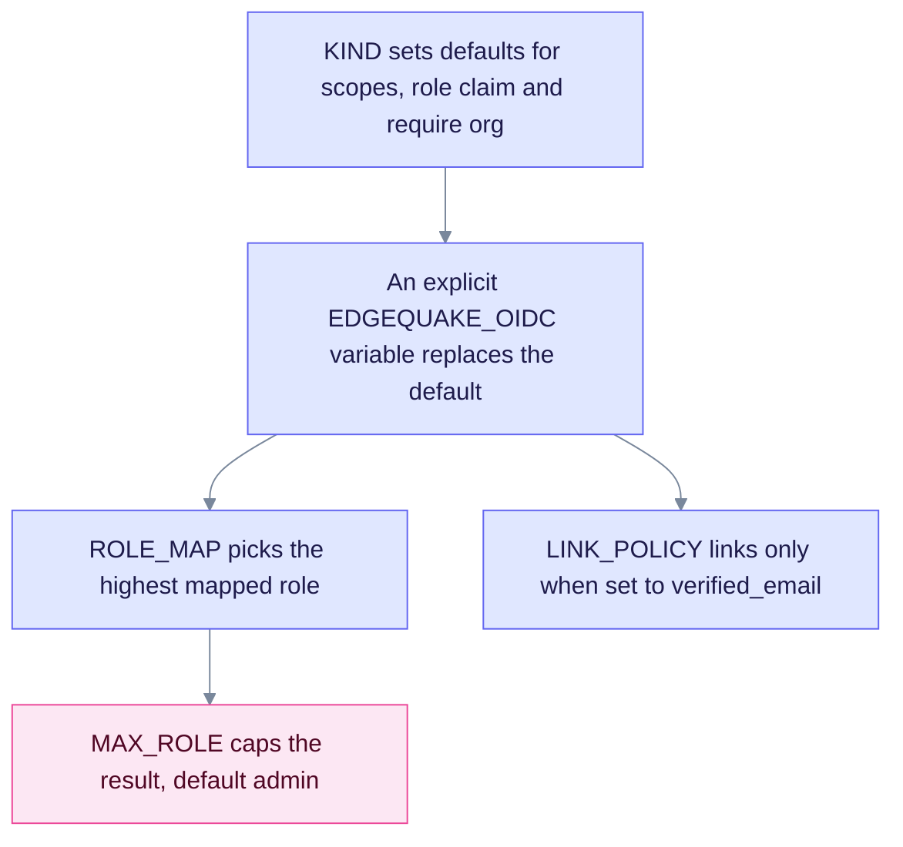

Every SSO setting starts with `EDGEQUAKE_OIDC_`. The defaults are the safest values. A commented starter block is in `.env.example`. Use this page as the full reference.

## How values combine

A kind sets defaults, an explicit variable overrides them, and the caps apply last. The chart shows the order.

Read it from the top: a kind is only a starting point. Explicit variables win, and the role cap is applied last, so the identity provider can never grant more than `MAX_ROLE`.

## Variables

| Variable | Default | Purpose |
|----------|---------|---------|
| `EDGEQUAKE_OIDC_ENABLED` | `false` | Master switch |
| `EDGEQUAKE_OIDC_ISSUER_URL` | - | Issuer. Must equal the `issuer` in the discovery document. |
| `EDGEQUAKE_OIDC_CLIENT_ID` / `_CLIENT_SECRET` | - | Confidential client |
| `EDGEQUAKE_OIDC_REDIRECT_URI` | - | `https://<api>/api/v1/auth/oidc/callback` |
| `EDGEQUAKE_OIDC_SUCCESS_REDIRECT_URL` | - | Web app landing page, for example `https://<app>/auth/callback` |
| `EDGEQUAKE_OIDC_KIND` | `generic` | `generic`, `keycloak`, `google`, `entra` or `cognito`. Sets defaults only. `azure` and `microsoft` mean `entra`, and `aws` means `cognito`. |
| `EDGEQUAKE_OIDC_SLUG` | Kind name (`oidc` for generic) | Provider ID, used as `?provider=` |
| `EDGEQUAKE_OIDC_DISPLAY_NAME` | `Single sign-on` | Login button label |
| `EDGEQUAKE_OIDC_TRUST_EMAIL` | `false` | Trust the `email_verified` claim |
| `EDGEQUAKE_OIDC_LINK_POLICY` | `never` | `never` or `verified_email`. Any other value, including `always`, means `never`. |
| `EDGEQUAKE_OIDC_JIT` | `true` | Create users automatically on first login |
| `EDGEQUAKE_OIDC_REQUIRE_ORG` | `false` (`true` for keycloak) | Deny logins that have no organization |
| `EDGEQUAKE_OIDC_TENANT_SLUG` | - | Pin the provider to one tenant |
| `EDGEQUAKE_OIDC_SCOPES` | Kind default: `profile` for keycloak, google, entra and cognito; none for generic | Comma-separated scopes beyond `openid email`. Replaces the kind default. |
| `EDGEQUAKE_OIDC_ROLE_CLAIM` | Keycloak: `realm_access.roles`. Entra: `roles`. Cognito: `cognito:groups`. | Claim that carries IdP roles or groups |
| `EDGEQUAKE_OIDC_ROLE_MAP` | Empty | Maps IdP roles to a membership role. JSON, for example `{"eq-admin":"admin"}`. Unknown roles are dropped. |
| `EDGEQUAKE_OIDC_DEFAULT_ROLE` | `member` | Role when no IdP role is mapped |
| `EDGEQUAKE_OIDC_MAX_ROLE` | `admin` | Ceiling for any IdP-granted role. Set `owner` only if the IdP may grant owners. |
| `EDGEQUAKE_OIDC_ALLOWED_HD` | - | Comma-separated Google domains. Non-empty means the `hd` claim must match. |
| `EDGEQUAKE_OIDC_ALLOWED_TID` | - | Comma-separated Entra directory IDs. Non-empty means the `tid` claim must match. |
| `EDGEQUAKE_STRICT_TENANT_BIND` | `false`. Forced on with SSO outside dev mode. | Reject token and header tenant mismatches |

Runtime providers (admin only): `GET /api/v1/admin/identity-providers`, and `PUT` or `DELETE /api/v1/admin/identity-providers/{slug}`.

Public, secret-free list for the login page: `GET /api/v1/auth/sso/providers`.

Compose overlay (`docker-compose.keycloak.yml`): `KC_PUBLIC_URL`, `EQ_API_PUBLIC_URL`, `EQ_WEB_PUBLIC_URL`, `EQ_KC_CLIENT_SECRET`, `EQ_KC_DEMO_PASSWORD`, `EQ_KC_SSL_REQUIRED` and `EDGEQUAKE_KEYCLOAK_IMAGE`.
