EdgeQuake does not accept GitHub directly. GitHub speaks OAuth2 only and does not issue an OIDC ID token. Connect GitHub to Keycloak instead, and let EdgeQuake use the Keycloak OIDC login. This decision is recorded in SPEC-158.

## What you need

- A GitHub OAuth App.
- A Keycloak realm (the shipped `edgequake` realm, or your own) with an organization for each tenant.
- EdgeQuake configured for Keycloak, as in the [Keycloak quickstart](keycloak-quickstart.md).

## Configure GitHub and Keycloak

1. In GitHub, open **Settings**, **Developer settings**, **OAuth Apps**, then **New OAuth App**. Set the callback URL to `https://<keycloak>/realms/edgequake/broker/github/endpoint`.
2. In the Keycloak realm, add a GitHub identity provider with the client ID and secret from step 1.
3. Keep **Trust Email** off on the Keycloak broker. Keep `EDGEQUAKE_OIDC_TRUST_EMAIL=false` in EdgeQuake. GitHub emails are user-controlled, so they must not link accounts.
4. Put users in a Keycloak Organization so the tenant claim is present, or invite them explicitly. See [Tenants, organizations and roles](tenant-and-roles.md).

## How the sign-in is chained

```mermaid
%%{init: {"theme":"base","themeVariables":{"primaryColor":"#E0E7FF","primaryBorderColor":"#6366F1","primaryTextColor":"#1E1B4B","secondaryColor":"#D1FAE5","secondaryBorderColor":"#10B981","secondaryTextColor":"#064E3B","tertiaryColor":"#FEF3C7","tertiaryBorderColor":"#F59E0B","tertiaryTextColor":"#6B7A90","lineColor":"#7A889C","clusterBkg":"rgba(99,102,241,0.07)","clusterBorder":"#A5B4FC","noteBkgColor":"#FEF9C3","noteTextColor":"#422006","textColor":"#6B7A90","titleColor":"#6B7A90","signalColor":"#7A889C","signalTextColor":"#6B7A90","loopTextColor":"#6B7A90","edgeLabelBackground":"#F1F5F9","actorLineColor":"#94A3B8"}}}%%
%% eq-theme:v1
flowchart LR
  U["User"] --> G["GitHub OAuth"]
  G --> K["Keycloak broker"]
  K --> E["EdgeQuake OIDC callback"]
  E --> T["Tenant from the organization claim"]
%% eq-classes
classDef eqActor fill:#FCE7F3,stroke:#EC4899,color:#500724
class U eqActor
```

The user signs in to GitHub, and Keycloak brokers the login. EdgeQuake sees only a normal Keycloak token, so the rules for Keycloak apply.

## Verify

1. Open the EdgeQuake login page and choose **Continue with Single sign-on**.
2. On the Keycloak page, choose GitHub and sign in.
3. You should land in the expected tenant. If you belong to no organization, the login is denied with `org_missing`.

## Troubleshoot

| Symptom | Cause | Fix |
|---------|-------|-----|
| `?error=account_exists_unlinked` | A local account has the same email | Sign in with the local password. Keep email linking off for GitHub (`LINK_POLICY=never`, `TRUST_EMAIL=false`). |
| `?error=org_missing` | The Keycloak user is in no organization | Add the user to an organization |
| `?error=org_unknown` | No EdgeQuake tenant has the organization's slug | Create the tenant with the same slug as the Keycloak organization |
