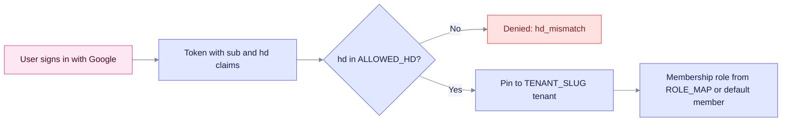

Google sign-in works in two ways. Connect Google directly for one Google Workspace domain. Or add Google to Keycloak, which keeps organization mapping in one place and is the preferred route.

## What you need

- A Google Cloud project with a **Web application** OAuth client.
- The authorized redirect URI `https://<api>/api/v1/auth/oidc/callback`.
- Your Workspace domain for the hosted-domain (`hd`) allow-list.
- A tenant slug to pin logins to, because Google has no organization claim.

## Configure EdgeQuake (direct OIDC)

1. In the Google Cloud console, open **APIs & Services**, then **Credentials**. Create a **Web application** OAuth client and add the redirect URI above.
2. Set the variables:

```bash
EDGEQUAKE_OIDC_ENABLED=true
EDGEQUAKE_OIDC_KIND=google
EDGEQUAKE_OIDC_SLUG=google
EDGEQUAKE_OIDC_ISSUER_URL=https://accounts.google.com
EDGEQUAKE_OIDC_CLIENT_ID=...apps.googleusercontent.com
EDGEQUAKE_OIDC_CLIENT_SECRET=...
EDGEQUAKE_OIDC_REDIRECT_URI=https://<api>/api/v1/auth/oidc/callback
EDGEQUAKE_OIDC_SUCCESS_REDIRECT_URL=https://<app>/auth/callback
EDGEQUAKE_OIDC_ALLOWED_HD=example.com        # Workspace hosted domain(s)
EDGEQUAKE_OIDC_TENANT_SLUG=example           # Google has no org claim: pin one tenant
```

A user is identified by the `sub` claim, never by email. Consumer `@gmail.com` accounts have no `hd` claim, so they are denied when the allow-list is set.

## Configure through Keycloak

Add Google as an identity provider in the Keycloak realm. Attach users to an Organization (for example, by email domain). EdgeQuake then sees a normal Keycloak login with the `organization` claim. See the [Keycloak quickstart](keycloak-quickstart.md).

## How a Google login is checked



The domain check runs before any account work. The tenant is then fixed by `EDGEQUAKE_OIDC_TENANT_SLUG`, and the role falls back to the default.

## Verify

1. Check that EdgeQuake lists the provider: `curl https://<api>/api/v1/auth/sso/providers`.
2. Open `https://<api>/api/v1/auth/oidc/login?provider=google`. The browser should go to `accounts.google.com`.
3. Sign in with an account on an allowed domain. The browser should return to `/auth/callback` with a one-time `code`, not a token.

## Troubleshoot

| Symptom | Cause | Fix |
|---------|-------|-----|
| `?error=hd_mismatch` | The `hd` claim is missing or not in `EDGEQUAKE_OIDC_ALLOWED_HD` | Add the domain to the list, or sign in with a Workspace account on an allowed domain |
| `@gmail.com` account is denied | Consumer accounts have no `hd` claim | Use a Workspace account |
| Google shows `redirect_uri_mismatch` | The redirect URI in Google differs from `EDGEQUAKE_OIDC_REDIRECT_URI` | Make both values identical, including scheme, host and path |
| `?error=state_expired` or a login loop | The login host differs from the redirect URI host | Start login from the same origin as the redirect URI |
