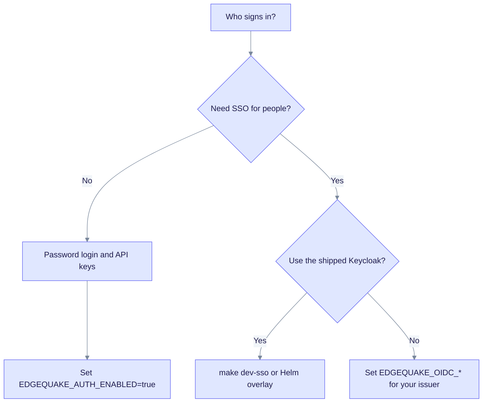
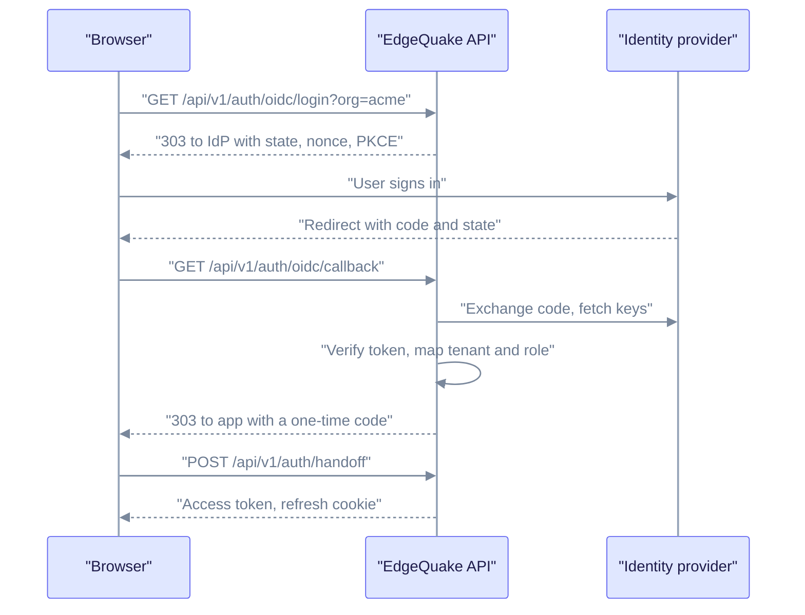

EdgeQuake signs in people with a password or with single sign-on (SSO) through OpenID Connect (OIDC). Programs use API keys or MCP OAuth. SSO is built in (SPEC-158): Keycloak is the main route, and any OIDC issuer such as Google, Microsoft Entra or AWS Cognito works directly or through Keycloak.

## Pick a path

The chart shows which setup fits your case. Start at the top.

Read it from the top: no SSO means passwords and API keys; SSO with the shipped Keycloak means [Keycloak quickstart](keycloak-quickstart.md); SSO with another issuer means the provider pages below. For local experiments only, `EDGEQUAKE_DEV_MODE=true` turns auth off. An `oauth2-proxy` in front of the API still works as an older alternative.

## How the SSO login works

The browser talks to the EdgeQuake API, which talks to the identity provider (IdP). The IdP's token is checked once, at the callback. After that EdgeQuake issues its own session.

Read it top to bottom: the one-time code is valid for 90 seconds and can be used once, so no token ever appears in a URL.

Design rules (see [SPEC-158](../../../specs/158-entreprise-grade-authentication/01-first-principles.md)):

1. IdP tokens are verified once, at the callback. EdgeQuake then issues its own session JWT.
2. A user is identified by the pair (issuer, subject). An email address never merges accounts unless you explicitly trust it.
3. The tenant comes from the IdP's organization claim, never from user input. An unknown organization is denied.
4. The redirect carries only a single-use code.

## Pages

| Page | For |
|------|-----|
| [Keycloak quickstart](keycloak-quickstart.md) | Run Keycloak and EdgeQuake locally, then move to production |
| [Tenants, organizations and roles](tenant-and-roles.md) | Map IdP organizations to tenants and roles |
| [Google](google.md), [Microsoft Entra](microsoft-entra.md), [AWS Cognito](aws-cognito.md), [GitHub](github.md) | Connect one IdP |
| [API keys and MCP](api-keys-and-mcp.md) | Programmatic access |
| [Production hardening](production-hardening.md) | Startup gates and checklist |
| [SSO environment reference](env-reference.md), [Troubleshooting SSO](troubleshooting.md) | Operators |

For non-SSO controls (API keys, rate limits, audit log) see the [security guide](../best-practices.md).
