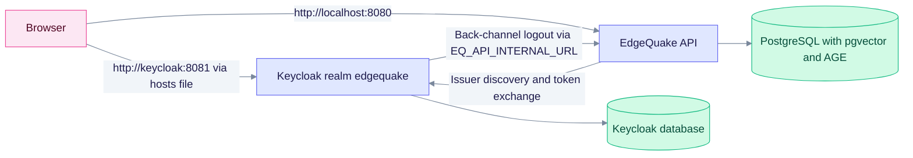

This page runs EdgeQuake and the shipped Keycloak on one machine. The realm is `edgequake`, and the image is Keycloak 26.8.0 or later. The last section lists the settings for a production HTTPS setup.

## Topology

The browser and the API must reach Keycloak under the same host name, because EdgeQuake compares the issuer string exactly.



Read it as two paths. The browser reaches Keycloak through the host name `keycloak`. Keycloak calls back into the API at its internal URL when a session ends.

## 1. One-time host setup

The browser must resolve the same issuer host as the API container. Add this line once:

```bash
echo "127.0.0.1 keycloak" | sudo tee -a /etc/hosts
```

## 2. Start the stack and run the smoke test

```bash
make dev-sso           # docker-compose.quickstart.yml + docker-compose.keycloak.yml
make keycloak-smoke    # headless auth-code + PKCE login, org claim, roles, API handoff
```

With no overrides, `make keycloak-smoke` targets the isolated proof stack (Keycloak on port 18081, API on 18080, web UI on 13010). For the `dev-sso` stack, set the endpoints explicitly:

```bash
EQ_SSO_KC=http://keycloak:8081 \
EQ_SSO_API=http://localhost:8080 \
EQ_SSO_REDIRECT=http://localhost:8080/api/v1/auth/oidc/callback \
EQ_WEB_PUBLIC_URL=http://localhost:3000 \
make keycloak-smoke
```

To also prove back-channel logout, run `KEYCLOAK_SMOKE_DEEP=1 make keycloak-smoke`. Keycloak must be able to reach the API at `EQ_API_INTERNAL_URL`.

| Service | URL | Credentials (dev defaults) |
|---------|-----|----------------------------|
| Keycloak admin | http://keycloak:8081 | `admin` / `KC_ADMIN_PASSWORD` (default `admin_dev_only`) |
| EdgeQuake API | http://localhost:8080 | Bootstrap admin: username `admin` unless `EDGEQUAKE_BOOTSTRAP_ADMIN_USERNAME` is set; password `EDGEQUAKE_BOOTSTRAP_ADMIN_PASSWORD` (default `Admin-dev-only-change-me-1`) |
| Demo users | `alice`, `bob`, `carol` | `EQ_KC_DEMO_PASSWORD` (default `demo-password-change-me`) |

Every default in the overlay is for development only. Set your own values before you share the stack.

## 3. Create the tenants

Organization aliases in Keycloak must match tenant slugs in EdgeQuake. EdgeQuake never creates a tenant from a claim, so an unknown organization is denied with `org_unknown`. Create the tenants with the bootstrap admin first:

```bash
TOKEN=$(curl -s http://localhost:8080/api/v1/auth/login \
  -H 'content-type: application/json' \
  -d '{"username":"'"${EDGEQUAKE_BOOTSTRAP_ADMIN_USERNAME:-admin}"'","password":"'"$EDGEQUAKE_BOOTSTRAP_ADMIN_PASSWORD"'"}' \
  | jq -r .access_token)

for org in acme globex; do
  curl -s http://localhost:8080/api/v1/tenants \
    -H "authorization: Bearer $TOKEN" \
    -H 'content-type: application/json' \
    -d "{\"name\":\"$org\",\"slug\":\"$org\"}"
done
```

## 4. Sign in

Open the web UI login page and choose **Continue with Single sign-on**. Type the organization alias, for example `acme`, if the login page asks for one. A user who belongs to several organizations and gives no hint gets a picker (`org_ambiguous`).

The realm has three demo users:

| User | Organizations | Realm roles |
|------|---------------|-------------|
| `alice` | acme | `eq-user`, `eq-admin` |
| `bob` | globex | `eq-user` |
| `carol` | acme and globex | `eq-user` |

## What the realm contains

- Organizations `acme` and `globex`, and the confidential client `edgequake-web` with PKCE `S256`.
- Realm roles `eq-user`, `eq-admin` and `eq-owner`. Map them with `EDGEQUAKE_OIDC_ROLE_MAP`.
- Back-channel logout to `${EQ_API_INTERNAL_URL}/api/v1/auth/oidc/backchannel-logout`.
- Brute-force protection on.
- Realm import is **create-only**. An existing realm is skipped, so edit a live realm in the Admin console (or with `kcadm`) instead of changing the JSON.

## Production configuration

Use this section when Keycloak and EdgeQuake have public HTTPS names. The laptop overlay (`EQ_KC_SSL_REQUIRED=none` and the demo users) must not ship.

1. Run Keycloak 26.8.0 or later with `KC_HOSTNAME` set to the public host. Set `sslRequired=external` on the realm, or `EQ_KC_SSL_REQUIRED=external` on the overlay.
2. Create EdgeQuake tenants whose **slugs match the Keycloak organization aliases** before anyone signs in.
3. Point the API at the issuer exactly as Keycloak reports it in discovery:

```bash
EDGEQUAKE_AUTH_ENABLED=true
EDGEQUAKE_STRICT_TENANT_BIND=true
EDGEQUAKE_OIDC_ENABLED=true
EDGEQUAKE_OIDC_KIND=keycloak
EDGEQUAKE_OIDC_SLUG=keycloak
EDGEQUAKE_OIDC_DISPLAY_NAME="Sign in with SSO"
EDGEQUAKE_OIDC_ISSUER_URL=https://sso.example.com/realms/edgequake
EDGEQUAKE_OIDC_CLIENT_ID=edgequake-web
EDGEQUAKE_OIDC_CLIENT_SECRET=<from secret manager>
EDGEQUAKE_OIDC_REDIRECT_URI=https://app.example.com/api/v1/auth/oidc/callback
EDGEQUAKE_OIDC_SUCCESS_REDIRECT_URL=https://app.example.com/auth/callback
EDGEQUAKE_OIDC_ROLE_MAP='{"eq-owner":"owner","eq-admin":"admin","eq-user":"member"}'
EDGEQUAKE_OIDC_MAX_ROLE=owner   # only if the IdP may grant owners
```

The default `EDGEQUAKE_OIDC_MAX_ROLE` is `admin`. An `eq-owner` user is capped at `admin` unless you set `EDGEQUAKE_OIDC_MAX_ROLE=owner` deliberately. The role rules are in [Tenants, organizations and roles](tenant-and-roles.md#roles).

Allow Keycloak to reach `POST /api/v1/auth/oidc/backchannel-logout` through the ingress or a NetworkPolicy.

For the Kubernetes overlay, see [values-sso-keycloak.yaml.example](../../../deploy/kubernetes/helm/edgequake/values-sso-keycloak.yaml.example). For every variable, see [env-reference.md](env-reference.md). For the startup gates and the full checklist, see [production-hardening.md](production-hardening.md).
