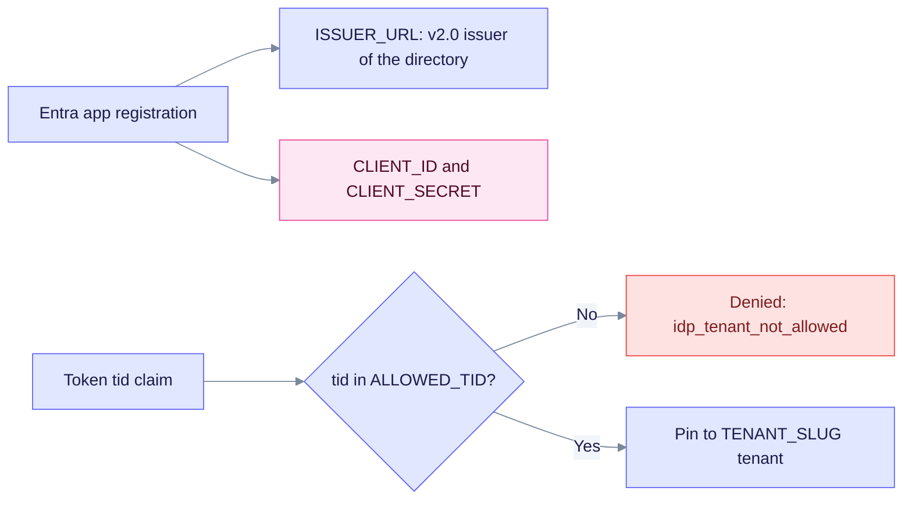

Microsoft Entra ID (formerly Azure AD) sign-in connects to EdgeQuake over OIDC. The directory allow-list (`tid`) decides which directories may sign in, so set it before you go live.

## What you need

- An Entra app registration of type **Web** with the redirect URI `https://<api>/api/v1/auth/oidc/callback`.
- A client secret for the app.
- The GUID of the directory that may sign in.
- A tenant slug to pin logins to, because Entra has no organization claim.

## Configure EdgeQuake

1. In Entra, open **App registrations** and create a Web app. Set the redirect URI, choose the account types your policy allows, and create a client secret.
2. Set the variables. Use the v2.0 issuer of your directory:

```bash
EDGEQUAKE_OIDC_ENABLED=true
EDGEQUAKE_OIDC_KIND=entra
EDGEQUAKE_OIDC_SLUG=microsoft
EDGEQUAKE_OIDC_ISSUER_URL=https://login.microsoftonline.com/<tenant-guid>/v2.0
EDGEQUAKE_OIDC_CLIENT_ID=<application-id>
EDGEQUAKE_OIDC_CLIENT_SECRET=...
EDGEQUAKE_OIDC_REDIRECT_URI=https://<api>/api/v1/auth/oidc/callback
EDGEQUAKE_OIDC_SUCCESS_REDIRECT_URL=https://<app>/auth/callback
EDGEQUAKE_OIDC_ALLOWED_TID=<tenant-guid>      # allow-list of directories (tid claim)
EDGEQUAKE_OIDC_TENANT_SLUG=contoso
```

Do not use the multi-tenant `common` authority without an `EDGEQUAKE_OIDC_ALLOWED_TID` list. A directory that is not on the list is denied with `idp_tenant_not_allowed`. Users who sign in from another directory (guests) are denied unless the `tid` in their token is on the list.

## How the values map



The first two arrows are settings you copy from Entra. The lower path is the check EdgeQuake runs on every login.

## Verify

1. Check that EdgeQuake lists the provider: `curl https://<api>/api/v1/auth/sso/providers`.
2. Open `https://<api>/api/v1/auth/oidc/login?provider=microsoft`. The browser should go to `login.microsoftonline.com`.
3. Sign in with a user from the allowed directory. The browser should return to `/auth/callback` with a one-time `code`.

## Troubleshoot

| Symptom | Cause | Fix |
|---------|-------|-----|
| `?error=idp_tenant_not_allowed` | The `tid` is not in `EDGEQUAKE_OIDC_ALLOWED_TID` | Add the directory GUID, or sign in with an account from an allowed directory |
| Login fails at the Entra page | Redirect URI or client secret does not match | Compare the redirect URI and secret in Entra with the EdgeQuake values |
| App roles do not apply | Roles are missing from the `roles` claim | Assign the app roles to the user or group in Entra, then sign in again |
