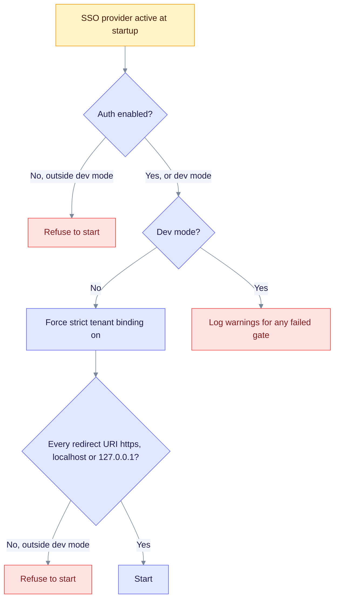

This page lists the startup checks that run when SSO is active, and the minimum checklist for production. The general checks are in the [security guide](../best-practices.md#startup-posture-checks).

## Startup gates

When an SSO provider is active, the server applies these gates at startup. Outside `EDGEQUAKE_DEV_MODE`, a failed gate stops the server. In dev mode, each failure is only a warning.

Read it from the top. Outside dev mode, EdgeQuake turns strict tenant binding on for you, so you cannot turn it off. Redirect URIs must use `https`, except `http://localhost` and `http://127.0.0.1`, which are tolerated for local testing.

## Checklist

Treat these items as the minimum for a production SSO deployment.

- [ ] Keycloak 26.8.0 or later. This fixes organization enumeration (CVE-2026-4633). Pin the image digest.
- [ ] TLS everywhere. Set `sslRequired=external` in the realm. The dev overlay sets `none` through `EQ_KC_SSL_REQUIRED`, so never ship that setting.
- [ ] Replace the demo users and passwords, and `EQ_KC_CLIENT_SECRET`. Store the client secret in a secret manager (Helm: `api.extraSecretEnv` in `values-sso-keycloak.yaml.example`).
- [ ] Issuer URL equals Keycloak's frontend URL exactly. Run Keycloak with `KC_HOSTNAME` set.
- [ ] Allow `POST /api/v1/auth/oidc/backchannel-logout` from Keycloak through the ingress or a NetworkPolicy.
- [ ] Keep `EDGEQUAKE_OIDC_TRUST_EMAIL=false`, unless the IdP verifies emails. Keep `EDGEQUAKE_OIDC_LINK_POLICY=never`.
- [ ] Keep `EDGEQUAKE_OIDC_MAX_ROLE` at `admin` (the default), so the IdP cannot create owners. Raise it to `owner` only on purpose.
- [ ] Set `JWT_SECRET` to at least 32 bytes. The insecure default and shorter secrets are fatal outside dev mode.
- [ ] Set `EDGEQUAKE_CORS_ORIGINS` to an explicit list. With a non-local `DATABASE_URL`, startup refuses open CORS outside dev mode.
- [ ] Keep a break-glass local admin.
- [ ] Back up the Keycloak database. Realm import is create-only on an existing realm.
- [ ] For several replicas, note that SSO state, handoff codes, sessions and `jti` replay protection live in PostgreSQL (migrations 164 and 165). Any replica can complete a login that another replica started.
