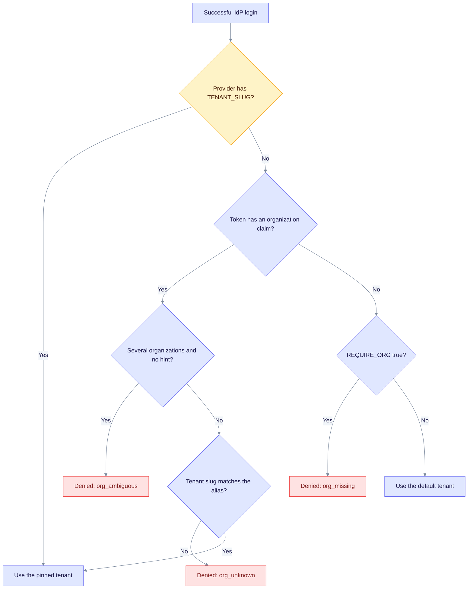

This page explains how EdgeQuake turns an identity provider (IdP) login into a tenant and a role. The mapping is strict, so an IdP can never give a user more access than you allow. Tenant rules come first, then roles, then account linking and lifecycle.

## Tenant resolution

EdgeQuake checks these rules in order, and the first match wins.



Read it from the top. A pinned tenant ignores the organization claim. A `?org=` value is only a hint: the token must assert that organization. Tenants are never created from a claim.

1. **Pinned tenant.** `EDGEQUAKE_OIDC_TENANT_SLUG` sends every login of that provider to one tenant.
2. **Organization claim.** For Keycloak, the claim is `organization`. The claim can be an array, map, string or object, and aliases are case-insensitive.
3. **No claim.** `EDGEQUAKE_OIDC_REQUIRE_ORG=true` denies the login. It is the default for `kind=keycloak`. Otherwise the default tenant is used.

## Denial codes

A denied login returns to the web app as `{SPA}/auth/callback?error=<code>`. The app then shows a translated message.

| Code | Meaning |
|------|---------|
| `org_unknown` | No tenant has a slug equal to the organization alias |
| `org_missing` | The token has no organization, and one is required |
| `org_ambiguous` | Several organizations and no hint. The code appears as `org_ambiguous:<aliases>`, and the UI shows a picker. |
| `tenant_suspended` | The tenant is suspended |
| `hd_mismatch` | The Google domain is not in `EDGEQUAKE_OIDC_ALLOWED_HD` |
| `idp_tenant_not_allowed` | The Entra directory is not in `EDGEQUAKE_OIDC_ALLOWED_TID` |
| `jit_disabled` | New users are not created automatically (`EDGEQUAKE_OIDC_JIT=false`) |
| `max_users` | The tenant is full |
| `membership_revoked` | The user's membership was removed |
| `tenant_access_denied` | The user may not use this tenant |
| `account_exists_unlinked` | A local account has the same email. The API returns HTTP 409. |

## Roles

The IdP's role claim (`EDGEQUAKE_OIDC_ROLE_CLAIM`) is mapped through `EDGEQUAKE_OIDC_ROLE_MAP`.

- The highest mapped role wins. If no role is mapped, `EDGEQUAKE_OIDC_DEFAULT_ROLE` applies (default `member`).
- The result is capped at `EDGEQUAKE_OIDC_MAX_ROLE`, which defaults to `admin`. Owner is never granted by default. Set `EDGEQUAKE_OIDC_MAX_ROLE=owner` only if the IdP may create owners.
- Roles are resynced at every login and on token refresh. Only memberships that SSO created (`metadata.source="sso"`) are resynced. Manually managed memberships are never rewritten.
- The last owner of a tenant is never demoted by an IdP claim.
- SSO never grants the platform `admin` role. An SSO user gets the global role `user`, or `readonly` for a readonly membership. A local platform admin keeps platform rights, independent of tenant roles.

Example: with the Keycloak role map below, a user with `eq-owner` gets `admin` by default, because the cap is `admin`. To give `owner`, you must also set `EDGEQUAKE_OIDC_MAX_ROLE=owner`.

```bash
EDGEQUAKE_OIDC_ROLE_MAP='{"eq-owner":"owner","eq-admin":"admin","eq-user":"member"}'
EDGEQUAKE_OIDC_MAX_ROLE=owner   # only if the IdP may grant owners
```

## Account linking

By default, a federated identity creates its own user. An email match never links to an existing local account unless all of these hold:

- `EDGEQUAKE_OIDC_LINK_POLICY=verified_email`
- `EDGEQUAKE_OIDC_TRUST_EMAIL=true`
- The IdP asserts `email_verified`
- The email is a real address, not a synthetic one

Otherwise the login is refused with `account_exists_unlinked`. Keep `TRUST_EMAIL` off for GitHub.

## Capacity and lifecycle

- `max_users` on the tenant is enforced when a user is created on first login.
- Suspending a tenant or removing a membership takes effect at the next refresh. The refresh then fails with `tenant_suspended` or `membership_revoked` (HTTP 403).
- A back-channel logout from the IdP revokes the session family at once.
