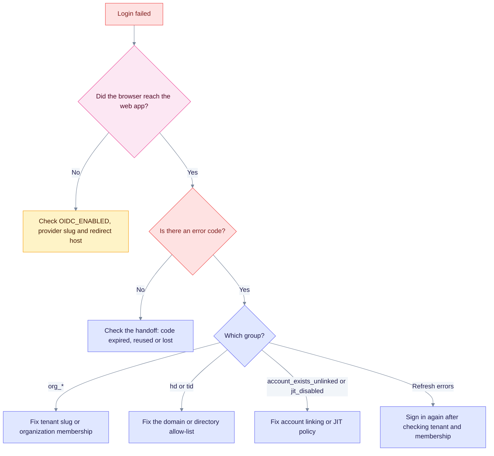

Start from the error code, then match the symptom. Denial codes appear in the redirect as `?error=<code>`. The full list is in [Tenants, organizations and roles](tenant-and-roles.md#denial-codes). Use the chart to pick a path, then the table for the fix.

Read it from the top: the first question is whether the browser reached the web app. Without a redirect, the problem is the setup. With a code, it is a policy decision.

| Symptom | Cause | Fix |
|---------|-------|-----|
| `GET /api/v1/auth/oidc/login` returns 503 | OIDC is off, or the `provider` slug is unknown | Set `EDGEQUAKE_OIDC_ENABLED=true` and `EDGEQUAKE_AUTH_ENABLED=true`, then check the slug in `GET /api/v1/auth/sso/providers` |
| `?error=org_unknown` | The tenant for the organization alias does not exist | Create a tenant whose slug equals the organization alias |
| `?error=org_missing` | The token has no organization claim (the user is not a member, or the scope is missing) | Add the user to the organization, and keep the `organization` scope requested |
| `?error=org_ambiguous:a,b` | Several organizations and no hint | Pick one in the UI picker, or pass `?org=` |
| `?error=hd_mismatch` | The Google domain is not in `EDGEQUAKE_OIDC_ALLOWED_HD` | Add the domain, or use an account from an allowed domain |
| `?error=idp_tenant_not_allowed` | The Entra directory is not in `EDGEQUAKE_OIDC_ALLOWED_TID` | Add the directory GUID, or use an account from an allowed directory |
| `?error=account_exists_unlinked` | The same email is already a local account | Sign in with the password, or enable verified-email linking deliberately |
| `?error=jit_disabled` | `EDGEQUAKE_OIDC_JIT=false` | Create the user and membership in advance, or enable JIT |
| The web UI shows `invalid_handoff` (the API returns 401, reason `code_invalid`) | The one-time code expired (90 s), was already used, or the tab was restored | Start sign-in again |
| Login loops, or `state_expired` | The login host differs from the redirect URI host, so the state cookie is lost | Use the same origin for login start and `REDIRECT_URI` |
| Issuer mismatch at startup or callback | The issuer string differs from the discovery `issuer` | Set Keycloak `KC_HOSTNAME`, and use an identical string |
| Keycloak form shows again after a correct password | Keycloak brute-force protection locked the user after quick failures | Wait, or unlock the user in the Keycloak Admin console |
| Realm edits are ignored | The import skips realms that already exist | Edit in the Admin console, or drop the database volume (dev only) |
| Refresh returns 401 `session_revoked` | Back-channel logout, or an admin revoked the session | Sign in again |
| Refresh returns 403 `tenant_suspended` or `membership_revoked` | The tenant or membership changed | Restore access, then sign in again |
| Server exits at boot with a pending migration (exit code 78) | The schema gate refuses to serve | Run `edgequake migrate`, or set `EDGEQUAKE_SCHEMA_GATE=wait` |

To check the Keycloak side on its own, run `python3 scripts/keycloak_smoke.py`. Add `--api URL` to include the EdgeQuake handoff.
