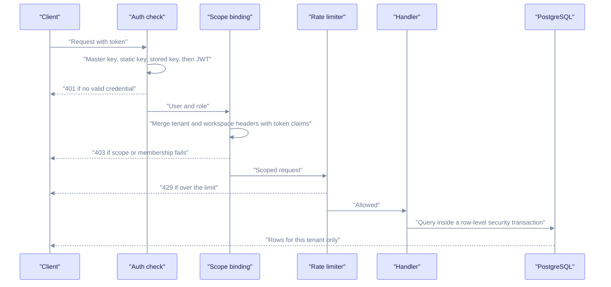
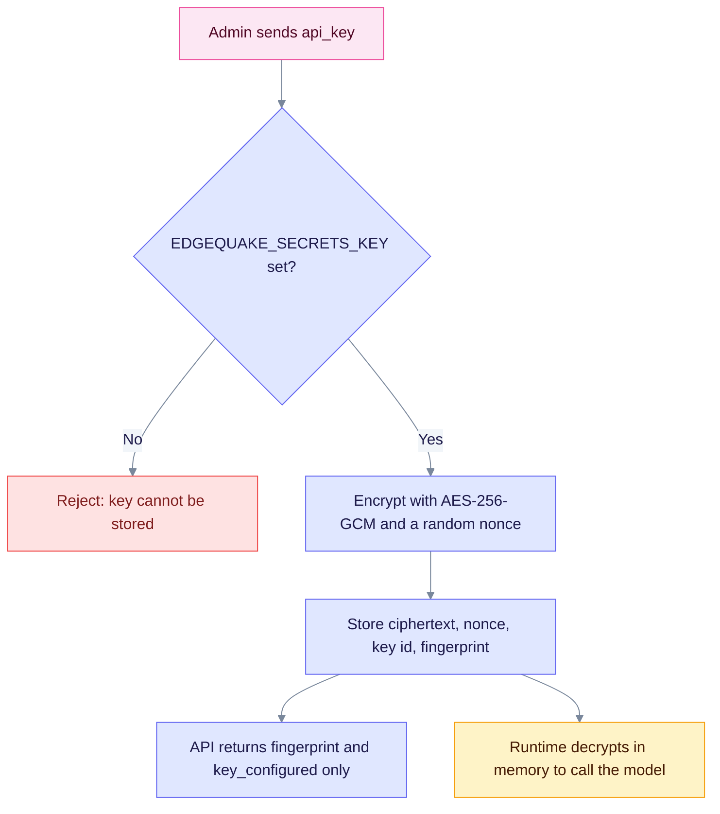
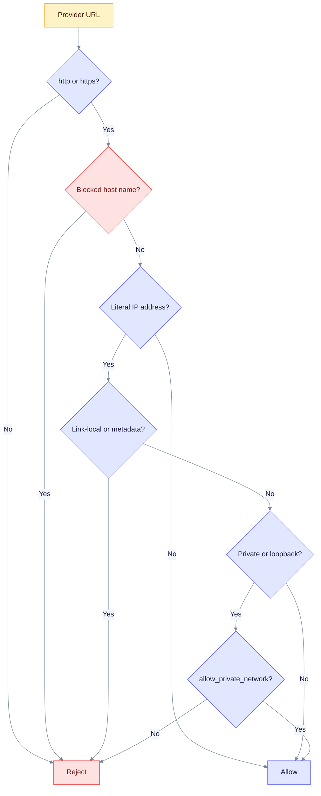

This guide describes the security controls in the code, in the order a request meets them. Each section gives the setting that controls it and what happens when it is off. For a short overview see the [security index](index.md).

> Product release: v0.32.2. Sections on provider Connections, SSRF checks and `edgequake doctor` describe v0.33.0 (SPEC-163).

## Authentication modes

EdgeQuake has three modes. Dev mode is for local use only.

| Mode | How to select | Callers need |
|------|---------------|--------------|
| Open (dev) | `EDGEQUAKE_DEV_MODE=true`, or `EDGEQUAKE_AUTH_ENABLED=false` | Nothing. Requests are accepted without a credential, and admin routes are open. |
| Authenticated | `EDGEQUAKE_AUTH_ENABLED=true`, or neither variable set | A JWT, an API key, or an SSO session |
| Bootstrap | Auth on, no users yet | `EDGEQUAKE_MASTER_API_KEY` or the `EDGEQUAKE_BOOTSTRAP_ADMIN_*` variables |

Auth is on by default when no variable is set. The Docker quickstart and `make dev` turn dev mode on for convenience; turn it off before you expose the port. See [Runtime auth hardening](../operations/runtime-auth-hardening.md) for the steps.

### Credential types

| Credential | Header | Role and scope | Notes |
|------------|--------|----------------|-------|
| Access JWT (HS256) | `Authorization: Bearer <jwt>` | Role in the token: `admin`, `user` or `readonly` | Lifetime 900 s by default (`JWT_EXPIRY_SECONDS`). `JWT_ISSUER` and `JWT_AUDIENCE` are checked when set. |
| Refresh token | HttpOnly cookie `eq_refresh` (path `/api/v1/auth`) or request body | Renews the access JWT | 30 days by default (`REFRESH_TOKEN_EXPIRY_DAYS`). It is rotated on use. |
| Stored API key | `X-API-Key: eq_...` or `Authorization: Bearer eq_...` | Scopes `edgequake:read`, `edgequake:query`, `edgequake:write` | Created with `POST /api/v1/api-keys`. Stored as an Argon2 hash. The default scopes are read and query. |
| Static API keys | Same headers | Read and query only; role `readonly` | From `EDGEQUAKE_API_KEYS` (comma-separated). |
| Master key | Same headers | Full admin; skips tenant membership checks | From `EDGEQUAKE_MASTER_API_KEY`. Every membership bypass is logged. Use it only to bootstrap or recover. |

Other facts:

- Passwords and API keys are hashed with Argon2 (64 MiB memory, 3 passes, 4 lanes by default).
- Five failed logins lock the account for 15 minutes and return HTTP 423 (`MAX_LOGIN_ATTEMPTS`, `LOCKOUT_DURATION_MINUTES`).
- WebSockets take the JWT in `Authorization: Bearer` or in `Sec-WebSocket-Protocol: edgequake.bearer, <jwt>`. A `?token=` query parameter is rejected.
- Public paths need no credential: `/health`, `/live`, `/ready`, `/auth/login`, `/auth/refresh`, the OIDC and SSO endpoints, `/setup/status`, `/setup/initialize`, the Swagger pages, `/mcp` (it does its own auth) and, when `ALLOW_REGISTRATION` is true, `POST /users`.
- `POST /setup/initialize` checks the `X-EdgeQuake-Setup-Token` header when `EDGEQUAKE_SETUP_TOKEN` is set.
- Single sign-on is covered in [Authentication and SSO](authentication/index.md).

## How a request is authorized

The chain below runs for every `/api/v1` and `/api/v2` call when auth is on. Authentication runs first; the rate limiter keys on the identity it finds.



Read it top to bottom: a request can stop early with 401, 403 or 429, and only a request that passes every step reaches the database. Headers choose a scope; they never grant one.

What each step checks:

1. **Auth check.** The token is tried as master key, static key, stored `eq_` key, then JWT. A JWT must not be on the revocation list, must carry a web-session audience (MCP tokens are refused on REST), and its user must still exist and be active.
2. **Scope binding.** `X-Tenant-ID` and `X-Workspace-ID` are merged with the token's claims. A mismatch returns 403. With auth on, `X-User-ID` is replaced by the authenticated user. Unless the path is a global resource (users, API keys, tenants, admin, settings, models, config, setup), the user needs an active membership in that tenant and workspace. Binding is on whenever auth is on and dev mode is off, or when `EDGEQUAKE_STRICT_TENANT_BIND=true`.
3. **Permission.** Paths under `/api/v1/admin/` need the admin role. Read-only users cannot write. Query endpoints (`/api/v1/query`, `/query/stream`, `/api/chat` and a few others) count as reads. Scoped keys need the matching scope. Changing workspaces needs an `owner` or `admin` membership.
4. **Rate limit.** See [Rate limiting](#rate-limiting).

### Roles

| Level | Values | Meaning |
|-------|--------|---------|
| Account role (JWT) | `admin`, `user`, `readonly` | Platform-wide ability |
| Membership role (per tenant) | `owner`, `admin`, `member`, `readonly` | Ability inside one tenant. A `readonly` membership downgrades the request to read-only. |

## Tenant isolation

Data is separated at three layers. A bug in one layer should not expose data, because the next layer still filters.

| Layer | Mechanism | Setting |
|-------|-----------|---------|
| Application | Handlers filter by tenant and workspace; KV keys are workspace-prefixed | Always on |
| Auth binding | Token claims and active membership must match the requested scope | `EDGEQUAKE_STRICT_TENANT_BIND`, or auth on and dev mode off |
| Database | PostgreSQL row-level security (RLS) with forced, fail-closed policies; session variables `app.current_*` are set inside each transaction | `EDGEQUAKE_PG_RLS_ENABLED` (default on) |

Do not connect the application with a superuser role: superusers bypass RLS. When you run several replicas, give each the same `DATABASE_URL` and the same auth variables.

## Secrets at rest

Saved provider Connections hold API keys. They are encrypted before they reach the database and are never returned by the API.



Read it from the top: the key is encrypted once on write and decrypted only inside the server process when a model call needs it.

- `EDGEQUAKE_SECRETS_KEY` is 32 bytes, as 32 raw characters, base64, or 64 hex characters. Generate one with `openssl rand -base64 32`.
- The fingerprint is a short non-secret label (`eqk_` plus 16 hex digits) so you can tell keys apart. It is not a cryptographic hash.
- The code decrypts with the single key in the environment. `EDGEQUAKE_SECRETS_KEY_ID` only labels rows, so key rotation is not supported yet: changing the key makes old rows unreadable and they are treated as having no key.
- Other secrets (`JWT_SECRET`, `DATABASE_URL`, `OPENAI_API_KEY`) live in your environment or secret manager. Do not commit them to Git.
- Encrypt the database disk (LUKS, encrypted cloud volumes) for the rest of your data, and use `sslmode=require` or stronger in `DATABASE_URL` for remote databases.

## SSRF defense for provider URLs

A Connection holds a URL that the server will call. The check stops a URL from reaching cloud metadata services or, unless you allow it, your private network. It runs when you save a Connection and when you test one.



Read it from the top: every "Reject" is final; "Allow" means the URL passes the text-level checks.

| Rule | Detail |
|------|--------|
| Blocked names | `metadata.google.internal`, `kubernetes.default`, `kubernetes.default.svc`, `instance-data`, `metadata`, anything ending in `.internal`, anything starting with `169.254.` |
| Always blocked IPs | `169.254.0.0/16`, `fe80::/10`, and IPv4-mapped forms of those |
| Private IPs | `127.0.0.0/8`, `10/8`, `172.16/12`, `192.168/16`, `0.0.0.0`, `::1`, unique-local IPv6. Blocked unless `allow_private_network` is true. |
| Probe hardening | The test endpoint uses an 8-second timeout and does not follow redirects. |
| Defaults | `allow_private_network` is true for `local` connections, false for `cloud` ones. |

Limits you should know:

- The check looks at the URL text and literal IP addresses. A public host name that resolves to a private address is not caught, because the DNS re-check function (`validate_resolved_ip`) exists but is not called by any request path yet. Treat Connection creation as an admin-only action (it is) and restrict outbound traffic at the network level.
- Only provider URLs go through this check. It does not cover other outbound calls.

## Rate limiting

The limiter is a token bucket per authenticated identity (`tenant:<id>:user:<id>`), not per IP. It is off by default.

| Item | Value |
|------|-------|
| Switch | `EDGEQUAKE_RATE_LIMIT_ENABLED=true` |
| Default budget | 100 requests per 60 seconds, plus a burst of 20 |
| Scope | `/api/v1`, `/api/v2` and `/mcp` |
| When exceeded | HTTP 429, body error `rate_limit_exceeded`, header `Retry-After` |
| Headers on success | `X-RateLimit-Limit`, `X-RateLimit-Remaining` |

The budget is fixed in code today; only the on/off switch is configurable. For per-IP or per-endpoint limits, add them in your reverse proxy:

```nginx
limit_req_zone $binary_remote_addr zone=api:10m rate=10r/s;
location /api/ {
    limit_req zone=api burst=20 nodelay;
    proxy_pass http://127.0.0.1:8080;
}
```

## Audit log

With PostgreSQL, EdgeQuake writes security events to the `audit_logs` table in the background. There is no REST endpoint for it yet; query the table with SQL.

| Event type | Recorded actions |
|------------|------------------|
| `Authentication` | Login success and failure, logout, SSO login outcomes |
| `DocumentUpload` | File and PDF uploads |
| `DocumentQuery` | Query execution (`execute_query`) |
| `WorkspaceAccess` | Workspace create, update and delete |
| `Authorization` | Document delete (`delete_document`) and master key membership bypass |

Each row holds the time, tenant, user, action, result (`Success`, `Failure`, `Blocked`, `Warning`), severity, request id and extra JSON. Login events are filed under tenant `default`. Ship server logs to a central system as well; rate-limit hits and auth failures are logged at warning level.

```sql
SELECT timestamp, event_type, event_action, result, user_id
FROM audit_logs ORDER BY timestamp DESC LIMIT 50;
```

## Startup posture checks

At boot the server checks its own configuration. A fatal result logs the reason and exits with code 1. Warnings are logged; with `EDGEQUAKE_STRICT_STARTUP=1` every warning becomes fatal.

| Condition | Result outside dev mode | In dev mode |
|-----------|-------------------------|-------------|
| `JWT_SECRET` is the public default or shorter than 32 bytes | Fatal | Warning |
| Auth off, and `DATABASE_URL` is not local | Fatal | Allowed |
| `DATABASE_URL` is not local and `EDGEQUAKE_CORS_ORIGINS` is empty | Fatal | Allowed |
| SSO configured but auth off, strict tenant binding off, or a non-`https` redirect URI | Fatal | Warning |
| Auth on but no `EDGEQUAKE_API_KEYS` or master key | Warning | Warning |
| `ALLOW_REGISTRATION` is true with auth on | Warning | none |
| `EDGEQUAKE_RATE_LIMIT_ENABLED` is off | Warning | none |
| `EDGEQUAKE_SECRETS_KEY` is unset | Warning | none |

"Local" means the database host is `localhost`, `127.0.0.1`, `::1` or `host.docker.internal`. SSO sets strict tenant binding for you outside dev mode.

Two tools show the result:

- `edgequake doctor` (add `--json` for machine output) checks `DATABASE_URL`, `EDGEQUAKE_SECRETS_KEY`, `JWT_SECRET` and the listen host. It exits 0, 1 (no `DATABASE_URL`) or 2 (another check failed).
- `GET /health` includes `security_posture`: `auth_enabled`, `dev_mode`, `secrets_key_configured`, `jwt_secret_is_default`, `rate_limit_enabled`, `swagger_enabled`.

## Network and web hardening

- **TLS.** EdgeQuake does not terminate TLS. Put Caddy, nginx or a cloud load balancer in front.
- **Bind address.** The server listens on `HOST` and `PORT` (defaults `0.0.0.0` and `8080`). Bind to `127.0.0.1` when a proxy on the same machine fronts it. The quickstart compose file publishes ports on `127.0.0.1` only.
- **CORS.** `EDGEQUAKE_CORS_ORIGINS` is a comma-separated allow-list. Outside dev mode, an empty list denies all cross-origin requests; in dev mode any origin is allowed.
- **Bulk delete.** Set `EDGEQUAKE_REQUIRE_DELETE_ALL_CONFIRM=true` to require the header `X-EdgeQuake-Confirm: delete-all-documents` for delete-all.
- **Ollama shim.** The Ollama-compatible `/api/*` routes are on by default; set `EDGEQUAKE_OLLAMA_COMPAT_ENABLED=false` to turn them off.
- **Input limits.** Default document size 50 MiB, query length 10,000 characters. Text uploads accept `txt`, `md`, `json`, `csv`, `html`, `htm`, `xml`, `yaml`, `yml`; images accept `png`, `jpg`, `jpeg`, `gif`, `webp`; PDFs use the PDF upload path. EdgeQuake does not scan files for malware.

A minimal Caddy front end:

```caddyfile
edgequake.example.com {
    reverse_proxy 127.0.0.1:8080
}
```

## Model provider data flow

Document text and queries go to the model provider you choose. EdgeQuake does not strip personal data first. If data must stay inside your network, use a local provider (see [Providers](../providers/index.md)). Vertex AI uses Google credentials (service account or application default credentials) instead of a static key; keep the service-account file in a secret manager.

## Multi-replica and container notes

- With `EDGEQUAKE_REPLICAS` above 1, set `EDGEQUAKE_TASK_DELIVERY=bridged` or `notify_only`. The server refuses to start otherwise.
- The API image is distroless: no shell and no `curl`. Use `edgequake healthcheck` for Docker health checks, `/live` and `/ready` for Kubernetes probes, and `edgequake pre-stop <seconds>` for the preStop hook.
- `DATABASE_URL` is required in every mode.

## Production checklist

Before you go live:

- [ ] TLS terminates at a proxy; the API port is not public.
- [ ] `EDGEQUAKE_AUTH_ENABLED=true` and `EDGEQUAKE_DEV_MODE` is unset or false.
- [ ] `JWT_SECRET` is a random value of 32 bytes or more.
- [ ] `EDGEQUAKE_SECRETS_KEY` is set and backed up.
- [ ] `EDGEQUAKE_CORS_ORIGINS` lists your web origins.
- [ ] `ALLOW_REGISTRATION=false` unless you want self-service sign-up.
- [ ] `EDGEQUAKE_RATE_LIMIT_ENABLED=true`.
- [ ] `EDGEQUAKE_STRICT_STARTUP=1`.
- [ ] A first admin exists (`EDGEQUAKE_BOOTSTRAP_ADMIN_*`), and the master key is not in a compose file.
- [ ] `edgequake doctor` and `GET /health` show the posture you expect.

Regular work: rotate API keys, apply dependency updates, review `audit_logs`, and test your backups.

## Report a problem

Follow the [security policy](https://github.com/raphaelmansuy/edgequake/blob/edgequake-main/SECURITY.md): report privately through GitHub Security Advisories and do not disclose before a patch exists.

## See also

- [Runtime auth hardening](../operations/runtime-auth-hardening.md)
- [Deployment](../operations/deployment.md)
- [Configuration](../operations/configuration.md)
- [Monitoring](../operations/monitoring.md)
