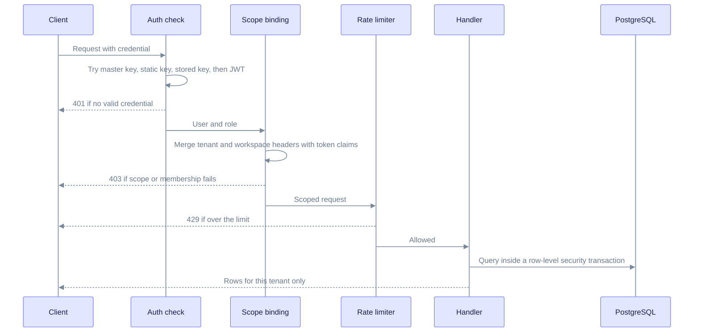
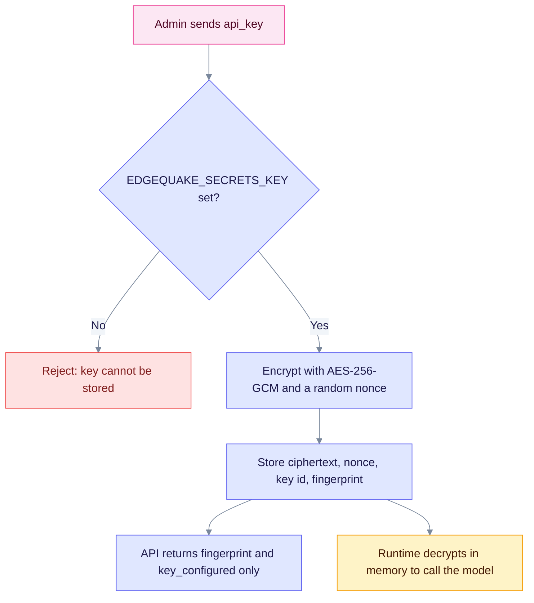
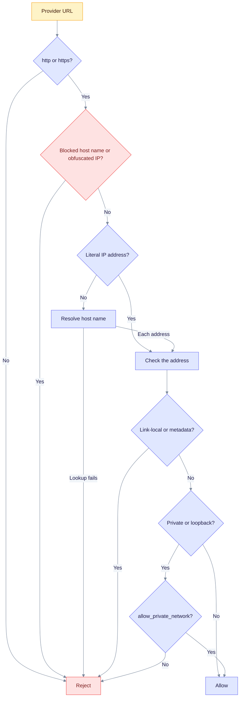
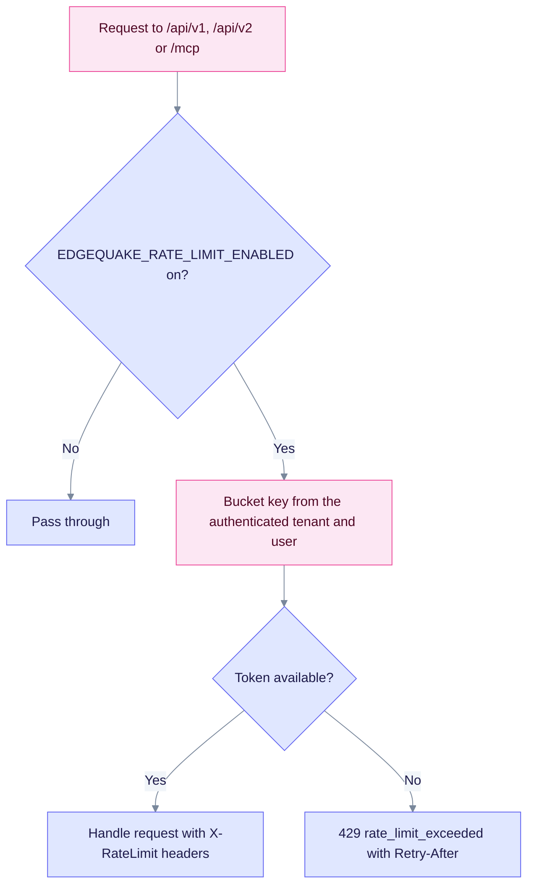
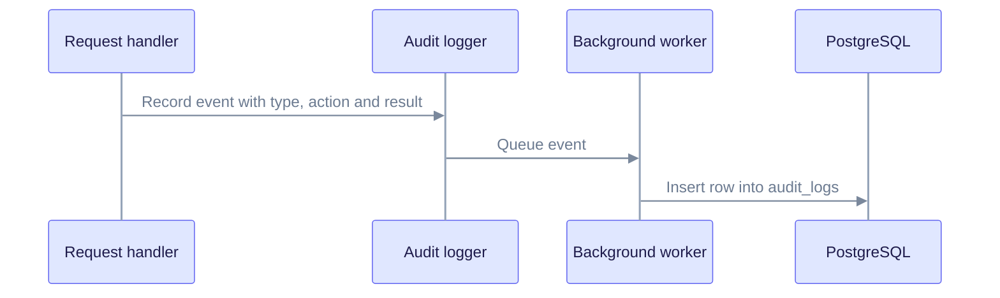

This guide covers the security controls in the code, in the order a request meets them. Each section names the setting that controls the control and what happens when it is off. For a short overview, read the [security index](index.md) first.

> Product release: v0.32.2. Sections on provider Connections, SSRF checks and `edgequake doctor` describe v0.33.0 (SPEC-163).

## Authentication modes

EdgeQuake has three modes. Dev mode is for local use only.

| Mode | How to select | Callers need |
|------|---------------|--------------|
| Open (dev) | `EDGEQUAKE_DEV_MODE=true`, or `EDGEQUAKE_AUTH_ENABLED=false` | Nothing. Requests are accepted without a credential, and admin routes are open. |
| Authenticated | `EDGEQUAKE_AUTH_ENABLED=true`, or neither variable set | A JWT, an API key, or an SSO session |
| Bootstrap | Auth on, no login-capable user yet | The master key, or `EDGEQUAKE_BOOTSTRAP_ADMIN_*` to create the first admin |

Auth is on by default when no variable is set. The Docker quickstart and `make dev` turn dev mode on for convenience. Turn it off before you expose the port. See [Runtime auth hardening](../operations/runtime-auth-hardening.md) for the steps.

### Credential types

| Credential | Header | Role and scope | Notes |
|------------|--------|----------------|-------|
| Access JWT (HS256) | `Authorization: Bearer <jwt>` | Role in the token: `admin`, `user` or `readonly` | Lifetime 900 s by default (`JWT_EXPIRY_SECONDS`). `JWT_ISSUER` and `JWT_AUDIENCE` are checked when set. |
| Refresh token | HttpOnly cookie `eq_refresh` (path `/api/v1/auth`) or request body | Renews the access JWT | Lasts 30 days by default (`REFRESH_TOKEN_EXPIRY_DAYS`). Each use issues a successor token in the same family (rotation). |
| Stored API key | `X-API-Key: eq_...` or `Authorization: Bearer eq_...` | Scopes `edgequake:read`, `edgequake:query`, `edgequake:write` | Created with `POST /api/v1/api-keys`. Stored as an Argon2 hash. Default scopes: read and query. |
| Static API key | Same headers | Read and query only; role `readonly` | From `EDGEQUAKE_API_KEYS` (comma-separated). |
| Master key | Same headers | Full admin; skips tenant membership checks | From `EDGEQUAKE_MASTER_API_KEY`. Each membership bypass is recorded in the audit log. Use it only to bootstrap or recover. |

Other facts:

- Passwords and API keys are hashed with Argon2id (64 MiB memory, 3 passes, 4 lanes by default).
- Five failed logins lock the account for 15 minutes and return HTTP 423 (`MAX_LOGIN_ATTEMPTS`, `LOCKOUT_DURATION_MINUTES`).
- WebSockets (for example `/ws/pipeline/progress`) accept the JWT in `Authorization: Bearer` or in `Sec-WebSocket-Protocol: edgequake.bearer, <jwt>`. An API key can go in `X-API-Key`. A `?token=` query parameter is rejected with HTTP 401.
- Public paths need no credential: `/health`, `/ready`, `/live`, `/swagger-ui` and `/api-docs`. Under `/api/v1` they are `/auth/login`, `/auth/refresh`, `/auth/oidc/login`, `/auth/oidc/callback`, `/auth/oidc/backchannel-logout` (POST), `/auth/handoff`, `/auth/sso/providers`, `/setup/status` and `/setup/initialize`. The MCP endpoint `/mcp` (POST) does its own auth. `POST /api/v1/users` is public only when `ALLOW_REGISTRATION` is true (the default is true).
- `POST /api/v1/setup/initialize` checks the `X-EdgeQuake-Setup-Token` header when `EDGEQUAKE_SETUP_TOKEN` is set.
- Single sign-on is covered in [Authentication and SSO](authentication/index.md).

## How a request is authorized

The chain below runs for every `/api/v1` and `/api/v2` call when auth is on. Authentication runs first, and the rate limiter keys on the identity it finds.



A request can stop early with 401, 403 or 429. Only a request that passes every step reaches the database. Headers choose a scope; they never grant one.

What each step checks:

1. **Auth check.** The token is tried as master key, static key, stored `eq_` key, then JWT. A JWT must not be on the revocation list, and it must carry a web-session audience (MCP tokens are refused on REST). Its user must still exist and be active.
2. **Scope binding.** `X-Tenant-ID` and `X-Workspace-ID` are merged with the token's claims, and a mismatch returns 403. With auth on, `X-User-ID` is replaced by the authenticated user. Unless the path is a global resource (`/api/v1/auth/`, `users`, `api-keys`, `tenants`, `admin/`, `settings/`, `models`, `config/`, `decision/`, `setup/`), the caller needs an active membership in that tenant and workspace. Binding is on when `EDGEQUAKE_STRICT_TENANT_BIND=true`, or when auth is on and dev mode is off.
3. **Permission.** Paths under `/api/v1/admin/` need the admin role. Read-only users cannot write. Query endpoints (`POST /api/v1/query`, `/api/v1/query/stream`, `/api/v1/query/context`, `/api/chat`, `/api/generate` and a few others) count as reads. Scoped keys need the matching scope. Workspace administration needs an `owner` or `admin` membership.
4. **Rate limit.** See [Rate limiting](#rate-limiting).

### Roles

| Level | Values | Meaning |
|-------|--------|---------|
| Account role (JWT) | `admin`, `user`, `readonly` | Platform-wide ability. SSO users never receive `admin`; they get `user` or `readonly`. |
| Membership role (per tenant) | `owner`, `admin`, `member`, `readonly` | Ability inside one tenant. A `readonly` membership downgrades the request to read-only. |

## Tenant isolation

Data is separated at three layers. A bug in one layer should not expose data, because the next layer still filters.

| Layer | Mechanism | Setting |
|-------|-----------|---------|
| Application | Handlers filter by tenant and workspace; KV keys are workspace-prefixed | Always on |
| Auth binding | Token claims and active membership must match the requested scope | `EDGEQUAKE_STRICT_TENANT_BIND`, or auth on and dev mode off |
| Database | PostgreSQL row-level security (RLS), see below | `EDGEQUAKE_PG_RLS_ENABLED` (default on) |

### PostgreSQL row-level security (RLS)

- RLS is on by default (`EDGEQUAKE_PG_RLS_ENABLED`).
- Policies are forced and fail closed, so a missing tenant context returns no rows (migration `096_rls_fail_closed_force.sql`).
- Each transaction sets the `app.current_*` session variables with `is_local`, so the policies see the tenant of the current request only.
- Do not connect the application with a superuser role. Superusers bypass RLS.
- When you run several replicas, give each the same `DATABASE_URL` and the same auth variables.

## Secrets at rest

Saved provider Connections hold API keys. The server encrypts them before they reach the database, and the API never returns them.



Read it from the top: the key is encrypted once on write and decrypted only inside the server process when a model call needs it.

- `EDGEQUAKE_SECRETS_KEY` must be 32 bytes: 32 raw bytes, base64, or 64 hex characters. Generate one with `openssl rand -base64 32`.
- The fingerprint is a short, non-secret label (`eqk_` plus 16 hex digits) so you can tell keys apart. It is not a cryptographic hash.
- The server decrypts with the single key in the environment. `EDGEQUAKE_SECRETS_KEY_ID` (default `v1`) only labels rows. Key rotation is not supported yet: changing the key makes old rows unreadable, and they are treated as having no key.
- Keep other secrets (`JWT_SECRET`, `DATABASE_URL`, `OPENAI_API_KEY`) in your environment or a secret manager. Do not commit them to Git.
- Encrypt the database disk (LUKS or an encrypted cloud volume). Use `sslmode=require` or stronger in `DATABASE_URL` for remote databases.

## SSRF defense for provider URLs

A Connection holds a URL that the server will call. The check stops a URL from reaching cloud metadata services or, unless you allow it, your private network. It runs when you save a Connection and when you test one.



Read it from the top: every Reject is final. Host names are resolved at save and test time, and each resolved address goes through the same checks as a literal IP.

| Rule | Detail |
|------|--------|
| Blocked names | `metadata.google.internal`, `kubernetes.default`, `kubernetes.default.svc`, `instance-data`, `metadata`, anything ending in `.internal`, anything starting with `169.254.` |
| Obfuscated IPs | Decimal (`2130706433`), hex (`0x7f000001`) and dotted-octal (`0177.0.0.1`) host forms are rejected |
| Always blocked IPs | `169.254.0.0/16`, `fe80::/10`, and IPv4-mapped forms of those |
| Private IPs | `127.0.0.0/8`, `10/8`, `172.16/12`, `192.168/16`, `0.0.0.0`, `::1`, unique-local IPv6. Blocked unless `allow_private_network` is true. |
| Probe hardening | The test endpoint uses an 8-second timeout and does not follow redirects. |
| Defaults | `allow_private_network` is true for `local` connections and false for `cloud` ones. |

Limits you should know:

- The check is check-then-connect. A DNS answer that changes after the check (DNS rebinding) is not covered. Restrict outbound traffic at the network level as well.
- Only provider URLs go through this check. It does not cover other outbound calls.

## Rate limiting

The limiter is a token bucket per authenticated identity (`tenant:<id>:user:<id>`), not per IP. It is off by default.



The key comes from the authenticated context, never from the `X-Tenant-ID` header, so a client cannot choose its own bucket.

| Item | Value |
|------|-------|
| Switch | `EDGEQUAKE_RATE_LIMIT_ENABLED=true` |
| Default budget | 100 requests per 60 seconds, plus a burst of 20 |
| Scope | `/api/v1`, `/api/v2` and `/mcp` |
| When exceeded | HTTP 429, body error `rate_limit_exceeded`, header `Retry-After` |
| Headers on success | `X-RateLimit-Limit`, `X-RateLimit-Remaining` |

The budget is fixed in code today; only the on/off switch is configurable. For per-IP or per-endpoint limits, add them in your reverse proxy:

```nginx
limit_req_zone $binary_remote_addr zone=api:10m rate=10r/s;
location /api/ {
    limit_req zone=api burst=20 nodelay;
    proxy_pass http://127.0.0.1:8080;
}
```

## Audit log

With PostgreSQL, EdgeQuake records security events in the `audit_logs` table. Handlers do not wait for the write: events go to a background worker that inserts them.



The handler continues while the worker writes the row, so a slow database delays the row, not the response.

| Event type | Recorded actions |
|------------|------------------|
| `Authentication` | Login success and failure, logout, SSO login outcomes |
| `DocumentUpload` | File and PDF uploads |
| `DocumentQuery` | Query execution |
| `WorkspaceAccess` | Workspace create, update and delete |
| `Authorization` | Document delete and master key membership bypass |

Each row holds the time, tenant, workspace, user, event type and action, result (`Success`, `Failure`, `Blocked` or `Warning`), severity, request ID, and a JSON metadata field. Login events are filed under tenant `default`. There is no REST endpoint for the audit log yet, so query the table with SQL:

```sql
SELECT timestamp, event_type, event_action, result, user_id
FROM audit_logs ORDER BY timestamp DESC LIMIT 50;
```

Ship server logs to a central system as well. Rate-limit hits are logged at warning level.

## Startup posture checks

At boot the server checks its own configuration. A fatal result logs the reason and exits with code 1. Warnings are logged. With `EDGEQUAKE_STRICT_STARTUP=1`, every warning becomes fatal.

| Condition | Result outside dev mode | In dev mode |
|-----------|-------------------------|-------------|
| `JWT_SECRET` is the public default or shorter than 32 bytes | Fatal | Warning |
| Auth off, and `DATABASE_URL` is not local | Fatal | Allowed |
| `DATABASE_URL` is not local and `EDGEQUAKE_CORS_ORIGINS` is empty | Fatal | Allowed |
| SSO configured but auth off, strict tenant binding off, or a non-`https` redirect URI | Fatal | Warning |
| Auth on but no `EDGEQUAKE_API_KEYS` or master key | Warning | Warning |
| `ALLOW_REGISTRATION` is true with auth on | Warning | None |
| `EDGEQUAKE_RATE_LIMIT_ENABLED` is off | Warning | None |
| `EDGEQUAKE_SECRETS_KEY` is unset | Warning | None |

"Local" means the database host is `localhost`, `127.0.0.1`, `::1` or `host.docker.internal`. SSO sets strict tenant binding for you outside dev mode.

Two tools show the result:

- `edgequake doctor` (add `--json` for machine output) checks `DATABASE_URL`, `EDGEQUAKE_SECRETS_KEY`, `JWT_SECRET` and the listen host. It exits 0 when all required checks pass, 1 when `DATABASE_URL` is missing, and 2 when another check fails.
- `GET /health` includes `security_posture`: `auth_enabled`, `dev_mode`, `secrets_key_configured`, `jwt_secret_is_default`, `rate_limit_enabled` and `swagger_enabled`.

## Network and web hardening

- **TLS.** EdgeQuake does not terminate TLS. Put Caddy, nginx or a cloud load balancer in front.
- **Bind address.** The server listens on `HOST` and `PORT` (defaults `0.0.0.0` and `8080`). Bind to `127.0.0.1` when a proxy on the same machine fronts it. The quickstart compose file publishes ports on `127.0.0.1` only.
- **CORS.** `EDGEQUAKE_CORS_ORIGINS` is a comma-separated allow-list. Outside dev mode, an empty list denies all cross-origin requests. In dev mode, any origin is allowed.
- **Bulk delete.** Set `EDGEQUAKE_REQUIRE_DELETE_ALL_CONFIRM=true` to require the header `X-EdgeQuake-Confirm: delete-all-documents` for delete-all.
- **Ollama shim.** The Ollama-compatible `/api/*` routes are on by default. Set `EDGEQUAKE_OLLAMA_COMPAT_ENABLED=false` to turn them off.
- **Input limits.** Default document size is 50 MiB and query length is 10,000 characters. Text uploads accept `txt`, `md`, `json`, `csv`, `html`, `htm`, `xml`, `yaml` and `yml`. Images accept `png`, `jpg`, `jpeg`, `gif` and `webp`. PDFs use the PDF upload path. EdgeQuake does not scan files for malware.

A minimal Caddy front end:

```caddyfile
edgequake.example.com {
    reverse_proxy 127.0.0.1:8080
}
```

## Model provider data flow

Document text and queries go to the model provider you choose. EdgeQuake does not strip personal data first. If data must stay inside your network, use a local provider (see [Providers](../providers/index.md)). Vertex AI uses Google credentials (a service account file via `GOOGLE_APPLICATION_CREDENTIALS`, or application default credentials) instead of a static key. Keep the service-account file in a secret manager.

## Multi-replica and container notes

- With `EDGEQUAKE_REPLICAS` above 1, set `EDGEQUAKE_TASK_DELIVERY=bridged` or `notify_only`. The server refuses to start otherwise.
- The API image is distroless: no shell and no `curl`. Use `edgequake healthcheck` for Docker health checks, `/live` and `/ready` for Kubernetes probes, and `edgequake pre-stop <seconds>` for the preStop hook.
- `DATABASE_URL` is required in every mode.

## Production checklist

Before you go live:

- [ ] TLS terminates at a proxy, and the API port is not public.
- [ ] `EDGEQUAKE_AUTH_ENABLED=true`, and `EDGEQUAKE_DEV_MODE` is unset or false.
- [ ] `JWT_SECRET` is a random value of 32 bytes or more.
- [ ] `EDGEQUAKE_SECRETS_KEY` is set and backed up.
- [ ] `EDGEQUAKE_CORS_ORIGINS` lists your web origins.
- [ ] `ALLOW_REGISTRATION=false`, unless you want self-service sign-up.
- [ ] `EDGEQUAKE_RATE_LIMIT_ENABLED=true`.
- [ ] `EDGEQUAKE_STRICT_STARTUP=1`.
- [ ] A first admin exists (`EDGEQUAKE_BOOTSTRAP_ADMIN_*`), and the master key is not in a compose file.
- [ ] `edgequake doctor` and `GET /health` show the posture you expect.

Regular work: rotate API keys, apply dependency updates, review `audit_logs`, and test your backups.

## Report a problem

Follow the [security policy](https://github.com/raphaelmansuy/edgequake/blob/edgequake-main/SECURITY.md). Report privately through GitHub Security Advisories, and do not disclose before a patch exists.

## See also

- [Runtime auth hardening](../operations/runtime-auth-hardening.md)
- [Deployment](../operations/deployment.md)
- [Configuration](../operations/configuration.md)
- [Monitoring](../operations/monitoring.md)
