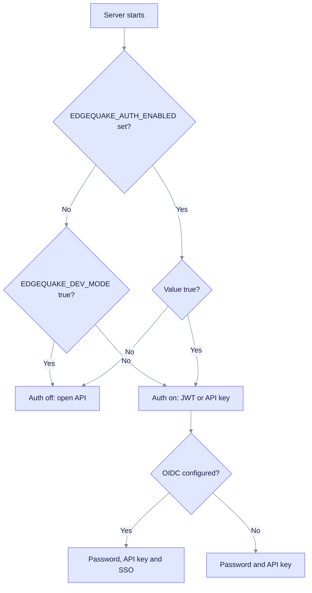

This section explains what EdgeQuake protects, from whom, and how to turn each control on. Start here for the overview, then follow the links for setup steps. It is written for operators who deploy EdgeQuake and for developers who integrate with it.

> Product release: v0.32.2. Provider Connections, the SSRF check and `edgequake doctor` ship in v0.33.0.

## What we protect

| Asset | Threat | Control | Where it is described |
|-------|--------|---------|-----------------------|
| Your documents and graph | Another tenant reads them | Tenant binding, workspace scope, PostgreSQL row-level security | [Tenant isolation](best-practices.md#tenant-isolation) |
| The API | Anonymous or stolen access | Passwords, JWT, API keys, SSO, rate limits, lockout | [Authentication](best-practices.md#authentication-modes) |
| Model API keys | Database or backup leak | AES-256-GCM encryption, write-only keys | [Secrets at rest](best-practices.md#secrets-at-rest) |
| Your network | Provider URL points at internal services | SSRF check on provider URLs | [SSRF defense](best-practices.md#ssrf-defense-for-provider-urls) |
| Your deployment | Insecure defaults go live | Startup posture checks, `edgequake doctor` | [Startup checks](best-practices.md#startup-posture-checks) |
| Accountability | No record of who did what | Audit log in PostgreSQL | [Audit log](best-practices.md#audit-log) |

Out of scope: TLS termination (use a reverse proxy), virus scanning of uploads, and prompt-injection defense beyond what your model provider offers. EdgeQuake does not redact personal data before it sends text to a model. Use a local provider when data must not leave your network.

## Which auth mode applies?

The server picks its mode from three settings. The chart shows the order of the checks.

Read it from the top: an explicit `EDGEQUAKE_AUTH_ENABLED` always wins, even over `EDGEQUAKE_DEV_MODE`. If it is unset, dev mode turns auth off; otherwise auth is on. Two legacy names are read in this order after the explicit variable: `AUTH_ENABLED`, then `EDGEQUAKE_AUTH_DISABLED=true`. Both are checked before dev mode.

## Pages

| Page | What you get |
|------|--------------|
| [Security guide](best-practices.md) | Threat controls, request flow, secrets, SSRF, rate limits, audit log, production checklist |
| [Authentication and SSO](authentication/index.md) | Keycloak and OIDC single sign-on, tenants and roles, per-provider guides |
| [Runtime auth hardening](../operations/runtime-auth-hardening.md) | Turn auth on, bootstrap the first admin |
| [Provider security](../providers/security.md) | Rules for model Connections |
| [Policy and reporting](https://github.com/raphaelmansuy/edgequake/blob/edgequake-main/SECURITY.md) | How to report a vulnerability |
