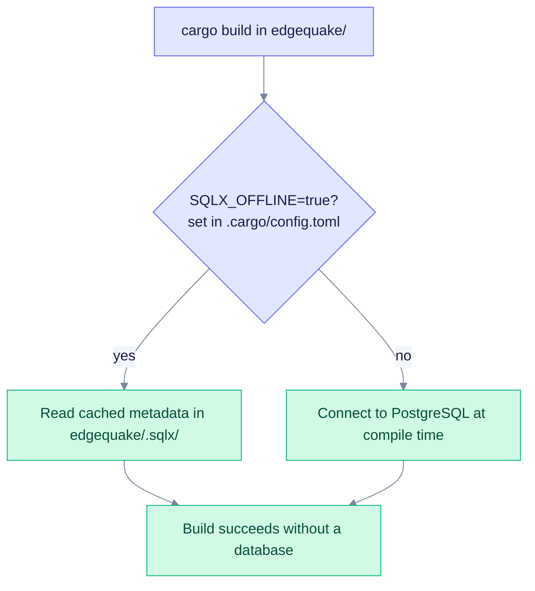
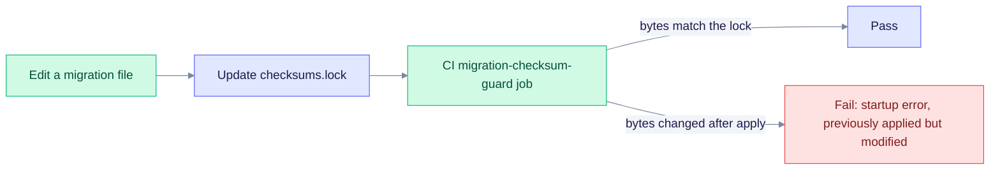

> **Product: v0.32.2** · Related: [Migration checksum gate](#migration-checksum-gate-adjacency)

# SQLx Offline Mode

Offline mode lets you build the EdgeQuake backend without a running PostgreSQL. This page explains how it works, when to regenerate its metadata, and how to fix common errors. It is for developers who change SQL queries or migrations.

## Overview

EdgeQuake uses SQLx's compile-time query checks. By default these checks connect to the database during the build. Offline mode reads cached query metadata from `edgequake/.sqlx/` instead.



Offline mode is on by default. The build reads only the metadata cache, so it opens no database connection.

## Problem

Without offline mode, the `query!`, `query_scalar!` and `query_as!` macros connect to PostgreSQL during `cargo build`. If the database is down, the build fails:

```text
error: error communicating with database: Connection refused (os error 61)
  --> edgequake/crates/edgequake-storage/src/adapters/postgres/pdf_storage_impl.rs
```

## Solution

Offline mode is the default. You generate the metadata once, while a database is reachable, and commit it.

### Configuration

1. `edgequake/.cargo/config.toml` turns offline mode on for every build:

   ```toml
   [env]
   SQLX_OFFLINE = "true"
   ```

2. `edgequake/.sqlx/` holds the generated query metadata, one JSON file per query macro call. Commit it to git.

### Workflow

#### Initial Setup (One Time)

Generate the metadata while a database is reachable:

```bash
# From the repo root: start PostgreSQL
make db-start

# Generate the SQLx metadata
make backend-sqlx-prepare

# Commit the metadata directory
git add edgequake/.sqlx/
git commit -m "chore: add SQLx offline metadata"
```

#### Regular Development

With offline mode configured, builds need no database:

```bash
# From the repo root (no database needed)
make backend-build

# Or use cargo directly
cd edgequake && SQLX_OFFLINE=true cargo build --release
```

#### When to Regenerate Metadata

Regenerate the metadata whenever you:

- add a `sqlx::query!`, `sqlx::query_scalar!` or `sqlx::query_as!` call,
- change an existing SQL query, or
- change the database schema (a migration).

```bash
# From the repo root (starts the database if needed)
make backend-sqlx-prepare
```

### Available Make Targets

All targets live in the repo-root [Makefile](../Makefile).

| Command | Description |
| ------- | ----------- |
| `make backend-build` | Builds the backend in offline mode (default) |
| `make backend-build-online` | Builds with live database verification |
| `make backend-sqlx-prepare` | Generates SQLx metadata for offline builds |

`backend-sqlx-prepare` runs `cargo sqlx prepare --workspace` inside `edgequake/`, with `DATABASE_URL` set to `localhost:5432`.

## How It Works

1. **Offline mode.** `SQLX_OFFLINE=true` makes the SQLx macros read `edgequake/.sqlx/` instead of querying the database.
2. **Metadata files.** Each macro call gets a JSON file with the query text, parameter types, result column types and nullability.
3. **Compile-time checks.** SQLx still checks each query and its types at compile time. It uses the cached metadata instead of a live connection.

## Migration checksum gate (adjacency)

SQLx metadata and migration immutability are separate gates. Both must pass.

| Gate | Path or command | What it catches |
| ---- | --------------- | --------------- |
| **SQLx offline** | `edgequake/.sqlx/` and `make backend-sqlx-prepare` | Query and type drift at compile time, without a live DB |
| **Migration checksum** | `edgequake/migrations/checksums.lock` and `./scripts/check_migration_checksums.sh` | Byte changes to migration SQL that has already been applied. Startup fails with "migration N was previously applied but has been modified" |



The guard compares each migration file with its locked checksum. Editing a migration that has already shipped trips it.

When you add or edit migration SQL:

1. Apply the migrations locally with `make migrate`, or restart the backend after `make db-start`.
2. Regenerate the SQLx metadata if queries changed: `make backend-sqlx-prepare`.
3. Update the checksum lockfile: `./scripts/update_migration_checksums.sh`.
4. Commit `edgequake/.sqlx/`, `edgequake/migrations/checksums.lock` and the migration file together.

CI runs `check_migration_checksums.sh` in the `migration-checksum-guard` job. To catch checksum drift before you push, install the local hooks with `./scripts/install_migration_hooks.sh`. Regression coverage is in `scripts/test_migration_e2e.sh`.

## Benefits

- **Faster CI and CD.** Build pipelines do not need a PostgreSQL service.
- **Offline development.** You can build without database access.
- **Consistent builds.** Every environment runs the same query checks.
- **Fewer dependencies.** The build stage needs no database credentials.

## Troubleshooting

### "`SQLX_OFFLINE=true` but there is no cached data for this query"

The full SQLx message ends with "run `cargo sqlx prepare` to update the query cache or unset `SQLX_OFFLINE`".

**Cause:** A query was added or changed, but the metadata was not regenerated.

**Fix:**

```bash
make backend-sqlx-prepare
```

Then commit `edgequake/.sqlx/`.

### Build fails with "Connection refused" even with `SQLX_OFFLINE=true`

**Cause:** The variable is not set, or `edgequake/.sqlx/` is missing.

**Fix:**

```bash
# Check the config
grep SQLX_OFFLINE edgequake/.cargo/config.toml

# Check that the metadata folder exists
ls -la edgequake/.sqlx/

# Regenerate the metadata if the folder is missing
make backend-sqlx-prepare
```

### CI fails migration-checksum-guard after editing SQL

**Cause:** The migration file bytes changed, but `checksums.lock` was not updated.

**Fix:**

```bash
./scripts/update_migration_checksums.sh
git add edgequake/migrations/checksums.lock
```

If the migration has already shipped, add a new migration instead of editing this one.

## References

- [SQLx offline mode (sqlx-cli README)](https://github.com/launchbadge/sqlx/blob/main/sqlx-cli/README.md#enable-building-in-offline-mode-with-query)
- [EdgeQuake Makefile](../Makefile): `backend-sqlx-prepare` target
- [edgequake/.cargo/config.toml](../edgequake/.cargo/config.toml): SQLx configuration
- [scripts/check_migration_checksums.sh](../scripts/check_migration_checksums.sh): CI immutability gate
