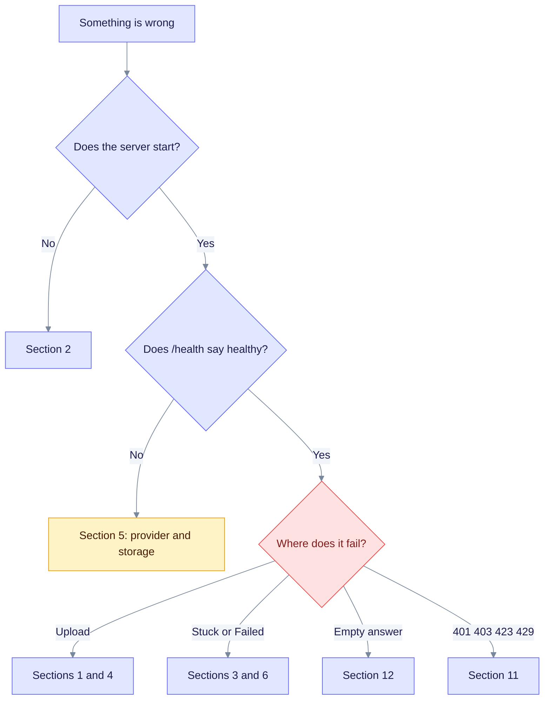
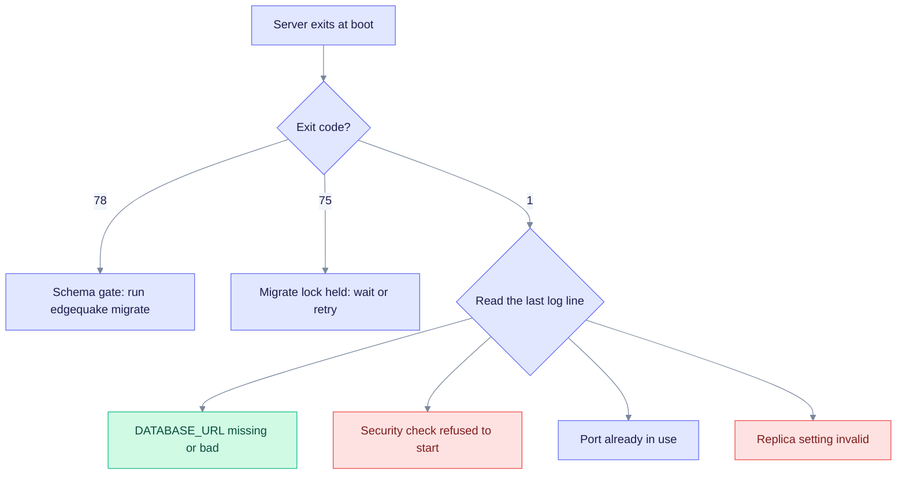
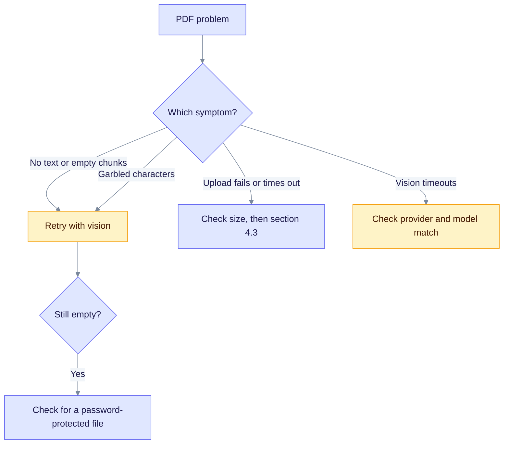

This page helps you find out why EdgeQuake does not start, does not ingest, or does not answer. Find your symptom, read the cause, and apply the fix. Every message in quotes comes from the code.

> Product release: v0.32.2. Sections 5.2, 11 and the `edgequake doctor` command describe SPEC-163, which ships in v0.33.0. Ingestion internals: [Ingestion cancel and fairness](../ingestion-cancel-and-fairness.md).

## Start here

Run these four checks first. They take a minute and narrow most problems to one area.

```bash
edgequake doctor                         # checks env settings (v0.33.0+)
curl -s http://localhost:8080/health | jq
curl -s -o /dev/null -w '%{http_code}\n' http://localhost:8080/ready
pg_isready -h localhost -p 5432
```

| Check | What it tells you |
|-------|-------------------|
| `edgequake doctor` | Whether `DATABASE_URL`, the secrets key, `JWT_SECRET` and the listen host are set. Exit 0 = all pass, 1 = `DATABASE_URL` missing, 2 = another check failed. Add `--json` for scripts. |
| `/health` | `status` is `healthy` or `degraded`. Look at `components` (storage and LLM provider) and `security_posture`. |
| `/ready` | 200 when the server can take traffic. 503 while a migration or index is pending, or when queue pressure is high. |
| `pg_isready` | Whether PostgreSQL answers at all. |

The next diagram shows where to go from the first symptom.



Read it from the top. Each leaf names the section of this page that covers that case.

## Diagnostic commands

```bash
# Backend and frontend logs when started with make dev-bg
tail -f /tmp/edgequake-backend.log
tail -f /tmp/edgequake-frontend.log

# Docker deployments
docker compose logs -f edgequake
docker compose logs -f postgres

# More detail from the server
RUST_LOG="edgequake=debug" cargo run
```

```sql
-- Documents by status
SELECT status, count(*) FROM documents GROUP BY status;

-- Failed documents
SELECT id, title, error_message FROM documents WHERE status = 'failed';
```

## 1. Document upload errors

EdgeQuake has three upload routes. Most upload errors come from sending the wrong body to the wrong route.

| Upload type | Endpoint | Content-Type | Body |
|-------------|----------|--------------|------|
| Text or JSON content | `POST /api/v1/documents` | `application/json` | `-d '{...}'` |
| Text, Markdown, JSON file, images | `POST /api/v1/documents/upload` | `multipart/form-data` | `-F "file=@"` |
| One PDF | `POST /api/v1/documents/pdf` | `multipart/form-data` | `-F "file=@"` |
| Several PDFs | `POST /api/v1/documents/pdf/batch` | `multipart/form-data` | `-F "files=@"` |
| Several text files (no PDFs) | `POST /api/v1/documents/upload/batch` | `multipart/form-data` | `-F "files=@"` |

DOCX and Excel files are not supported. See the [FAQ](../faq.md#what-document-formats-are-supported) and the [upload quick reference](../api-reference/document-upload-quick-reference.md).

| Symptom | Cause | Fix |
|---------|-------|-----|
| "Expected request with `Content-Type: application/json`" | You sent a multipart file to `/api/v1/documents` | Send JSON there, or use `/documents/upload` (or `/documents/pdf` for PDFs) |
| "Failed to parse the request body as JSON" | The JSON is malformed, or the content type is mixed | Check the body, and send `Content-Type: application/json` |
| A `.pdf` is rejected by `/documents/upload` or `/upload/batch` | PDFs have their own route | Use `/api/v1/documents/pdf` |
| HTTP 413 | The file is larger than 50 MiB | Split the file |
| HTTP 408 | The request timed out | Retry. For large PDFs, check section 3 |

```bash
# JSON content
curl -X POST http://localhost:8080/api/v1/documents \
  -H "Content-Type: application/json" \
  -d '{"content": "Your text here", "title": "Document title"}'

# A text or Markdown file
curl -X POST http://localhost:8080/api/v1/documents/upload \
  -F "file=@your-document.md" -F "title=My document"

# A PDF
curl -X POST http://localhost:8080/api/v1/documents/pdf \
  -F "file=@your-document.pdf" -F "title=My document"
```

## 2. The server will not start

The server stops early on purpose when something unsafe or missing would give you a half-working system. Use the message or exit code to find the row.



Exit 78 and 75 are the two codes that orchestrators can act on. Exit 1 has several causes, so read the last log line.

| Message or exit code | Cause | Fix |
|----------------------|-------|-----|
| "DATABASE_URL is required; start PostgreSQL and rerun make dev or make dev-auth" | `DATABASE_URL` is not set. There is no in-memory mode. | Set it, or run `make dev`. Check with `psql "$DATABASE_URL" -c "SELECT 1"` |
| "failed to initialize PostgreSQL storage at ..." | The URL is wrong, the database is down, or credentials are wrong | `pg_isready -h localhost -p 5432`, then fix the URL |
| "Address already in use (port ...)" | Another process listens on the port | `lsof -i :8080`, stop it, or set `PORT=9090` |
| Exit 78 and a line starting `BOOT_GATE_REFUSAL:` | Schema gate: a migration is pending and `EDGEQUAKE_SCHEMA_GATE` is `fail` (default) | Run `edgequake migrate`, or set `EDGEQUAKE_SCHEMA_GATE=wait` so the server serves `/live` and `/ready` (503) until the schema is ready |
| Exit 75 | `edgequake migrate` could not take its advisory lock within `EDGEQUAKE_MIGRATE_LOCK_DEADLINE` (default 60 s) | Wait for the other migrate run to end, then retry |
| "JWT_SECRET is the insecure default ..." or "JWT_SECRET is shorter than 32 bytes ..." | Outside dev mode the JWT secret must be 32 bytes or more and not the default | Set a strong `JWT_SECRET`, or `EDGEQUAKE_DEV_MODE=true` on a laptop |
| "Authentication disabled with non-local DATABASE_URL ..." | Auth is off and the database host is not local | Enable auth (`EDGEQUAKE_AUTH_ENABLED=true`), or use a local database in dev mode |
| "EDGEQUAKE_CORS_ORIGINS is required in production ..." | Non-local database and no allowed web origins | Set `EDGEQUAKE_CORS_ORIGINS` to your web origin list |
| "invalid EDGEQUAKE_DECISION_* setting" | A decision-extraction variable has a bad value | Fix the variable named in the error |
| Boot fails after setting `EDGEQUAKE_REPLICAS` above 1 | Task delivery is `local`, which is single-process | See [3.4](#34-multi-replica-boot-failure-edgequake_replicas1) |
| Boot continues but warns | A soft posture check failed | Fix the warning, or set `EDGEQUAKE_STRICT_STARTUP=1` so warnings stop the boot |

The full list of startup checks is in the [security guide](../security/best-practices.md#startup-posture-checks). Local database hosts are `localhost`, `127.0.0.1`, `::1` and `host.docker.internal`.

### PostgreSQL extensions

| Symptom | Cause | Fix |
|---------|-------|-----|
| "Extension 'vector' not found" | pgvector is not installed in this database | As a superuser run `CREATE EXTENSION IF NOT EXISTS vector;`, or use the project's Docker image |
| "AGE extension not loaded" | Apache AGE is not loaded in the session | Use the project's PostgreSQL image. Manual check: `LOAD 'age'; SET search_path = ag_catalog, "$user", public;` |

### Docker is down

`make db-start` reuses a reachable EdgeQuake PostgreSQL (ports 5432 to 5449). If Docker is down and none is reachable, it stops with instructions. It does not start Docker for you. Start Docker (or OrbStack) yourself, wait for `docker info` to work, and run `make dev`. To skip Docker, point `DATABASE_URL` at an existing PostgreSQL.

## 3. Documents stay in Processing

Check queue pressure and recent tasks first.

```bash
curl -s http://localhost:8080/api/v1/pipeline/queue-metrics | jq
curl -s "http://localhost:8080/api/v1/tasks?status=pending" | jq
tail -f /tmp/edgequake-backend.log
```

| Cause | Fix |
|-------|-----|
| The model server is down or slow | Check section 5. Start Ollama with `ollama serve` |
| Invalid or missing API key | Check the key for the provider that does extraction |
| Tenant fairness is parking the task | Normal with a local model. Look at the waiters in `queue-metrics`. See [Ingestion cancel and fairness](../ingestion-cancel-and-fairness.md) |
| A lease expired | See 3.1 and 3.2 |
| The worker died | Restart the backend |

To retry one document, post its id in the body:

```bash
curl -X POST "http://localhost:8080/api/v1/documents/reprocess" \
  -H "Content-Type: application/json" \
  -d "{\"document_id\":\"$DOC_ID\",\"force\":true,\"mode\":\"full\"}"
```

### 3.1 Interrupted / Reprocess

A document shows Failed with "Interrupted — use Reprocess". A task was in `Processing` when the server restarted or its lease expired.

When `EDGEQUAKE_STARTUP_AUTO_RESUME` is unset, the server moves stale `Processing` tasks back to `Pending` at boot. Set it to `0`, `false`, `off` or `no` to opt out. Then those tasks become Failed with the Interrupted message. Pending tasks always survive a restart. Reprocess with the command above.

### 3.2 Lease stuck in Processing

A task stays `Processing` with no progress. A worker died without releasing its lease, or an LLM call ran past the lease.

```bash
curl -s http://localhost:8080/api/v1/pipeline/queue-metrics | jq '{pending, processing, pressure, store_contention}'
grep -i "lease expired\|heartbeat lost\|Interrupted" /tmp/edgequake-backend.log | tail -20
```

The lease lasts `EDGEQUAKE_TASK_LEASE_TTL_SECS` (default 120, minimum 30). Wait for the reaper to mark the task Failed, then reprocess. You can also restart the backend. If it keeps happening, lower ingest concurrency or raise the lease for slow local models.

### 3.3 Cancel shows Failed

Cancel is a separate final state. Cancel with `POST /api/v1/tasks/{track_id}/cancel`. Then read the presentation fields, not the raw `status`:

```bash
curl -s "http://localhost:8080/api/v1/documents/$DOC_ID" | jq '{display_status, ui_phase, status, failure_class}'
```

After a cancel you should see `display_status` as `cancelled` and `ui_phase` as `terminal` (or `stopping` for a moment).

### 3.4 Multi-replica boot failure (`EDGEQUAKE_REPLICAS>1`)

The server refuses to start when `EDGEQUAKE_REPLICAS` is above 1 and `EDGEQUAKE_TASK_DELIVERY` is `local` (the default). Local delivery works inside one process only.

```bash
export EDGEQUAKE_REPLICAS=2
export EDGEQUAKE_TASK_DELIVERY=bridged   # or notify_only
```

Both modes only wake workers. Correctness always comes from the database claim and lease. Details: [Multi-replica delivery](../ingestion-cancel-and-fairness.md#multi-replica-delivery-spec-057-p3).

## 4. PDF extraction problems

A PDF is parsed by one of these backends. Pick it with the form field `pdf_parser_backend` on `POST /api/v1/documents/pdf`, with the workspace setting, or with `EDGEQUAKE_PDF_PARSER_BACKEND`.

| Value | Aliases | Use it for |
|-------|---------|-----------|
| `edgeparse` | `edge-parse`, `edge_parse` | Digital PDFs with a text layer. Fast, no LLM cost. |
| `edgeparse-ocr` | `edgeparse_ocr`, `edge-parse-ocr` | EdgeParse with OCR for scanned pages |
| `vision` | `llm` | Scans, handwriting, image-heavy pages. Uses the vision model, so it costs more and is slower. |
| `auto` | none | Let EdgeQuake choose |

An unknown value is ignored, so check the spelling. These form fields are accepted on the PDF routes: `enable_vision`, `vision_provider`, `vision_model`, `vision_reasoning_effort`, `title`, `metadata`, `track_id`, `pdf_parser_backend`, `vision_extract_images`, `vision_extract_charts`, `vision_extract_figures` and the four `vision_*_system_prompt` fields.



Most PDF problems are fixed by switching the backend or fixing the vision model setting.

### 4.1 No text, empty chunks or garbled characters

A scan has no text layer, and some fonts have no usable encoding. Both give `chunk_count` of 0, empty chunks, or `?` and replacement characters.

```bash
curl -s http://localhost:8080/api/v1/documents/$DOC_ID | jq
```

Retry with the vision backend:

```bash
curl -X POST http://localhost:8080/api/v1/documents/pdf \
  -F "file=@scanned.pdf" -F "pdf_parser_backend=vision"
```

To make vision the default for a workspace of scans, update the workspace:

```bash
curl -X PUT http://localhost:8080/api/v1/workspaces/$WORKSPACE_ID \
  -H "Content-Type: application/json" \
  -d '{"pdf_parser_backend":"vision"}'
```

To check fonts, run `pdffonts document.pdf` (from poppler-utils) and look for fonts with `no` in the `emb` column. If the PDF is password-protected, remove the password first.

### 4.2 Tables or reading order look wrong

EdgeQuake has no per-request switches for table repair or column detection. Two things help:

- Use `pdf_parser_backend=vision`. The vision model reads the rendered page, so it follows tables and columns the way a person does.
- For handwritten or old documents, see the `EDGEQUAKE_PDF_MANUSCRIPT_*` and `EDGEQUAKE_VISION_*_MANUSCRIPT` settings in the [environment reference](../operations/env-reference.md).

Very complex tables (many levels of merged cells) can still be imperfect. If you have a sample file, open an issue on GitHub with the page count, size and logs.

### 4.3 Upload fails, times out, or Vision times out

| Symptom | Cause | Fix |
|---------|-------|-----|
| 413 | The file is over 50 MiB | Split it, for example `pdftk large.pdf cat 1-50 output part1.pdf` |
| 500 on a damaged file | The PDF is corrupt | Repair it: `gs -o repaired.pdf -sDEVICE=pdfwrite -dPDFSETTINGS=/prepress original.pdf` |
| "Vision extraction timed out after ..." | The vision model is slow, or the model does not belong to the provider | See below |
| "Circuit breaker tripped after N consecutive timeouts" | Several timeouts in a row stopped the task | Fix the cause, then reprocess |
| "Provider 'ollama' may be unresponsive" | The provider does not answer | Check the provider, section 5 |

The most common cause of vision timeouts is a model that the provider cannot serve. An example is `EDGEQUAKE_VISION_MODEL=gpt-4.1-nano` with `EDGEQUAKE_VISION_PROVIDER=ollama`. It happens when a Makefile or compose file sets the model and `.env` sets the provider. Check the effective settings:

```bash
curl -s http://localhost:8080/api/v1/config/effective | jq '.areas[] | select(.name == "Vision")'
```

If `has_mismatch` is `true`, `mismatch_description` says how to fix it. The Settings page shows the same data under Configuration Explainability. EdgeQuake skips an incompatible model at run time and logs a warning, but you should fix the variables.

| Fix | Command |
|-----|---------|
| Use the provider's default model | `unset EDGEQUAKE_VISION_MODEL` |
| Use an OpenAI model | `EDGEQUAKE_VISION_PROVIDER=openai` and `OPENAI_API_KEY` |
| Stay on Ollama | `EDGEQUAKE_VISION_MODEL=gemma4:latest` |

Restart the backend, then re-upload through `/api/v1/documents/pdf`.

## 5. LLM and provider errors

### 5.1 Common provider errors

An error from the model server comes back as HTTP 502 with code `LLM_ERROR`.

| Symptom | Cause | Fix |
|---------|-------|-----|
| "Rate limit exceeded" from OpenAI | Your quota or rate limit was hit | Wait and retry. Lower `EDGEQUAKE_MAX_CONCURRENT_EXTRACTIONS`, or switch the provider |
| "Invalid API key" | The key is wrong or revoked | `curl https://api.openai.com/v1/models -H "Authorization: Bearer $OPENAI_API_KEY"` |
| "Connection refused" to Ollama | Ollama is not running, or `OLLAMA_HOST` is wrong | `ollama serve`, then `curl http://localhost:11434/api/tags` |
| Model not found | The model is not pulled | `ollama pull gemma4:latest` and `ollama pull embeddinggemma` |
| Embedding dimension mismatch | You changed the embedding model after ingesting | Re-embed the workspace. See [Roles](../providers/roles.md) |
| `/health` is `degraded` and `llm_provider` is false | A local provider does not answer, or a cloud provider has no key | Fix the provider, then check `/health` again |

### 5.2 Test a connection before you use it (v0.33.0)

`POST /api/v1/providers/test` and the Test button in Settings check a model server without saving anything. They try to list models, send a one-word chat, and (for most shapes) request one embedding. Each try waits at most 8 seconds and does not follow redirects.

```bash
curl -sS -X POST http://localhost:8080/api/v1/providers/test \
  -H 'Content-Type: application/json' \
  -d '{"shape":"openai_chat","base_url":"http://127.0.0.1:9050/v1","allow_private_network":true}'
```

The answer has a `kind`. Use it to pick the fix.

| `kind` | Meaning | Fix |
|--------|---------|-----|
| `ok` | Reachable, chat works | Nothing to do |
| `invalid_url` | No `base_url`, or it cannot be parsed | Give a full `http://` or `https://` URL |
| `ssrf_denied` | The URL is blocked | See the SSRF table in 11.3 |
| `unreachable` | The server did not answer in time | Is it running, and is the host and port right? From Docker use `host.docker.internal`, not `localhost` |
| `unauthorized` | The server returned 401 | Check the key and `auth_scheme` (`bearer`, `x_api_key` or `none`) |
| `shape_mismatch` | The server answered but not in the expected format | Pick the right shape. Check that the base URL ends where the server expects |
| `model_not_found` | The model is not on the server | Use a model from the list the test returns |
| `dim_mismatch` | The embedding size differs from the expected size | Use the same embedding model as the workspace |

The test adds `/v1/models` and `/v1/chat/completions` to your base URL itself. The chat client used at run time takes the base URL as given and adds only `/chat/completions`. Save a Connection with a base URL that ends in `/v1` for OpenAI-compatible servers. A URL without `/v1` can pass the test and then fail in use. This comes from reading the code and was not run against a live server. See [OpenAI-compatible](../providers/openai-compatible.md).

### 5.3 Saving a Connection fails

| Message | Cause | Fix |
|---------|-------|-----|
| "EDGEQUAKE_SECRETS_KEY is required to store API keys" (HTTP 400) | The server has no key to encrypt with | Set `EDGEQUAKE_SECRETS_KEY` to 64 hex characters (`openssl rand -hex 32`) and restart |
| "EDGEQUAKE_SECRETS_KEY must be 32 bytes (raw, base64, or 64-char hex)" | The key has the wrong length | Use 64 hex characters, base64 of 32 bytes, or 32 raw characters |
| "provider URL host is blocked (...)" | Metadata or internal host | Use a different host |
| "private or loopback URLs require locality=local (set allow_private_network)" | A private address with `locality` set to cloud | Set `locality` to `local` or set `allow_private_network` to true |
| HTTP 401 or 403 on `/api/v1/connections` | These routes need an admin | Sign in as an admin, or use the master API key |

### 5.4 A saved Connection is not used

Role and Connection resolution falls back silently. A bad `connection_id`, a missing row, a failed decrypt (for example after you changed `EDGEQUAKE_SECRETS_KEY`) or a client build error makes EdgeQuake fall back to the workspace, tenant and then environment settings. Nothing is shown to the user.

1. Check the server log for the provider name actually used.
2. Re-save the Connection with its key, so the key is encrypted with the current secrets key.
3. Remember that only the `extract` and `query` roles use `connection_id` today. See [Roles](../providers/roles.md).
4. A Connection with an Ollama shape still reads `OLLAMA_HOST` at run time, not its `base_url`.

Keys are never returned by the API. If you lose the secrets key, you must enter the provider keys again. `quickstart.sh` creates a new `EDGEQUAKE_SECRETS_KEY` on each run unless you export one, so keep yours in your environment or `.env` file.

## 6. Slow answers and timeouts

### 6.1 Slow queries

Turn on debug logs (`RUST_LOG="edgequake=debug"`) and look at the timing in the log.

| Cause | Fix |
|-------|-----|
| The model is cold | Run one warm-up query |
| Too much context | Send a smaller `max_results` in the query body |
| Embedding runs on CPU | Use a GPU or a cloud embedding model |
| The database pool is full | See section 7 |

### 6.2 "Timeout after 180s (attempt X/3)" during ingestion

The per-chunk limit ended before your model finished. There are two layers. The first fires first.

| Layer | Variable | Default | Notes |
|-------|----------|---------|-------|
| Per chunk | `EDGEQUAKE_CHUNK_TIMEOUT_SECS` | 180 s for cloud providers, 600 s for local ones | Minimum 10 |
| HTTP cap for extraction calls | `EDGEQUAKE_LLM_TIMEOUT_SECS` | 600 s for cloud, 900 s for local | Range 10 to 3600 |

"Local" means Ollama, LM Studio, oMLX, MTPLX, llama.cpp, vLLM-MLX and mlx-lm. Local providers also run one extraction at a time by default. Cloud providers run 16 at a time. `EDGEQUAKE_MAX_CONCURRENT_EXTRACTIONS` accepts 1 to 32. Raising it above 1 for a local provider only has effect when `EDGEQUAKE_ALLOW_LOCAL_HIGH_CONCURRENCY=1` is set.

Lowering concurrency often fixes timeouts better than raising limits, because many parallel calls to one GPU all wait behind each other.

```bash
# A slow local model
export EDGEQUAKE_CHUNK_TIMEOUT_SECS=900
export EDGEQUAKE_LLM_TIMEOUT_SECS=1800
export EDGEQUAKE_CHUNK_RETRY_DELAY_MS=5000
```

To measure one call on your hardware:

```bash
time curl -s http://localhost:11434/api/chat \
  -d '{"model":"gemma4:latest","messages":[{"role":"user","content":"extract entities from: Alice works at Acme"}]}'
```

More profiles: [Performance tuning](../operations/performance-tuning.md#ingestion-pipeline-tuning).

## 7. Database problems

| Symptom | Cause | Fix |
|---------|-------|-----|
| "Connection pool exhausted" | More concurrent work than connections | Check `SELECT count(*) FROM pg_stat_activity WHERE datname='edgequake'`. Raise `DATABASE_POOL_SIZE` (default 32). Use PgBouncer if needed |
| "relation 'documents' does not exist" | The schema has not been created | Run `edgequake migrate`, then start the server |
| Disk full or slow inserts | The disk is full or tables are bloated | `df -h`, find big tables with `pg_total_relation_size`, run `VACUUM ANALYZE` |

## 8. Graph problems

| Symptom | Cause | Fix |
|---------|-------|-----|
| Entities have no relationships | Extraction found none, or it failed | Check `GET /api/v1/graph/relationships`. Reprocess with `RUST_LOG="edgequake_pipeline=debug"` |
| Graph page is empty | No entities, or the browser cannot reach the API | Check `GET /api/v1/graph/entities`, then the browser console |
| Nodes named like `84b69e27-e38b-444a-...` | Older versions stored opaque ids from the text as entity names | Re-ingest after upgrading. New ingests reject UUID, ULID, hash and ARN-shaped names. Delete leftover nodes in the Graph page |
| PostgreSQL stays busy during a community refresh | The refresh is scanning a large graph | See below |

Community refresh loads the workspace graph in pages. Each page is cancelled after `EDGEQUAKE_COMMUNITY_STATEMENT_TIMEOUT_MS` (default 30 s, range 1 s to 300 s). The refresh is skipped when the workspace has more than `EDGEQUAKE_COMMUNITY_BACKFILL_MAX_NODES` nodes (default 50,000), when counting nodes fails, or when another replica holds the lock. When it runs, it loads at most `EDGEQUAKE_COMMUNITY_MAX_NODES` nodes (default 50,000) and clusters a sample beyond that. Look for `Skipping community index refresh` or `statement_timeout` in the log. Raise the limits only for a plan you trust.

## 9. Web UI problems

| Symptom | Cause | Fix |
|---------|-------|-----|
| The UI cannot reach the API | The backend is down, or CORS blocks the origin | `curl http://localhost:8080/health`. Outside dev mode set `EDGEQUAKE_CORS_ORIGINS` to the UI origin |
| Stale data after an upgrade | Browser cache | Hard refresh (Cmd+Shift+R) |
| Port 3000 in use | A stale process | `lsof -ti:3000 \| xargs kill` |
| The "provider down" banner shows | `/health` reports `components.llm_provider` as false (checked every 30 s) | See 5.1 and 5.2 |

## 10. Documents page: Read path busy

The page shows "Error loading documents — Read path busy" and the header shows Busy. Interactive reads share one deadline and a small database permit, so ingest cannot hold the pool until the client gives up ([#400](https://github.com/raphaelmansuy/edgequake/issues/400)). HTTP 503 with code `read_path_busy` means that budget ran out. It is retryable and does not leave a lock behind.

| `details.reason` | Meaning |
|------------------|---------|
| `work_deadline` | The handler took longer than `EDGEQUAKE_DOCUMENTS_READ_TIMEOUT_MS` (default 2500, range 500 to 30000) |
| `permit_wait` | Too many list or search reads were already running |
| `permit_closed` | The permit was shut down |

Guarded routes: `GET /api/v1/documents`, document detail, `GET /api/v1/documents/search`, `GET /api/v1/tenants` and `GET /api/v1/tenants/{id}/workspaces`.

The web UI retries once after `details.retry_after_ms`, then shows Try again. The Busy pill means readiness is `degraded`. `?include_stats=true` on the workspace list returns `stats: null` on a cache miss under this deadline. Open the workspace, or call `GET /api/v1/workspaces/{id}/stats`, to fill the cache.

What to do:

1. Retry. One 503 during a heavy ingest is expected.
2. If every list fails, look at pool use and slow queries in `pg_stat_activity`. Do not restart to "release a lock".
3. Raise `EDGEQUAKE_DOCUMENTS_READ_TIMEOUT_MS` only if the list query is really slower than 2.5 s. PostgreSQL stops 250 ms earlier so the connection returns to the pool.
4. The permit count is `max(2, DATABASE_POOL_SIZE / 8)`, which is 4 with the default pool of 32.

## 11. Sign-in, access and security errors

### 11.1 HTTP status reference

| Status and code | Meaning | What to do |
|-----------------|---------|------------|
| 400 `BAD_REQUEST` | Bad request | Check the body |
| 401 `UNAUTHORIZED` | No valid credential | Send `Authorization: Bearer <token or key>`. Refresh an expired token |
| 403 `FORBIDDEN` | Valid credential, not allowed | Check the role and key scopes. A read-only user cannot write |
| 404 `NOT_FOUND` | Not found, or not in your tenant | Check the id and the `X-Tenant-ID` and `X-Workspace-ID` headers |
| 408 `REQUEST_TIMEOUT` | Timed out | Retry |
| 409 `CONFLICT` | Duplicate or conflicting state | Read the message |
| 422 `VALIDATION_ERROR` or `CONFIG_ERROR` | A field or setting is invalid | Fix the field |
| 423 `ACCOUNT_LOCKED` | Five failed logins | Wait 15 minutes. See `MAX_LOGIN_ATTEMPTS` and `LOCKOUT_DURATION_MINUTES` |
| 429 `RATE_LIMITED` | Rate limit (only when `EDGEQUAKE_RATE_LIMIT_ENABLED` is on) | Wait for `Retry-After` seconds |
| 502 `LLM_ERROR` | The model server failed | See section 5 |
| 503 `SERVICE_UNAVAILABLE` | A dependency is not ready | `read_path_busy`: section 10. Otherwise check `/ready` |

### 11.2 Common sign-in problems

| Symptom | Cause | Fix |
|---------|-------|-----|
| Every call is 401 after turning auth on | No credentials configured | Set `EDGEQUAKE_MASTER_API_KEY`, or the bootstrap admin (`EDGEQUAKE_BOOTSTRAP_ADMIN_USERNAME` and `_PASSWORD`) |
| `/api/v1/setup/initialize` returns 401 | The `x-edgequake-setup-token` header does not match `EDGEQUAKE_SETUP_TOKEN` | Send the right header |
| WebSocket closes at once | The token was sent as `?token=`, which is rejected | Use the `Authorization` header or `Sec-WebSocket-Protocol: edgequake.bearer, <jwt>` |
| SSO errors such as `org_unknown` | Mapping from the identity provider failed | See [SSO troubleshooting](../security/authentication/troubleshooting.md) |

### 11.3 Provider URL blocked (SSRF)

EdgeQuake checks every provider URL before it connects. The error text tells you the rule.

| Message | Rule |
|---------|------|
| "provider URL must be http or https" | Other schemes are refused |
| "provider URL host is blocked (...)" | Metadata and internal names such as `metadata.google.internal`, `*.internal` and `169.254.*` are always blocked |
| "private or loopback URLs require locality=local (set allow_private_network)" | Private and loopback addresses are allowed only for local providers |
| "invalid provider URL: ..." | The URL cannot be parsed |

Details and limits: [Security guide](../security/best-practices.md#ssrf-defense-for-provider-urls).

### 11.4 `edgequake doctor` fails

| Check | Fails when | Fix |
|-------|-----------|-----|
| `database` | `DATABASE_URL` is empty | Set it. This is the only failure that gives exit 1 |
| `secrets_key` | No `EDGEQUAKE_SECRETS_KEY` (and `EDGEQUAKE_DEV_MODE` is not set at all) | Set a 64-hex key |
| `jwt_secret` | `JWT_SECRET` is under 32 bytes or the default (dev mode excepted) | Set a strong secret |
| `bind` | `EDGEQUAKE_HOST` is not `127.0.0.1` or `localhost` (it defaults to `0.0.0.0`) and dev mode is off | Set `EDGEQUAKE_HOST=127.0.0.1`, or `EDGEQUAKE_DEV_MODE=true` locally. The server itself binds with `HOST` and `PORT` |

The `llm_provider` check never fails. It only prints the default provider.

## 12. Queries return nothing

```bash
curl -s "http://localhost:8080/api/v1/documents" -H "X-Workspace-ID: $WORKSPACE_ID" | jq
curl -s "http://localhost:8080/api/v1/graph/entities" -H "X-Workspace-ID: $WORKSPACE_ID" | jq
curl -s "http://localhost:8080/api/v1/workspaces/$WORKSPACE_ID/stats" | jq
```

| What you see | Cause | Fix |
|--------------|-------|-----|
| 0 documents | Nothing was uploaded to this workspace | Upload, and check that you use the right workspace |
| Documents, but 0 entities | Extraction failed | Check the document error, then reprocess |
| Entities, but an empty answer | The mode does not match the question | Try another mode, such as `naive` (vector search only) |

```bash
curl -X POST "http://localhost:8080/api/v1/query" \
  -H "Content-Type: application/json" -H "X-Workspace-ID: $WORKSPACE_ID" \
  -d '{"query": "test", "mode": "naive"}'
```

If `naive` works and `hybrid` does not, the graph is the problem. Go to section 8.

## Getting help

Before you open an issue, collect:

1. The EdgeQuake version (`curl -s http://localhost:8080/health | jq .version`).
2. The output of `edgequake doctor --json` and `/health`.
3. The LLM provider and model.
4. The steps to reproduce and the relevant log lines.

For maximum logging start with `RUST_LOG="edgequake=trace,sqlx=debug,tower_http=debug"`.

## See also

- [Ingestion cancel and fairness](../ingestion-cancel-and-fairness.md) for cancel, leases and multi-replica delivery
- [Observability](../OBSERVABILITY.md) for metrics and queue pressure
- [Configuration reference](../operations/configuration.md) and [environment reference](../operations/env-reference.md)
- [Providers](../providers/index.md) and [Security](../security/index.md)
