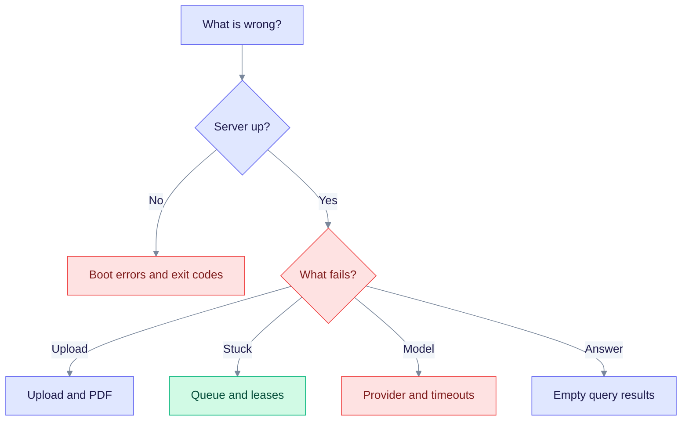

This section helps you find and fix problems with a running EdgeQuake. Start with the checks below, then open the matching section of the [troubleshooting guide](common-issues.md).

> Product release: v0.32.2. `edgequake doctor` and the provider test endpoint arrive in v0.33.0.

## First checks

```bash
edgequake doctor                              # v0.33.0 and later
curl -s http://localhost:8080/health | jq
curl -s -o /dev/null -w '%{http_code}\n' http://localhost:8080/ready
```

| Result | Meaning | Go to |
|--------|---------|-------|
| The server exits at boot | A required setting is missing or unsafe | [Server will not start](common-issues.md#2-the-server-will-not-start) |
| `/health` says `degraded` | A provider or store is down | [LLM and provider errors](common-issues.md#5-llm-and-provider-errors) |
| `/ready` returns 503 | A migration is pending, or the queue is under pressure | [Server will not start](common-issues.md#2-the-server-will-not-start) |
| Uploads fail | Wrong route or body | [Upload errors](common-issues.md#1-document-upload-errors) |
| Documents stay Processing | Queue, lease or model problem | [Processing](common-issues.md#3-documents-stay-in-processing) |
| 401, 403, 423 or 429 | Credentials, role or limits | [Sign-in and access](common-issues.md#11-sign-in-access-and-security-errors) |

## Pick a section



Follow the branch that matches what you see. Each leaf is a section in the guide.

## Pipeline reliability

| Topic | Where |
|-------|-------|
| Cancel is not Failed (`display_status`, Stopping) | [Ingestion cancel and fairness](../ingestion-cancel-and-fairness.md) |
| Interrupted, then Reprocess, after a restart or lease expiry | [Guide 3.1](common-issues.md#31-interrupted--reprocess) |
| Lease stuck in Processing | [Guide 3.2](common-issues.md#32-lease-stuck-in-processing) |
| Boot fails with `EDGEQUAKE_REPLICAS` above 1 | [Guide 3.4](common-issues.md#34-multi-replica-boot-failure-edgequake_replicas1) |
| Queue pressure and quarantine | [Observability](../OBSERVABILITY.md#queue-pressure--store-contention-v019) |
| Documents page shows Read path busy | [Guide 10](common-issues.md#10-documents-page-read-path-busy) |
| Provider Connection and Test failures | [Guide 5.2 and 5.3](common-issues.md#52-test-a-connection-before-you-use-it-v0330) |

## Related

- [Configuration](../operations/configuration.md) lists the settings for leases, replicas and queue thresholds.
- [Monitoring](../operations/monitoring.md) covers Prometheus and the health endpoints.
- [SQLx offline mode](../sqlx-offline-mode.md) explains builds without a database.
- [Providers](../providers/index.md) and [Security](../security/index.md).
