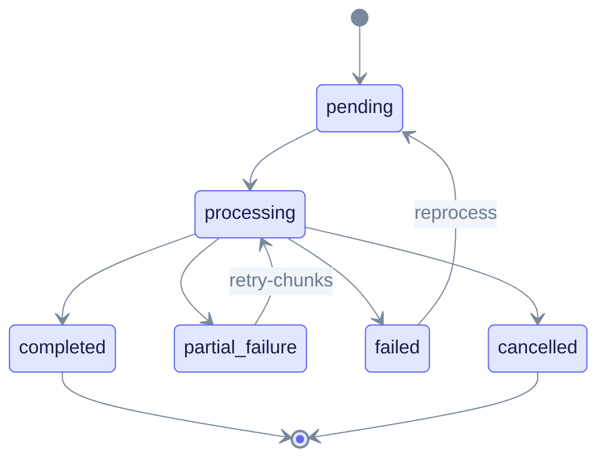

In this tutorial you upload documents in three ways, watch them move through the ingestion pipeline and tune the options that matter most. You also learn how to retry failed documents.

> **You will build:** a workspace that ingests text, PDFs and files with tuned chunking and entity types, plus a recovery routine for failures.
>
> **You need:** the setup from [First RAG app](first-rag-app.md): a running server, a workspace, and the shell variables `EQ_API` and `WORKSPACE_ID`. Allow about 20 minutes.

## The pipeline

Ingestion turns a document into a searchable knowledge graph. The flowchart shows the stages. PDFs take one extra conversion step at the start.

```mermaid
%%{init: {"theme":"base","themeVariables":{"primaryColor":"#E0E7FF","primaryBorderColor":"#6366F1","primaryTextColor":"#1E1B4B","secondaryColor":"#D1FAE5","secondaryBorderColor":"#10B981","secondaryTextColor":"#064E3B","tertiaryColor":"#FEF3C7","tertiaryBorderColor":"#F59E0B","tertiaryTextColor":"#6B7A90","lineColor":"#7A889C","clusterBkg":"rgba(99,102,241,0.07)","clusterBorder":"#A5B4FC","noteBkgColor":"#FEF9C3","noteTextColor":"#422006","textColor":"#6B7A90","titleColor":"#6B7A90","signalColor":"#7A889C","signalTextColor":"#6B7A90","loopTextColor":"#6B7A90","edgeLabelBackground":"#F1F5F9","actorLineColor":"#94A3B8"}}}%%
%% eq-theme:v1
flowchart LR
  A["Upload"] --> B["Convert PDF to Markdown"]
  A --> C["Chunk (chunking)"]
  B --> C
  C --> D["Extract (extracting)"]
  D --> E["Glean (gleaning)"]
  E --> F["Merge (merging)"]
  F --> G["Embed (embedding)"]
  G --> H["Store (storing)"]
%% eq-classes
classDef eqLlm fill:#FEF3C7,stroke:#F59E0B,color:#451A03
class G eqLlm
```



Read it left to right. Plain text and Markdown skip the PDF step. Gleaning (a second pass that asks the model for missed items) is optional. The labels in brackets are the stage names that the API reports. See [Pipeline progress](../deep-dives/pipeline-progress.md) for the full list and [LightRAG algorithm](../deep-dives/lightrag-algorithm.md) for the theory.

## 1. Upload a document

EdgeQuake has three upload routes. All of them return quickly and process in the background.

| Route | Body | Use it for |
|-------|------|------------|
| `POST /api/v1/documents` | JSON with `content` | Text your code already has in memory. |
| `POST /api/v1/documents/upload` | Multipart field `file` | `.txt`, `.md` and other text files. |
| `POST /api/v1/documents/pdf` | Multipart field `file` | PDFs. See [PDF ingestion](pdf-ingestion.md). |

Every call needs the header `X-Workspace-ID`.

### Upload JSON text

```bash
curl -s -X POST "$EQ_API/api/v1/documents" \
  -H "Content-Type: application/json" \
  -H "X-Workspace-ID: $WORKSPACE_ID" \
  -d '{
    "title": "Quarterly report",
    "content": "Acme Corp reported record revenue. CEO Jane Park credited the new Berlin office.",
    "metadata": {"source": "tutorial"}
  }' | jq '{document_id, status, track_id, duplicate_of}'
```

Expected output (HTTP `202 Accepted`):

```json
{
  "document_id": "6a0d4b0e-...",
  "status": "pending",
  "track_id": "<track-id>",
  "duplicate_of": null
}
```

The JSON route always processes in the background. The field `async_processing` is accepted for compatibility, but the server queues the document either way.

If you upload the same content twice, `duplicate_of` holds the ID of the existing copy and no new work starts. The status then reads `duplicate_processing`.

### Upload a file

```bash
curl -s -X POST "$EQ_API/api/v1/documents/upload" \
  -H "X-Workspace-ID: $WORKSPACE_ID" \
  -F "file=@notes.md" \
  | jq '{document_id, filename, status, is_duplicate, track_id}'
```

To upload several files in one call, use `POST /api/v1/documents/upload/batch` and repeat the `files` field.

### Upload options

Send these as JSON fields, or as extra multipart text fields where marked.

| Option | JSON | Multipart | Default | Effect |
|--------|:----:|:---------:|---------|--------|
| `title` | yes | no | `Untitled` | Display name. |
| `metadata` | yes | yes (JSON string) | none | Free-form data stored with the document. |
| `chunk_strategy` | yes | yes | chosen from the file type | `recursive`, `fixed`, `markdown`, `pdf` or `semantic`. |
| `chunk_options` | yes | yes (JSON string) | workspace policy | For example `{"chunk_token_size": 1200, "chunk_overlap_token_size": 100}`. |
| `enable_gleaning` | yes | no | `true` | Run the second extraction pass. |
| `max_gleaning` | yes | no | `1` (capped at `2`) | Number of extra passes. |
| `use_llm_summarization` | yes | no | `true` | Merge long entity descriptions with the LLM. |
| `extract_max_entities` | yes | yes | `40` (server default) | Cap on entities per chunk response. |
| `extract_max_records` | yes | yes | `100` (server default) | Cap on total rows per chunk response. |
| `extraction_mode` | yes | yes | `llm` | `llm` or `decision`. See [Decision extraction](../concepts/decision-extraction.md). |

The two `extract_max_*` defaults come from `EDGEQUAKE_MAX_EXTRACTION_ENTITIES` and `EDGEQUAKE_MAX_EXTRACTION_RECORDS`.

Example with options:

```bash
curl -s -X POST "$EQ_API/api/v1/documents" \
  -H "Content-Type: application/json" \
  -H "X-Workspace-ID: $WORKSPACE_ID" \
  -d '{
    "title": "Long report",
    "content": "...",
    "chunk_strategy": "recursive",
    "chunk_options": {"chunk_token_size": 600, "chunk_overlap_token_size": 60},
    "enable_gleaning": false
  }'
```

> **Defaults on local models.** With Ollama or LM Studio, gleaning is off even if you ask for it, because it doubles the load on a local server. Set `EDGEQUAKE_LOCAL_ENABLE_GLEANING=true` on the server to allow it. See [Gleaning](../deep-dives/gleaning.md).

## 2. Track progress

Every upload returns a `document_id` and a `track_id`. Save them from the response, for example with `jq -r '.document_id'` and `jq -r '.track_id'`, into `DOC_ID` and `TRACK_ID`. Use the track ID to follow all documents from one upload or batch:

```bash
curl -s "$EQ_API/api/v1/documents/track/$TRACK_ID" \
  -H "X-Workspace-ID: $WORKSPACE_ID" \
  | jq '{is_complete, total_count, status_summary, latest_message}'
```

To follow one document, read it by ID. `ui_phase` is `idle`, `running`, `stopping` or `terminal`. While a document runs, `display_status` shows the current stage name:

```bash
curl -s "$EQ_API/api/v1/documents/$DOC_ID" -H "X-Workspace-ID: $WORKSPACE_ID" \
  | jq '{display_status, ui_phase, chunk_count, entity_count, relationship_count, error_message}'
```

The document moves through these states:



Read it from the start dot. `processing` stands for every running stage (chunking, extracting, gleaning, merging, embedding and storing). `failed` goes back to `pending` when you reprocess it. `partial_failure` re-runs its failed chunks with `retry-chunks`.

Other ways to watch progress:

- `GET /api/v1/documents?page=1&page_size=20` lists documents with status and counts.
- A WebSocket at `/ws/progress/{track_id}` (no `/api/v1` prefix) streams live events for one upload.
- `GET /api/v1/workspaces/$WORKSPACE_ID/stats` returns workspace totals: `document_count`, `chunk_count`, `entity_count`, `relationship_count`.

## 3. Choose chunking

A **chunk** is a slice of text sized in tokens. The chunker has three layers of settings; the most specific wins:

1. The upload (`chunk_strategy`, `chunk_options`).
2. The workspace (`chunking_mode`, `chunk_token_size`, `chunk_overlap_token_size`).
3. The server (`EDGEQUAKE_CHUNK_SIZE`, `EDGEQUAKE_CHUNK_OVERLAP`, used when adaptive sizing is off).

Set a workspace policy once, and every upload inherits it:

```bash
curl -s -X PUT "$EQ_API/api/v1/workspaces/$WORKSPACE_ID" \
  -H "Content-Type: application/json" \
  -d '{"chunking_mode": "fixed", "chunk_token_size": 800, "chunk_overlap_token_size": 80}' | jq '.id'
```

Smaller chunks give more precise retrieval and more LLM calls. Larger chunks keep more context and risk exceeding the embedding model limit. The strategies, adaptive sizing and defaults are in [Chunking strategies](../deep-dives/chunking-strategies.md).

## 4. Choose entity types

The extractor labels each entity with a type. The default types are `PERSON`, `CREATURE`, `ORGANIZATION`, `LOCATION`, `EVENT`, `CONCEPT`, `METHOD`, `CONTENT`, `DATA`, `ARTIFACT`, `NATURALOBJECT` and `OTHER`.

Replace them for your domain on the workspace. Types are uppercased and the list is capped at 50 entries.

```bash
curl -s -X PUT "$EQ_API/api/v1/workspaces/$WORKSPACE_ID" \
  -H "Content-Type: application/json" \
  -d '{"entity_types": ["PERSON", "ORGANIZATION", "PRODUCT", "REGULATION"], "entity_types_strict": true}' \
  | jq '.id'
```

With `entity_types_strict` on (the default), a type outside your list is remapped to a fallback type such as `OTHER`. Set it to `false` to let the model invent labels. The setting applies to documents ingested after the change. Reprocess older documents to apply it to them.

The workspace also accepts `extraction_language` (for example `"French"`) to set the language of extracted descriptions. See [Entity extraction](../deep-dives/entity-extraction.md).

## 5. Merge and normalize

After extraction, EdgeQuake gives each name a canonical ID and merges entities that share it. `Sarah Chen` and `sarah chen` become one node `SARAH_CHEN`. Titles and punctuation are kept, so `Dr. S. Chen` stays separate. The rules and edge cases are in [Entity normalization](../deep-dives/entity-normalization.md).

## 6. Handle failures

The table lists the recovery calls. Each needs `X-Workspace-ID`.

| Goal | Call |
|------|------|
| Retry one failed document | `POST /api/v1/documents/reprocess` with `{"document_id": "<id>"}` |
| Retry all failed documents | `POST /api/v1/documents/reprocess` with `{}` |
| Re-run a completed document | Same call with `{"document_id": "<id>", "force": true}` |
| Retry only failed chunks | `POST /api/v1/documents/<id>/retry-chunks` |
| List failed chunks | `GET /api/v1/documents/<id>/failed-chunks` |
| Recover stuck documents | `POST /api/v1/documents/recover-stuck` |
| Cancel a running document | `POST /api/v1/documents/<id>/cancel` |
| Delete one document | `DELETE /api/v1/documents/<id>` |

Example:

```bash
curl -s -X POST "$EQ_API/api/v1/documents/reprocess" \
  -H "Content-Type: application/json" \
  -H "X-Workspace-ID: $WORKSPACE_ID" \
  -d '{"document_id": "'"$DOC_ID"'"}' | jq '{failed_found, requeued, skipped, skip_reasons}'
```

Common causes of failure:

| Symptom in `error_message` | Cause | Fix |
|----------------------------|-------|-----|
| Network error to the model server | Ollama, LM Studio or the cloud API is unreachable. | Start or fix the provider, then reprocess. |
| Embedding input too long | Chunks exceed the embedding model limit. | Lower `chunk_token_size` to about 600. |
| Rate limit or quota | Cloud provider limit. | Retry later, or lower `MAX_TASKS_PER_TENANT` to send fewer tasks at once. |
| `partial_failure` | Some chunks failed, the rest succeeded. | Use `retry-chunks`. |

For server-wide concurrency and rate settings, see the [environment reference](../operations/env-reference.md) and [Performance tuning](../operations/performance-tuning.md).

## 7. Verify the result

Compare counts, then list a few entities:

```bash
curl -s "$EQ_API/api/v1/workspaces/$WORKSPACE_ID/stats" | jq '{document_count, chunk_count, entity_count, relationship_count}'

curl -s "$EQ_API/api/v1/graph/entities?page_size=10&search=acme" \
  -H "X-Workspace-ID: $WORKSPACE_ID" | jq '.items[] | {entity_name, entity_type}'
```

To see which chunks and entities one document produced, read `GET /api/v1/documents/<id>/lineage`. [Tracing entity sources](tracing-entity-sources.md) shows how.

## What you learned

- Three upload routes feed one pipeline; all of them queue work and return at once.
- Chunking, entity types and gleaning are set per upload, per workspace or per server, with the most specific setting winning.
- Failed documents and chunks have their own retry routes, so you rarely need to re-upload.

## Next steps

- [PDF ingestion](pdf-ingestion.md)
- [Query optimization](query-optimization.md)
- [Cost tracking](../deep-dives/cost-tracking.md): estimate and monitor LLM spend.
- [Product limits](../product-limits.md)
