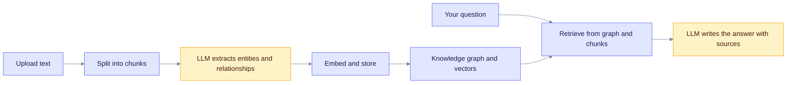

In this tutorial you build a small question-answering app on top of EdgeQuake. You create a workspace, upload one document, ask questions about it and look at the knowledge graph that EdgeQuake extracted.

**Prerequisites:** a running EdgeQuake server with a chat model and an embedding model configured (see [Getting started](../getting-started/index.md) and [Configure LLM providers](../providers/index.md)), plus `curl` and `jq`.

## What happens

The diagram shows the path of your document from upload to answer. Steps 3 to 6 of this tutorial walk through it.



Read it left to right. The top row runs once per document. The bottom row runs for every question.

## 1. Check the server

Set the base URL and check health. Use port `8080` for the Docker quickstart. `make dev` picks `8090` by default; run `make status` to see the actual port.

```bash
export EQ_API=http://localhost:8080
curl -s "$EQ_API/health" | jq '{status, version, llm_provider_name, components}'
```

Expected output (values vary with your install):

```json
{
  "status": "healthy",
  "version": "0.32.2",
  "llm_provider_name": "ollama",
  "components": {
    "kv_storage": true,
    "vector_storage": true,
    "graph_storage": true,
    "llm_provider": true
  }
}
```

`status` is `healthy` or `degraded`. If it is `degraded`, or `llm_provider` is `false`, fix the provider first. Run `edgequake doctor` or read [Configure LLM providers](../providers/index.md).

> **Authentication.** A default quickstart has auth off, so no credentials are needed. If you turned auth on, add `-H "Authorization: Bearer $TOKEN"` (or `-H "X-API-Key: $KEY"`) to every call and send `X-Tenant-ID` as well. See [Auth quickstart](../operations/auth-quickstart.md).

## 2. Create a workspace

A **workspace** is an isolated knowledge base: its own documents, graph and vectors. Every workspace belongs to a **tenant**. A fresh server has one tenant named `default` with ID `00000000-0000-0000-0000-000000000002`.

```bash
export TENANT_ID=00000000-0000-0000-0000-000000000002

export WORKSPACE_ID=$(curl -s -X POST "$EQ_API/api/v1/tenants/$TENANT_ID/workspaces" \
  -H "Content-Type: application/json" \
  -d '{"name": "First RAG App", "description": "Tutorial workspace"}' | jq -r '.id')

echo "$WORKSPACE_ID"
```

Expected output: a UUID such as `3f6c1c0e-8a2d-4c6e-9d5b-0a1b2c3d4e5f`. The server derives a URL slug from the name. If you get a `409` conflict, a workspace with that slug already exists in the tenant. Pick another name.

From here on, every call sends the header `X-Workspace-ID: $WORKSPACE_ID`. That header selects the workspace for documents, queries and the graph.

## 3. Upload a document

Save a short sample document:

```bash
cat > sample.md <<'EOF'
# NeuralSearch Project

Dr. Sarah Chen leads the NeuralSearch project at TechCorp. The project builds a
semantic search engine on top of vector databases.

Dr. Chen works with Michael Torres, a senior engineer at TechCorp. Michael designed
the indexing pipeline. Their team is based in San Francisco.
EOF
```

Upload it as a file. The server answers right away and processes the document in the background.

```bash
curl -s -X POST "$EQ_API/api/v1/documents/upload" \
  -H "X-Workspace-ID: $WORKSPACE_ID" \
  -F "file=@sample.md" | tee upload.json | jq '{document_id, status, track_id}'

export DOC_ID=$(jq -r '.document_id' upload.json)
```

Expected output (the status can also be `pending` or `processing`):

```json
{
  "document_id": "9d1e0a52-4f55-4c43-b3f0-6b6e0b0c2f11",
  "status": "processing",
  "track_id": "track-..."
}
```

To upload plain text from a script instead, use the JSON route `POST /api/v1/documents` with a body such as `{"title": "Notes", "content": "..."}`. It also returns `document_id` and `track_id`. See [Document ingestion](document-ingestion.md) for all options.

## 4. Wait for processing

Poll the document until `ui_phase` is `terminal`:

```bash
until [ "$(curl -s "$EQ_API/api/v1/documents/$DOC_ID" \
    -H "X-Workspace-ID: $WORKSPACE_ID" | jq -r '.ui_phase')" = "terminal" ]; do
  sleep 3
done

curl -s "$EQ_API/api/v1/documents/$DOC_ID" -H "X-Workspace-ID: $WORKSPACE_ID" \
  | jq '{display_status, chunk_count, entity_count, relationship_count, error_message}'
```

Expected output (counts vary with the model):

```json
{
  "display_status": "completed",
  "chunk_count": 1,
  "entity_count": 6,
  "relationship_count": 5,
  "error_message": null
}
```

Time depends on your model. A small local model can take a minute for this short text. If `display_status` is `failed`, read `error_message` and see [Troubleshooting](#troubleshooting).

The `ui_phase` field has four values:

| `ui_phase` | Meaning |
|------------|---------|
| `idle` | Queued, not started. |
| `running` | A pipeline stage is working. |
| `stopping` | You asked to cancel and the worker is stopping. |
| `terminal` | Finished. Check `display_status`: `completed`, `partial_failure`, `failed` or `cancelled`. |

## 5. Ask a question

Send a question to `POST /api/v1/query`. The default mode is `mix`, which combines graph and vector retrieval. [Query optimization](query-optimization.md) explains the modes.

```bash
curl -s -X POST "$EQ_API/api/v1/query" \
  -H "Content-Type: application/json" \
  -H "X-Workspace-ID: $WORKSPACE_ID" \
  -d '{"query": "Who leads the NeuralSearch project and who works with them?"}' \
  | jq '{answer, mode, sources: [.sources[] | {source_type, id, score}], total_ms: .stats.total_time_ms}'
```

Expected output (the wording of the answer varies):

```json
{
  "answer": "Dr. Sarah Chen leads the NeuralSearch project at TechCorp. She works with Michael Torres, a senior engineer who designed the indexing pipeline.",
  "mode": "mix",
  "sources": [
    { "source_type": "chunk", "id": "9d1e0a52-...-chunk-0", "score": 0.82 },
    { "source_type": "entity", "id": "SARAH_CHEN", "score": 0.77 }
  ],
  "total_ms": 3100
}
```

Each item in `sources` is a chunk, entity or relationship that fed the answer. To get a streamed answer, call `POST /api/v1/query/stream` with the same body. To get the retrieved context without an LLM answer, add `"context_only": true`.

## 6. Inspect the knowledge graph

List the entities that were extracted. Names are stored in `UPPERCASE_WITH_UNDERSCORES` form.

```bash
curl -s "$EQ_API/api/v1/graph/entities?page_size=20" \
  -H "X-Workspace-ID: $WORKSPACE_ID" \
  | jq '.items[] | {entity_name, entity_type}'
```

Expected output (extracted types depend on the model):

```json
{ "entity_name": "SARAH_CHEN", "entity_type": "PERSON" }
{ "entity_name": "TECHCORP", "entity_type": "ORGANIZATION" }
{ "entity_name": "NEURALSEARCH", "entity_type": "CONCEPT" }
```

List the relationships between them:

```bash
curl -s "$EQ_API/api/v1/graph/relationships?page_size=20" \
  -H "X-Workspace-ID: $WORKSPACE_ID" \
  | jq '.items[] | {src_id, tgt_id, keywords}'
```

Expected output:

```json
{ "src_id": "SARAH_CHEN", "tgt_id": "NEURALSEARCH", "keywords": "leads, project" }
```

Read one entity and its neighbours:

```bash
curl -s "$EQ_API/api/v1/graph/entities/SARAH_CHEN/neighborhood" \
  -H "X-Workspace-ID: $WORKSPACE_ID" | jq '.'
```

## 7. Use the Web UI

Open the Web UI (`http://localhost:3000` for Docker, `http://localhost:3010` for `make dev`). Select your workspace in the workspace selector, then use the sidebar:

| Sidebar item | What you do there |
|--------------|-------------------|
| Documents | Upload files and watch the processing status. |
| Query | Ask questions and read the sources. |
| Knowledge Graph | Explore entities and relationships. |

## 8. Clean up

Deleting a workspace removes its documents, graph and vectors.

```bash
curl -s -X DELETE "$EQ_API/api/v1/workspaces/$WORKSPACE_ID"
rm -f sample.md upload.json
```

## Troubleshooting

| Symptom | Likely cause | Fix |
|---------|--------------|-----|
| `health` shows `degraded` or `llm_provider: false` | The chat or embedding server is unreachable or misconfigured. | Run `edgequake doctor`, then see [Configure LLM providers](../providers/index.md). |
| Document ends as `failed` with a network error | The model server is down, for example Ollama is not running. | Start it, then `POST /api/v1/documents/reprocess` with `{"document_id": "<id>"}`. |
| `entity_count` is `0` | The model returned no usable entities (common with very small models). | Use a larger chat model, then reprocess. |
| Query answer says it has no information | The document is not finished, or you sent the wrong `X-Workspace-ID`. | Check step 4 and the header. |
| `401` or `403` | Auth is on. | Add credentials and `X-Tenant-ID`; see [Auth quickstart](../operations/auth-quickstart.md). |

More fixes are in [Troubleshooting](../troubleshooting/index.md).

## Next steps

- [Document ingestion](document-ingestion.md): chunking, gleaning and entity types.
- [Query optimization](query-optimization.md): pick the right query mode.
- [Tracing entity sources](tracing-entity-sources.md): see where an answer came from.
- [Core concepts](../concepts/index.md): why Graph-RAG works.
